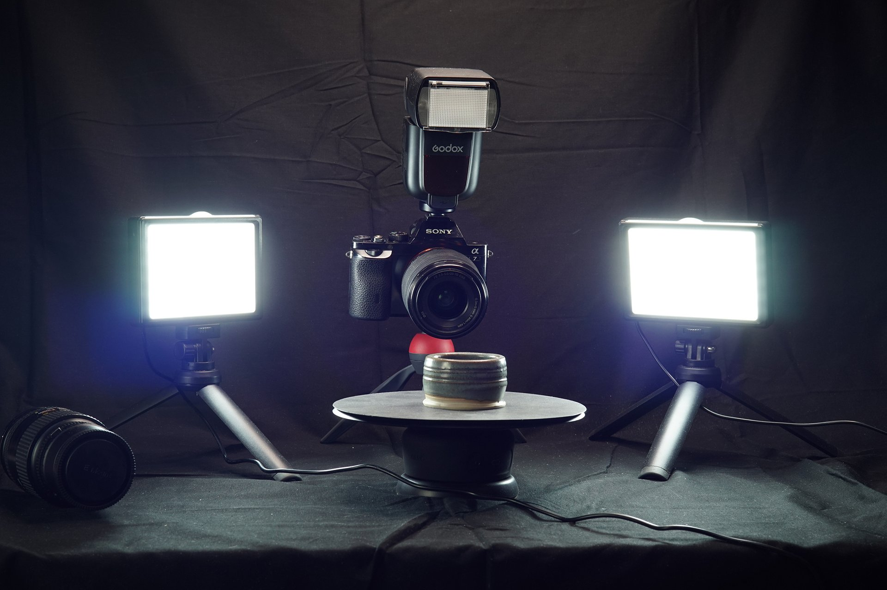

# 3D キャプチャ照明

>[!WARNING]
>
> 3D キャプチャのサポートは、Samplerバージョン5.1で削除されました。

## 光源

ビデオチュートリアルで3D キャプチャ用に設定した照明について詳しく知りたい場合は、[ここ](https://youtu.be/7mgpmlq6xAc?si=_ubOyBsNFAPrPEmD "3D キャプチャ用ライトのビデオチュートリアル")を参照してください。

写真測量には、均一で均一な照明が必要です。

それは必ずしも可能ではありません。屋外の照明を当てている場合は、雲のない明るい太陽か、雨が降っている可能性もあります。 曇った日でも、被写体にシャドウや光が当たるため、被写体を裏返すときに問題が発生することがあります。 照明を制御することで、これらの問題を解消できます。 また、制御されたスタジオ照明を使用すると、より良いモデルだけでなく、より多くのテクスチャを得ることができます。

## ライトのタイプ

照明を均一にする方法は数多くあります。 最適な方法は、<b>個の強力なリングフラッシュ</b>を使用することです。 これらのフラッシュはレンズの周りにリングを形成し、カメラに見えるすべてのものが均等に照らされるようにします。 これらは標準的なトップマウントフラッシュほど一般的ではありません。安価なモデルには、フィルターを取り付けることができないなどの欠点があります。これについては、次のパートで説明します。 大きくて強力なリングフラッシュも非常に高価ですが、中には強いものもあるため、環境光に過度に影響を与えるため、日中に使用することもできます。

代わりに、<b>標準的なフラッシュ</b>と安価な<b>連続ビデオライト</b>を組み合わせて使用できます。 標準的なトップマウントフラッシュは安価で見つけやすいため、レンズフィルターも使用できます。 シンプルなビデオライトも安価で、カメラ設定のピント合わせや設定が簡単にできます。 一部のカメラでは異なるフラッシュコネクターが使用されるため、ブランドに合った適切なフラッシュを選択してください。

ビデオライトには、安価な選択肢がたくさんあります。 あまり大きくはならないが、適度な量の光を出せるものが欲しい。 また、オブジェクトを2つの側面から照らしたいので、少なくとも2つのライトを取得することも重要です。 スタンド付きの安価なLED照明セットは、ここで良い選択をすることができます。

3～4個のライトが当たった場合は、フラッシュを完全にスキップして、より多くの角度をカバーすることもできます。 これはオブジェクトの複雑さによって異なります。オブジェクトの穴や割れ目が多いほど、オブジェクトを均等に埋めるために必要な角度のライトが多くなります。

理想的なセットアップでは、リングライトを模倣しようとしますが、上部からのフラッシュの光、左右からのビデオの光、レンズの横には、ちょうど視界から外れています。

<b>ライトにディフューザーを追加</b>することで、均一な照明を実現できます。 ディフューザーは、あなたの光の上に行く紙、プラスチックシートまたはキャップにすることができます。 光をより均等に広げて、シャドウをソフトにします。 ほとんどのフラッシュガンセットには、ディフューザが付属しています。通常、ビデオライトにも拡散シートが付いています。 そうでない場合は、トレース紙、はさみ、粘着テープをいつでも使用できます。 正確な科学じゃない！

適切な明るさのカメラを得るために利用できる光の量を調整するには、<b>レンズの露光量設定</b>が必要です。 露光量設定のバランスが取れているように、ライトのバランスも調整できます。 低い露光量では、より多くの光が必要になる場合があり、一般に、光はカメラ設定よりも微調整が容易です。

## ライトの組み合わせを使用する

ビデオの光はより少ない光を放出しますが、フラッシュは短く強い光のフラッシュであることを指摘する価値がありますが、ノンストップです。 フラッシュは非常に正確に微調整できますが、フラッシュが発光するまではカメラーで光を確認できないため、焦点を合わせたり微調整したりするのは少し難しい作業です。カメラによってISO感度やシャッタータイムが上がる場合があり、プレビューとして最終写真の露光量を模倣するために、ディスプレイに最終写真を100%正確に表示されない場合があります。

フラッシュは非常に短時間で発光するため、シャッター時間の影響をあまり受けません。シャッターを1秒間開いても、フラッシュが発光するのは数ミリ秒だけです。

フラッシュ照明と連続ビデオ照明を組み合わせて使用している場合は、<b>すべての設定を微調整して照明を均等に調整</b>できます。 フラッシュがビデオのLEDを上書きしやすいため、強さのトーンを下げることができます。 また、シャッター時間を長くすると、シャッターが開いている間は光が加わり続けるため、ビデオライトの効果を上げることもできます。

ここでは、実際のケースと機器で試してみる必要がある解決策は1つではありません。 最終的な目標は、見える影が最小限の均一な照明を<b>均一にすることです</b>。 自動写真計測システムを使用すれば、簡単に写真の位置を揃えることができ、真のPBRベースカラーテクスチャのように、テクスチャがより均一かつ均一に見えるようになります。
