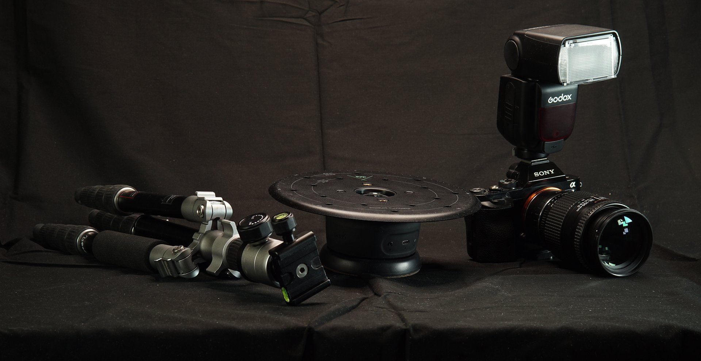

# カメラ設定 – 露光量

>[!WARNING]
>
> 3D キャプチャのサポートは、Samplerバージョン5.1で削除されました。

## カメラ設定 – 露光量

このユーザーガイドでは、カメラの設定および設定の基本について説明します。

このガイドはビデオチュートリアルとして視聴しますか？ [こちら](https://youtu.be/kR9EGW_zxlY?si=x8dN9tccofZhScKw "3D キャプチャ処理用の露光量のビデオチュートリアル")で確認できます。

マニュアルモードでは、カメラの撮影方法を完全に制御でき、最も重要な点として、これにより最もシャープな写真を撮影できます。これが、自動モードよりも推奨される理由です。

## 手動モード

デジタル一眼レフカメラには、完全に自動から完全に手動まで、いくつかのモードを持つダイヤルがあります。 マニュアルモードでは通常、「M」の印が付いており、アパーチャ、シャッタースピード、ISOの3つの主要な設定すべてを制御して、写真の露光量とシャープネスを調整できます。 この3つの組み合わせによって、カメラが捉える光の量が決まります。

<b>アパーチャ</b>は、レンズの内側の開口部です。 この開口部が大きいほど、カメラに入る光の量が多くなります。 F値で表されます。F値を大きくすると、開口部が小さくなります。

<b>シャッタースピード</b>は、カメラがシャッターを開いて光を集める時間です。 シャッタータイムが長いと、光の量も多くなります。 秒で表されますが、通常は1/60秒などの分数で表されます。

<b>ISO</b>は、カメラセンサーの感度です。 ISOを上げると、センサーの感度が高くなり、より多くの光が集まります。

組み合わせが高くなりすぎると、画像が明るくなりすぎたり白とびしたりして、低すぎると暗くなり、暗くなります。

これらの3つには副作用があり、それぞれ欠点となる可能性があります。 アパーチャが大きい（F値が小さい）場合、被写界深度が大幅に小さくなり、近くの深度がぼやける可能性があります。

シャッタータイムが長いと、被写体や写真の撮影中にカメラが動いて、画像がぼやける可能性があります。

最後に、ISOはカメラセンサーを少し過負荷にし、非常にノイズが多く、ぼやけた結果が得られます。

## バランスを見つける

カメラに入る光が少なすぎるため、これらすべてを最もシャープな設定にすることは不可能です。 撮影マニュアルでは3つの要素のバランスを取りますが、その設定方法は目的によって異なります。当社の正確な写真測量とは異なる、表現力豊かなストリート写真の撮影が必要となります。

必要なのは、<b>可能な限りシャープな画像</b>です。 ISOを設定する最も簡単な方法： ISOの自動設定を避け、可能な限り低い値に抑えます。理想的には<b>400未満では100が理想的です</b>。

シャッタータイムは大きな問題ではありません。三脚と静止した被写体を使用している場合、手持ち撮影で可能な時間よりも長い時間に簡単に移行でき、必要に応じて秒単位で移行できます。

<b>アパーチャ</b>は、もう少し目立ちすぎています。 大きなアパーチャ（低いf値）は必要ありません。大きなピクセルを使用すると、被写体の一部がぼやける可能性があり、可能な限りシャープな画像が必要になります。 正確な値はレンズによって異なります。これを調べるようにしてください。通常は、f8 ～ f16 </b>の値です。<b>

フルマニュアルモードを使用する必要はありません。Aと記されているアパーチャモードでは、アパーチャとISOを手動で設定できますが、最適なシャッター時間を自動的に選択します。 制御を放棄すると、設定が少し簡単になります。

先ほど見たように、アパーチャ、シャッタースピード、ISO感度、撮影する光量の4つの要素が混在しています。 いずれかの変更が反映された場合は、他の変更を調整する必要があります。 光が多いほど露光量が低くなり、アパーチャが少ないほどシャッタータイムが長くなり、ISOが低いほど多くの光が必要になります。正しく機能させるには、何度か練習と実験が必要です。

カメラには、チャンスを逃したくないもう1つの設定があります。 画像のホワイトバランスによって、写真の見た目が「暖色」か「寒色」かが決まります。 照明に完全に依存しています。屋外の太陽光は寒く見え、屋内の電球は暖かく見えます。 この値はケルビン、Kで表されます。この値を照明に合わせます。 屋外照明は約7-8000K、屋内約5000です。 これを目立たせるというのはたいてい結構だ。

露光量について理解が深まったところで、[3D キャプチャプロセスにカメラの重点を置く](camera-settings-focus-substance-3d-sampler.md)方法について説明します。
