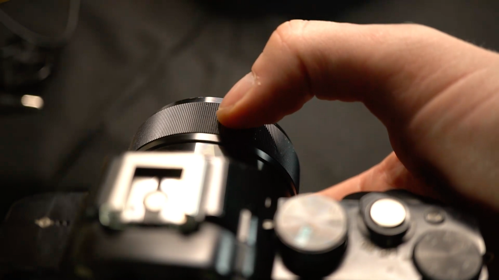
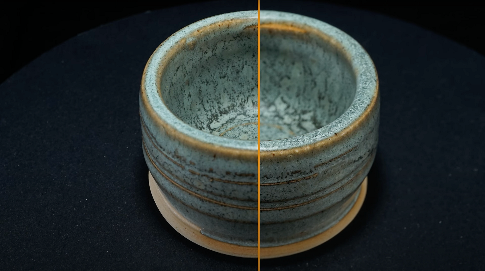

# カメラ設定のフォーカス

>[!WARNING]
>
> 3D キャプチャのサポートは、Samplerバージョン5.1で削除されました。

## カメラの設定 – フォーカス

<b>アパーチャ</b>は最も複雑なカメラ設定であるため、このユーザーガイドでは深度して説明します。

このガイドはビデオチュートリアルとして視聴しますか？ [こちら](https://youtu.be/kFZ71ZWuap0?si=MDuvyO9w96rFpsQ9 "3D キャプチャビデオチュートリアルのアパーチャとフォーカス")で確認できます。

## レンズの焦点を合わせる

デフォルトでは、カメラのオートフォーカスシステムがこれを制御し、フォーカスが自動的に設定されます。 人物や広い環境、動的な被写体などを撮影する場合は、これが理にかなっています。しかし、被写体が固定されていて固定されている場合は、問題が発生する場合もあります。2枚の写真の間にオートフォーカスが設定されている場合でも、間違いが生じ、写真が台無しになる可能性があります。

すべてのデジタル一眼レフは、自動フォーカスからフル<b>手動フォーカス</b>に切り替えることができます。 これは、レンズのフォーカスリングをねじることで、フォーカスを完全に制御できることを意味します。 こうすることで、ショット間でフォーカスが移動するのを防ぐことができます。 カメラマニュアルを読むと、カメラディスプレイ上に色付き効果が描かれる「フォーカスピーキング」など、役立つ設定が表示される場合があります。 これにより、画像のどの部分にピントが合っているかを確認できます。 現在のビューの一部が白とびして表示されるズーム拡大鏡を使用すると、ピクセルに最適なフォーカスを得ることができます。 特にこのズーム拡大鏡は、あなたの焦点を固定するのに不可欠です。

マニュアルフォーカスを使用すると、<b>絞り</b>と<b>フォーカス</b>で何が起こっているのかよく見て理解できます。 欠点は、カメラや被写体を移動するたびに<b>フォーカスを再調整</b>する必要があることです。 写真を忘れて台無しにするのは簡単なので、チェックすることを習慣にすることをお勧めします。

## アパーチャ値の選択

<b>アパーチャ</b>は、<b>フォーカス</b>と<b>シャープ</b>に影響するため注意が必要です。 被写体の一部に焦点を合わせたくありません。これは、写真測量プロセスで問題の原因となります。 そのため、標準レンズの場合は通常f1.8 ～ f3.5の範囲で大きなアパーチャが発生します。 一方、最小アパーチャのf/32も大きくなく、シャープさも落ち、光量も少ないので照明が弱くなります。

アパーチャが小さくなるほどフィールドの深度は広くなりますが、焦点距離に合わせて拡大・縮小することもできます。 つまり、フィールド深度を近くに配置して、それどころか、遠くに配置して鮮明さを仕上げることができます。 写真の大部分を小さなオブジェクトに取り込ませたい場合、小さなオブジェクトでは問題が生じることがあります。

それでは、適切なアパーチャの価値は何でしょうか。 目安として、使用するレンズの最もシャープなアパーチャ範囲を調べ、この値から始めます。 これは、おそらく<b> F8またはf11 （最大f16</b>）です。  <b>すべてがピントに合っているかどうか確認してください</b>そうでない場合は、f20前後までステップごとに減らしてください。 オブジェクトのピントが完全には合っていない場合は、少し離してみます。 10-15センチメートルの距離でも、小さなオブジェクトの違いを作ることができます。

また、レンズの選択が大きな違いを生む可能性があることに注意してください。 カメラに付属するデフォルトのキットレンズは、通常、最もシャープで高品質なものではなく、より高品質なレンズに投資する価値があります。 特にクローズアップの場合、マクロレンズはフォーカスをレンズに近づけることができるため便利です。

## フォーカスのブラケット

他の方法が全て失敗した場合に完璧なシャープを達成するために、1つの特別なトリックを行うことができます。 <b>ピントのブラケット</b>とは、<b>複数の写真</b>を<b>ピントの間隔を変えて</b>撮影し、Photoshopで組み合わせることです。 特に完全なループシリーズの場合、<b>多くの追加作業</b>が必要であるため、最後の手段としてのみ使用してください。

フォーカスの異なる複数の写真がある場合は、それらを別のレイヤーに読み込みます。

すべてのレイヤーを選択して、<b>編集</b>に移動します > <b>レイヤーを自動整列</b>。 デフォルト設定で「 ok 」をクリックします。 Photoshopは、選択されたすべてのレイヤーのピクセルの完全アラインメントを試みます

次に、<b>編集</b>に移動します > <b>レイヤーの自動ブレンド</b>。 もう一度、すべてのデフォルト設定で「 ok 」を選択します。 Photoshopは、レイヤーの最もシャープな部分をブレンドします。

すべてがうまくいけば、完璧にシャープな写真になります。 時間を節約するために、これらの手順の少なくとも一部を、記録されたアクションに変換する価値があります。

3D キャプチャプロセスのアパーチャとフォーカスについて知っておくべきことをすべて学習したので、[理想的な照明の設定を行う方法](3d-capture-lighting-substance-3d-sampler.md)について詳しく説明します。
