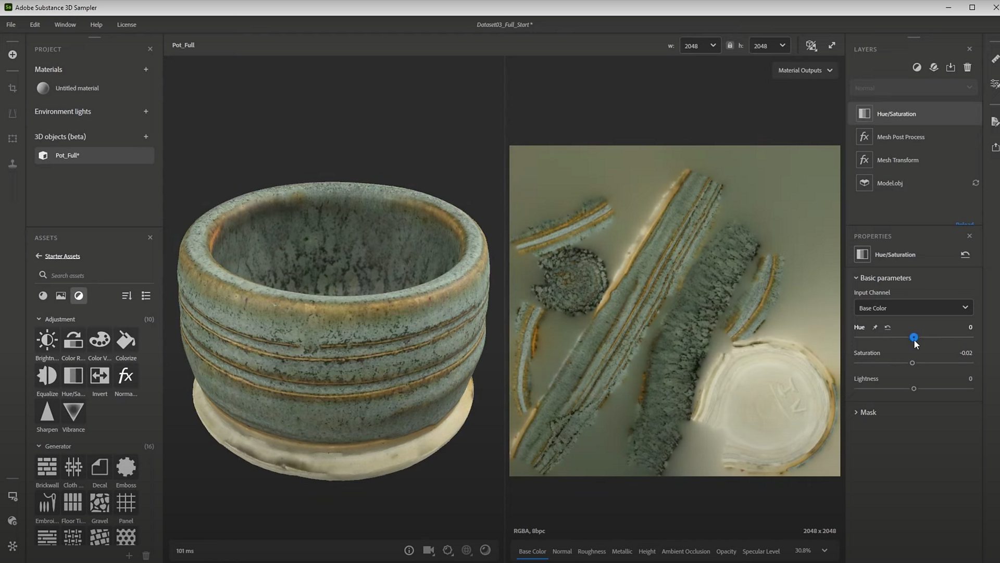

# 3D撮影メッシュの編集

>[!WARNING]
>
> 3D キャプチャのサポートは、Samplerバージョン5.1で削除されました。

## 3D撮影メッシュの編集

このユーザーガイドでは、Substance 3D Samplerで3Dキャプチャされたオブジェクトを編集および後処理するためのテクニックについて説明します。

これをビデオチュートリアルとして視聴しますか？ [こちら。](https://youtu.be/6_EZEAR0Uy8?si=6AaCUHD6nnWZyKUE "高度な3D キャプチャ - メッシュでの後処理チュートリアルビデオ")で確認できます。

3D キャプチャプロセスを完了し、Samplerプロジェクトにメッシュを追加したら、プロジェクトに変更を加えることができます。 これらは、メッシュまたはマテリアルに対する変更です。 メッシュフィルターは、Sampler 4.0以降で新しく追加されました。 マテリアルフィルターでは、以前Samplerにあったおなじみのフィルターがすべて使用されます。

Samplerでキャプチャした3Dオブジェクトを編集する場合、<b>メッシュとマテリアルフィルターのスタックを組み合わせることができます</b>。これらはデータの適切な部分に自動的に適用されます。 クイックフィルターリストでは、2つのタイプを識別できません。

## メッシュフィルター

まず、メッシュフィルターについて説明します。 Samplerには、<b>メッシュ変形</b>と<b>メッシュのポストプロセス</b>の2つがあります。

<b>メッシュの変形</b>は、メッシュを<b>移動</b>、<b>回転</b>して<b>拡大・縮小</b>できるシンプルなフィルターです。 多くの場合、オブジェクトを反転したり、スケールを調整したりできます。 スキャンには、事前に適用された変形が付属しています。

<b>メッシュの後処理</b>は、3D キャプチャダイアログの最後にある後処理と同じですが、動的フィルターに含まれています。 これにより、テクスチャを<b>再メッシュ</b> 、 <b>再UV</b>および<b>再ベイク</b>できます。 このフィルターは、<b>トリカウントを減らし、UVを改善し、テクスチャを縮小して、メッシュを最適化する</b>ことを目的としています。 それを使うことによる最良の結果の一つは、改善されたUVレイアウトである。 デフォルトでは、元の3D キャプチャ出力のUVは非常に断片化しています。通常、新しい自動UVが改善されています。

これは高速フィルタではありません。パラメータを変更するたびにメッシュが処理されます。 辛抱強く我慢するのが一番だ。

## マテリアルフィルター

マテリアルフィルターははるかに多様で、通常のマテリアルで使用できるすべてのものを3D キャプチャメッシュのマテリアルで使用できますが、多くのフィルターは均一でタイリングなマテリアルを対象としているため、結果が常に機能するとは限らないことに注意してください。

最も便利なフィルターは、明るい<b>コントラスト</b>、<b>色相の彩度</b>などの調整と、チャンネルを編集するためのより高度なフィルターです。 オブジェクトのラフネスをキャプチャできなかったため、フィルターを使用して復元します。

<b>色相/彩度フィルター</b>を使用して、オブジェクトの実際の色に合った色をさらに取得できます。 カラーの精度を上げるより良い方法もありますが、このクイックフィルターよりも多くの要素が関係しています。

次に、オブジェクトに存在していた反射を取り戻します。 ここでは、<b>色の置き換えフィルター</b>を使用できます。 カラー置き換えを使用すると、テクスチャからカラーを選択し、そのカラーを使用してすべての領域を変更できます。

既定では、選択した色ですべてが着色されますが、<b>[詳細なセグメント化]</b>をオンにして、<b>[基本色からマスク]</b>に設定し、<b>ラフネス</b>で<b>置き換え</b>にすると、選択した色の領域ラフネスをすべて鮮明に表示できます。 輝度のバリエーションとマスク範囲を調整すると、マスクの微調整に役立ちます。

最後に、ベースカラーのディテールを少しラフネスに戻します。 <b>チャンネル切り替えフィルター</b>を使用すると、異なるチャンネル間でディテールをミックスしてブレンドできます。 <b>入力をベースカラー</b>rに、<b>出力をラフネス</b>に設定し、ブレンドモードと不透明度を調整すると、実生活に近い、趣のある画像を作成できます。

最後に、最終的なラフネスをさらに調整する場合は、明るさコントラストフィルターを使用して、ラフネスチャンネルに適用することができます。 次に、値を微調整してラフネスを少しだけ粗くします。

各オブジェクトは異なるため、データセットによっては、特定の調整が必要になる場合があります。 <b>クローンスタンプツール</b>を使用して、補助マーカーのキャプチャなど、削除したいテクスチャの一部を消去することもできます。 テクスチャ上の特定の場所を使用するマテリアルフィルターはUVレイアウトに依存するため、マテリアルフィルターの前にメッシュ処理を行ってください。

オブジェクトとテクスチャに問題がなければ、<b>共有/書き出し形式</b>ダイアログを使用して<b>結果を書き出し</b>できます。 「一般」では名前とパスを、「メッシュ」では3D メッシュのフォーマットを、「マテリアル」ではメッシュのマテリアルを指定できます。 メッシュまたはマテリアルをオフに切り替えて、そのうちの1つだけを個別に書き出すことができます。 書き出すと、メッシュを他の3Dアプリケーションで使用できます。
