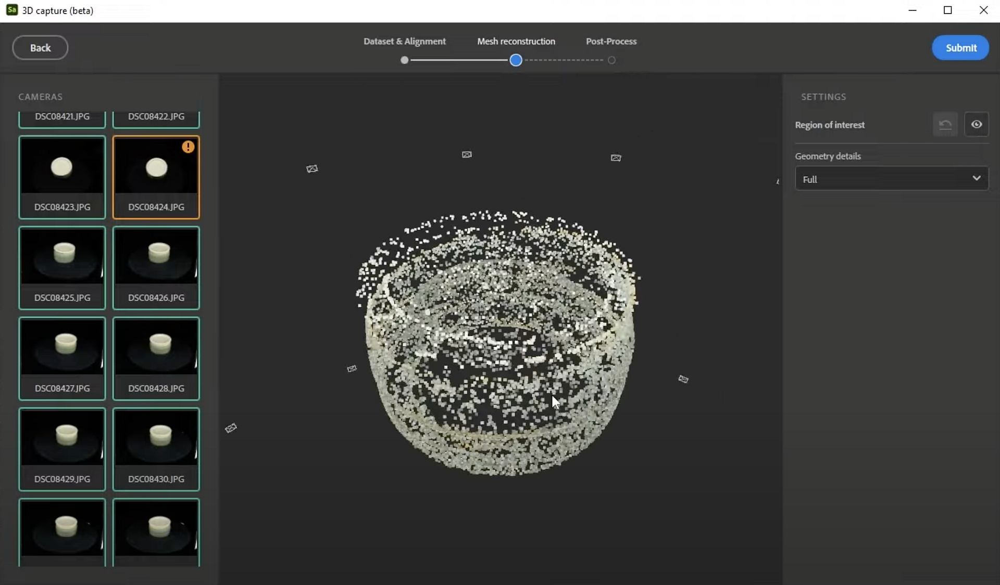
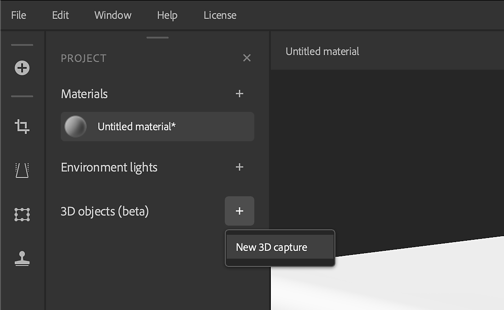
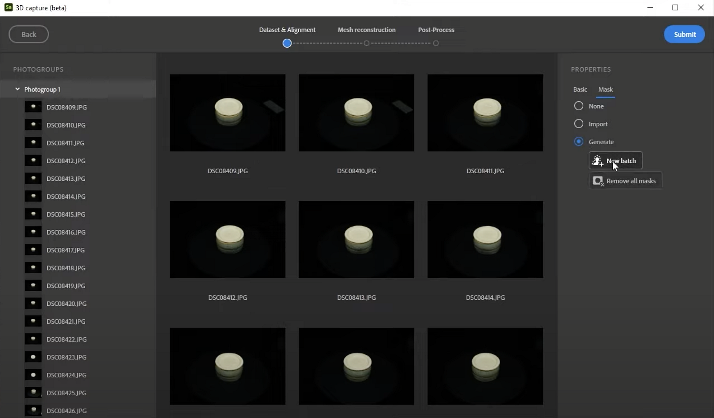

# 高度な3Dキャプチャを処理中

>[!WARNING]
>
> 3D キャプチャのサポートは、Samplerバージョン5.1で削除されました。

## Substance 3D Samplerでの高度な3Dキャプチャの処理

このユーザーガイドでは、Substance 3D Samplerでの3D キャプチャデータセットの処理について深度内で説明します。

これをビデオチュートリアルとして視聴しますか？ [こちら](https://youtu.be/vJQ756Up55Y?si=GiAnajXRGkb5gyTH "高度な3D キャプチャ – キャプチャ処理チュートリアル")で確認できます。

3D キャプチャや写真測量を行う場合、大部分の作業は優れた写真の撮影です。これらの手順については、前のユーザーガイド記事で説明しています。 また、人間の大きさまでのオブジェクトの3D キャプチャ体験を設計し、焦点を当てています。 非常に大きなデータセット（6ギガピクセル以上、つまり500 12メガピクセルの写真）を使用すると、問題が発生する場合があります。

## 3D キャプチャ・プロセスの開始

Samplerで開始するには、<b>新しいプロジェクト</b>を作成する必要があります。 プロジェクトウィンドウに、新しい「3Dオブジェクト」セクションが表示されます。 横にある「+」をクリックし、「<b>新規3Dオブジェクト</b>」を選択して、専用の新しいウィンドウで3D キャプチャプロセスを開始します。

エクスプローラー内のすべての写真を選択し、3D キャプチャウィンドウにドラッグします。 しばらく読み込むと、写真がリストとギャラリーに表示されます。右側には選択範囲のプロパティが表示されます。

左側の写真群一覧は、写真に使用したカメラとレンズの名前が表示されています。 携帯電話、デジタル一眼レフカメラ、ドローンなど、複数のデバイスの写真を組み合わせると、ここに<b>個別のグループ</b>が表示されます。

グループを選択すると、そのプロパティの概要が表示されます。 <b>焦点距離</b>と<b>センサーのサイズ</b>が不足している場合があります。数値がわかっている場合は、<b>手動で</b>これらの値を入力できます。 この情報は、処理を少し改善するのに役立ちます。

## マスクを生成中

最も重要なオプションは、<b>マスク</b>セクションにあります。 ターンテーブルで写真が撮られているので、背景はあまり変わりませんが、被写体は変わりました。 これにより、アラインメントプロセスが完全に失敗する可能性があります。 また、背景には意味のある情報が一切含まれていません。 これを解決するには、各写真の被写体をマスクします。

最も簡単な方法は、自動バッチ生成を使用することです。 「<b>生成</b>」、「<b>新規バッチ</b>」の順に選択し、Samplerがマスクを作成するのを待ちます。 これは、Photoshopと同様に、Adobe Senseiの「被写体を選択」テクノロジーを使用します。 72枚の写真でこのプロセスは完了するのに少し時間がかかるので、忍耐強くすることが最善です。

個々のマスクを確認するには、<b>写真を選択</b>し、右下のマスクパスの横にある<b>目のアイコン</b>をクリックします。 これにより、マスクのグレースケールプレビューが表示されます。 自動マスクで間違いが生じて背景の一部が残ってしまった場合でも、いくつかの正しくないマスクでも問題ありません。

ほとんどのマスクには、被写体のみを含めます。 このため、<b>均一で平坦な背景</b>で写真を撮影することが重要です。自動マスクを適切に機能させる方がはるかに簡単です。 ほとんどのマスクが正しくない場合は、すべてのマスクを手動で修正するか、より適した背景で写真を再撮影することができます。

データセットの再試行を複数回行うことがありますが、その都度マスクを再生成することを避けたい場合があります。これは、Samplerを閉じるとマスクが削除されるためです。 マスクは、Documents¥Adobe¥Adobe Substance 3D Sampler¥3DCapture¥p1にキャッシュされます。 1つのセッションで複数のアセットを実行すると、p2、p3などの名前のフォルダーが作成されます。このデータセットに再度アクセスする必要がある場合に時間を節約できるように、<b>キャッシュされたマスクをデータセットと共に安全な場所にコピー</b>することをお勧めします。

## アラインメント

正しいマスクがあれば、アラインメントに進む準備が整います。 右上の<b>青い送信ボタン</b>を押します。 <b>精度</b>と<b>写真の順序</b>の2つのオプションが表示されます。

* <b>精度</b>はアラインメントを向上させます。低い値から始めることをお勧めします。失敗した写真が見つかった場合は、高い値で再試行してください。
* <b>写真の順序</b>は、写真を撮影した順序に関連しています。 オブジェクトの周りを歩いて、らせん状に円を描いて撮影した場合は、シーケンスに移動して時間を節約できますが、通常は、整列に少し時間がかかる場合でも、デフォルトが最も安全なオプションです。

<b>[プロセス]</b>をクリックし、アラインメントが完了するのを待ちます。 これには数分かかる場合があるため、もう一度我慢してください。 完了すると、オブジェクトの点群表現が表示され、各写真はカメラとして表され、オブジェクトの周囲に浮かんでいます。 左上のオレンジ色の警告三角形は、一部の写真で<b>整列に失敗</b>したことを示します。 前に戻って、高品質の精度で試してください。まだお持ちでない場合は、デフォルトの順序で試してください。 一部の写真は、整列に失敗する場合があります。これは、十分な重なりが存在しないか、ディテールが不十分であることを意味します。 この問題を解決するには、撮影プロセスを見直す必要がある場合があります。または、ほんの数枚の写真であれば、それらを無視してかまいません。

点群データを見ると、オブジェクトの一部ではない<b>余分な点がオブジェクトの周囲に浮かんでいることがわかります</b>。 これは通常、マスクの問題が原因です。この場合、いくつかのマスクの問題が原因で、一部のパーティクルで表示されることがあります。 目標範囲の横にある右側の目のアイコンを使用して、<b>切り抜き</b>できます。 <b>正方形のハンドル</b>を移動するだけで、オブジェクトの周囲により近い形に見えます。 このボックスの外側にある点（濃いグレーで表示）は、最終的な3Dモデルには含まれません。 このバウンディングボックスを使用して、<b>モデルをより適切に事前回転および整列できます。</b>

点群は他の点に比べて密度が高い場合があります。 これは問題ではなく、ポイントが少ないほど、サーフェスのジオメトリの詳細が小さくなります。 ディテールやコントラストがオブジェクトの一部に欠けていることと、ディテールが際立っていることの両方が原因です。

## ジオメトリの詳細

メッシュを作成する前に残された設定は1つだけです。 [ジオメトリの詳細]で、最初のジオメトリの詳細レベルを選択できます。

* <b>RAW</b>は<b>未解読</b>時間です。これが必要でない限り、実際に使用することはお勧めできません。
* <b>フルからドラフトへの変換</b>は、<b>デシメートされたメッシュ</b>です。低いオプションを選択するとテスト結果がより速く、高いオプションを選択すると詳細が得られますが、処理時間は長くなります。

<b>[送信]をクリックしてメッシュ処理を開始します</b>。 このプロセスには、前の手順のいずれかよりも長い時間がかかる場合があります。

## プレビューとポストプロセス

メッシュが完了すると、最後のウィンドウでメッシュをプレビューし、後処理してから、Samplerプロジェクトに追加できます。 <b>テクスチャ</b>、<b>影付き塗りつぶし</b>のメッシュを<b>UV</b>、<b>ワイヤーフレームチェッカーマテリアル</b>で確認するには、このモードの下部にいくつかのボタンがあります。 側の後処理設定を使用すると、新しいバージョンのメッシュを作成できます。 つまり、新しい自動UVと元のメッシュからベイクされたテクスチャを備えた、再テッセレーションされたメッシュです。 メインコントロールでは、ターゲット面数を設定したり、通常、Height、AOのベイクを切り替えたりすることができます。 微調整する詳細設定はたくさんありますが、通常はデフォルトで十分です。

メッシュがSamplerに追加されたら、このメッシュ処理ステップを後で実行することもできます。 Samplerに追加したファイルは、名前を付けるとプロジェクトリストに表示されます。

メッシュとテクスチャを編集できますが、<b>共有</b>を使用して結果を既にエクスポートできます > <b>書き出し形式</b>ダイアログ。 <b>全般の設定</b>では名前とパスを指定し、<b>メッシュの設定</b>では3D メッシュの形式を指定し、<b>マテリアルの設定</b>ではメッシュのマテリアルを指定します。 メッシュまたはマテリアルをオフに切り替えて、そのうちの1つだけを個別に書き出すことができます。 書き出すと、メッシュを他の3Dアプリケーションで使用できます。

次に、[Samplerでキャプチャした3D メッシュをさらに編集](editing-3d-captured-meshes.md)する方法について説明します。
