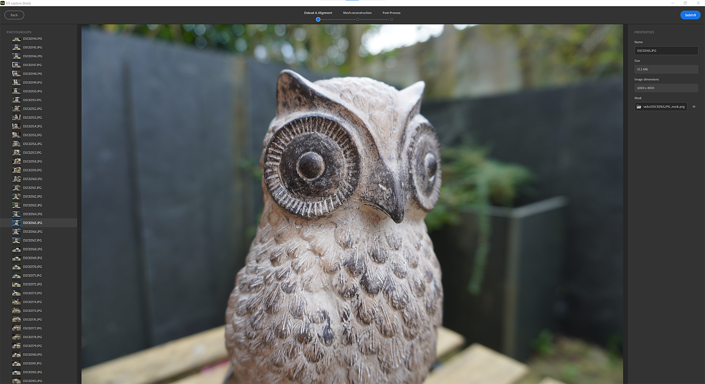
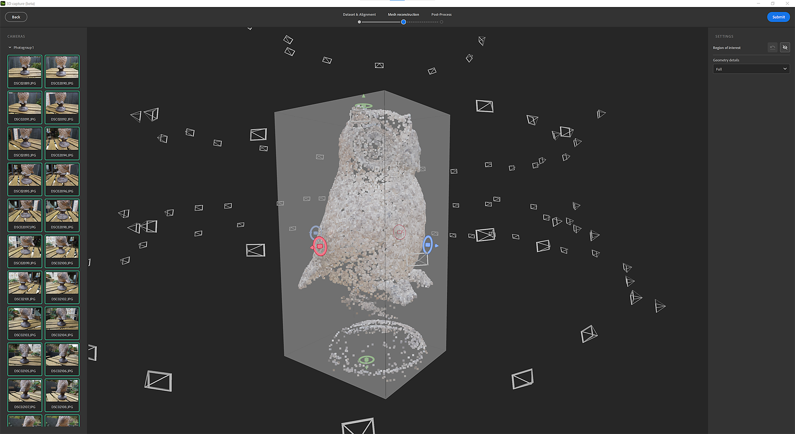
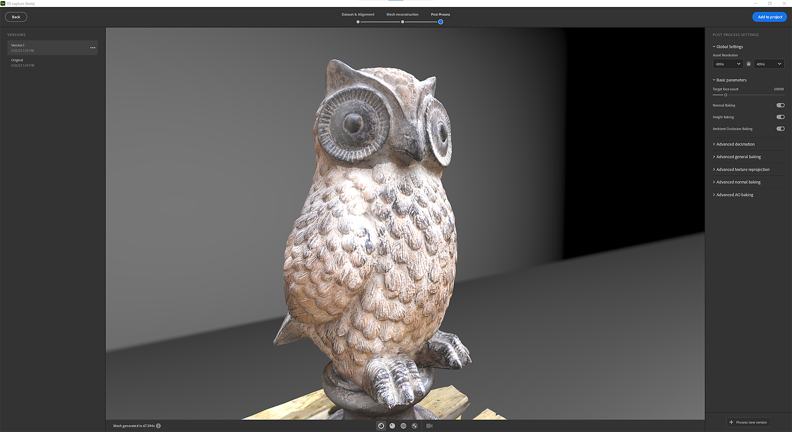

# 3D キャプチャ

## はじめに

## 写真測量とは？

Samplerは、写真測量を使用して、テクスチャを使用して画像をメッシュに変換しています。 写真測量は、画像から測定を行う科学です。 写真から情報を抽出し、3Dモデルやテクスチャを作成するために使用されます。 このプロセスでは、異なる角度からオブジェクトの複数の写真を撮影してから、画像を処理して、画像内のフィーチャの形状と位置に関する情報を抽出します。

目標は、各画像のカメラの相対位置を確立するために、画像間で対応するフィーチャを一致させることです。 一致したフィーチャから、オブジェクトの3Dモデルが再構築されます。 最後に、テクスチャを3Dモデルに投影します。

## ハードウェア要件

3D キャプチャは、WindowsとMacOS MontereyまたはVenturaで利用できます。

Windows/Linux

次をお勧めします。

* 8 GbのVRAMを搭載したGPU
* 16 GbのRAM 32 Gbおよび64 Gbが理想的です。
* 10 Gb以上のディスク容量

[Linuxの設定](https://helpx.adobe.com/jp/substance-3d/unlisted/documentation/sadoc/3d-capture-set-up-on-linux-255426606.html)

Mac

* Apple Siliconデバイスは（M1またはM2）を強くお勧めします
* 4 Gb以上のVRAMとレイトレーシングをサポートしているIntelベースおよびAMD GPU

## 新しい3D キャプチャの作成

## データセットを読み込み

## データセットの準備

写真をドラッグ&amp;ドロップするか、OSエクスプローラーをクリックして参照します。

>[!NOTE]
>
> **おすすめのデータセット**
> 
> 3D キャプチャをスムーズに実行するために、<b>20枚の画像</b>を含むデータセットを使用することをお勧めします。

iPhoneユーザーの場合、.HEIC形式はまだサポートされていません。 Lightroomを使用して.jpegに変換できます。

macOSでは、[クイックアクション](https://support.apple.com/en-gb/guide/mac-help/mchl97ff9142/mac)を使用して画像を変換できます。

RAW形式のカメラの場合は、Lightroomを使用して写真を.jpegに変換することをお勧めします。

>[!NOTE]
>
> **データセットの制限**
> 
> **Windows**:データセットは合計で6Gピクセル（6 000 000 000ピクセル）未満である必要があります。 12Mピクセルの500枚の写真を表しています

写真を読み込んだら、写真をクリックすると、全体が表示されます。

フォトグループ定義：

データセットは、複数のフォトグループに分割できます。 フォトグループは、プロパティ（センサーサイズ、焦点距離、回転など）ごとに写真をグループ化します。

## マスキング

マスクを使用することには、多くの利点があります。 これにより、写真測量プロセスでフィーチャを検出し、マスクされていない領域のみを再構築できます。

これにより、マスクによってすべての写真の背景が非表示になるため、撮影中にオブジェクトを移動することもできます。

マスクを使用するには、フォトグループを選択し、右側の「**マスク**」タブを開きます。

マスクを読み込むには、命名規則を尊重します。

* [image\_name].file\_extension
* [image\_name]\_mask.file\_extension

アドビのAI技術を使用して、写真でマスクを自動的に生成できます。

## アラインメント

調整は、すべての画像を処理して抽出し、対応するフィーチャを一致させ、各画像のカメラの相対的な位置を設定することです。

## 設定

精度

低と高の2つのオプションがあります。

* 低：ほとんどのデータセットに推奨されます。
* 高：被写体のテクスチャが不十分な場合や写真が小さい場合に、より多くの写真に合うように推奨されるポイントの数を増やします。 この設定では、処理速度が遅くなります。 最初に低いオプションを試すことをお勧めします。

写真の順序

デフォルトとシーケンスの2つのオプションがあります。

これは、異なるフィーチャマッチングアルゴリズムを使用して計算できます。

* デフォルト：選択は複数の条件に基づいて行われ、その中から画像間の類似性が選ばれます。
* Sequence：デフォルトモードが失敗した場合に、写真の単一シーケンスを処理するために推奨される、指定された距離内の近隣画像のみを使用します。 写真の挿入順序は、シーケンスの順序と一致している必要があります。

## 点群とカメラの位置

調整ステップの結果は、すべてのフィーチャが検出され、すべてのカメラの位置が設定されたスパース点群です。

画像のアウトラインが緑の場合、画像は正しく配置されています。

画像のアウトラインがオレンジ色の場合、画像は正しく配置されていなかったため、この画像から機能が抽出されませんでした。

左側のパネルの画像をクリックして、関連するカメラの点群をフレームに入れることができます。

カメラをクリックして、そのカメラ上に点群をフレームすることができます。

## 再建

再構築ステップは、3Dモデル上にテクスチャを投影するものとして、マッチした特徴から対象物の3Dモデルを生成する。

## 設定

[ジオメトリの詳細]このオプションは、入力写真の精度レベルを指定します。これにより、計算された3Dモデルの詳細度が増減します。

## 目標範囲

3Dモデルを生成する前に、境界ボックスを使用して点群の周囲に再構成する領域を設定できます。

ボックスは、3軸に沿って移動、スケール、回転できます。

Shiftキーを押しながら拡大・縮小すると、ボックスが中心から拡大・縮小されます。

<table>
<tr style="border: 0;">
<td style="border: 0;" valign="top">

</td>
<td style="border: 0;" valign="top">

</td>
</tr>
</table>

## 後処理

後処理により、メッシュとテクスチャをニーズや使用方法に合わせて調整、最適化することができます。

再構築の結果、数百万のポリゴンと最大16Kのテクスチャを持つメッシュを生成できます。 これは、レンダリング、リアルタイム、AR体験に最適化されていない場合がよくあります。

結果を後処理して、詳細を失うことなくポリゴンの数を減らす必要があります。

後処理のステップは、次の4つのステップを自動的にチェーン化します。

* デシメーション：必要なフェースの数を定義してポリゴンの数を減らします
* UVアンラップ：デシメートされたメッシュのシーム、アンラップ、およびパッケージUVを自動的に定義します。
* 再投影：フォトグラメトリメッシュのカラーテクスチャをデシメートしたメッシュに再投影します
* ベイク処理：写真測量メッシュの法線、Height、AOのディテールをデシメットメッシュにベイク処理します。 これにより、デシメーション中に失われたすべてのメッシュのディテールが確実にテクスチャマップに転送されます。

## バージョン

異なるポストプロセスオプションを簡単に繰り返してテストするために、複数のバージョンを作成し、プロジェクトに追加するバージョンを選択できます。

異なるモードでメッシュを表示すると便利です。

実線モード

ワイヤーフレームモード

UVグリッドモード

## 非破壊的なワークフロー

プロジェクトにバージョンを追加すると、複数のレイヤーを使用してレイヤースタックが作成されます。

最初のレイヤーは再構築の結果です。

2番目のレイヤ（後処理を行った場合）は、3D キャプチャウィンドウで定義された値を持つメッシュ後処理レイヤです。 他の設定を使用する場合は、この手順で引き続きパラメータを編集できます。

3番目のレイヤーは、3Dオブジェクトの拡大・縮小、移動、回転を行うメッシュ変形レイヤーです。

この段階で、マテリアルに適用するために使用するフィルターを追加して、3Dオブジェクトのテクスチャを編集できます。

## 書き出し

書き出しウィンドウで、メッシュ形式とマテリアル設定を定義できます（マテリアルを書き出す場合と同じ設定）。

## チュートリアル

[詳細Tutorialsに移動](https://substance3d.adobe.com/tutorials/courses/Advanced-3D-Capture/youtube-f8iCtZ3Gmzs)

## FAQ

**写真測量に最適な撮影条件は何ですか？**

写真測量で正確な結果を得るには、画像の撮影時に一定のベストプラクティスに従うことが重要です。

1. 照明：写真測量は、適切な照明条件で画像を撮影した場合に最適です。 低光量または高コントラストの照明で画像を撮影すると、画像から特徴を正確に抽出することが難しくなるため、撮影を避けてください。 写真測量に最適な照明条件は、曇りの日または日陰の領域です。
1. 重なり：特徴を正確に抽出するのに十分な情報が画像にあることを確認するには、重なりの大きい画像を撮影することが重要です。 大まかに言えば、水平方向と垂直方向の両方で、画像間に60%以上の重なりを持たせるのが一般的です。
1. カメラ：高画質でシャープな高解像度のカメラとレンズを使用してください。 魚眼レンズまたは広角レンズのカメラは、最終結果に影響を与える幾何学的なゆがみを引き起こす可能性があるため、使用しないでください。
1. 方向：画像を撮影するときは、カメラを水平に、地面に対して垂直に保つようにします。 斜めから撮影された画像では、特徴を正確に抽出することが難しく、ゆがんだ結果が得られることがあります。
1. カメラキャリブレーション：画像を撮影する前に、カメラがキャリブレーションされていることを確認します。 このプロセスにより、レンズのゆがみや最終結果の精度に影響を与える可能性のあるその他の誤差を補正することができます。

**Specularや反射物に対してどのように機能しますか？**

Specular量の多いオブジェクトや反射量の多いオブジェクトを扱う場合は、写真測量が困難になることがあります。これは、明るい反射によって、画像から特徴を引き出すことが難しくなることがあるためです。 これらの課題を解決するために使用できる戦略をいくつか紹介します。

1. 照明：反射率の高い被写体の画像を撮影する場合は、直射日光を避け、代わりに曇りまたは日陰の状態の画像を撮影してください。 これにより、反射の強度を下げて、画像から特徴を簡単に抽出できます。
1. マット仕上げ：反射面にマット仕上げを適用すると、反射の強度を下げ、画像から特徴を簡単に抽出できるようになります。
1. 複数の画像をキャプチャする：同じオブジェクトの複数の画像を異なる角度からキャプチャすると、反射の影響を減らし、少なくとも一部の画像から特徴を抽出できる可能性を高めることができます。
1. 画像編集：後処理では、Lightroomなどの特定の画像編集ソフトウェアを使用して、映り込みを減らし、コントラストの強調やカラー補正などの画像の特徴を強化できます。

リフレクトするオブジェクトには、より精巧な設定と処理が必要な場合があり、すべての場合に完璧な結果を得ることはできない場合があることに注意してください。 様々なテクニックを試してみることをお勧めします。

**写真測量用に携帯電話とデジタル一眼レフカメラの間で推奨される推奨事項は何ですか？**

携帯電話もデジタル一眼レフカメラも写真測量に使えますが、長所と短所は異なります。 使用するカメラの種類を決定する際に考慮すべき点をいくつか紹介します。

1. 解像度：一般的にデジタル一眼レフカメラの解像度は携帯電話よりもはるかに高いため、より詳細で正確な結果が得られます。 しかし、最近の携帯電話カメラの進歩により、一部のハイエンド携帯電話カメラは、一部のローエンドのデジタル一眼レフカメラと同等の解像度と画質を備えています。
1. カメラのキャリブレーション：写真測量は、正確なカメラのキャリブレーションに依存しています。これは、通常、携帯電話のカメラではデジタル一眼レフカメラよりも困難です。 一部の携帯電話カメラには、使用可能なキャリブレーションパラメーターが組み込まれていますが、これはデジタル一眼レフカメラの適切なキャリブレーションほど正確ではない場合があります。
1. バッテリー持続時間とストレージ：携帯電話のカメラは、デジタル一眼レフカメラに比べてバッテリー持続時間が短くなります。 したがって、作業中に電話を充電したり、余分なバッテリーを持ち運ぶことを計画する必要があります。 さらに、スマートフォンに大きな画像ファイルを処理するのに十分なストレージ容量があることを確認する必要があります。
1. コスト：デジタル一眼レフカメラは一般的に携帯電話よりも高価です。また、三脚や外付けフラッシュユニットなどのアクセサリも必要です。
1. 携帯性：携帯電話はデジタル一眼レフカメラよりも携帯性が高く、写真測量用に撮影したい興味深い被写体やシーンを見つけたときに、携帯電話を携帯している可能性が高くなります。

要するに、それは実際には特定のニーズとプロジェクトの特性に依存します。 低解像度のプロジェクトでは、携帯電話で十分な場合があります。 ただし、高い精度と高解像度が必要な場合は、デジタル一眼レフカメラが適している場合があります。 また、定期的に、または長期的なプロジェクトのために写真を撮影する場合は、デジタル一眼レフカメラに投資すると、長期的にはよりコスト効率の高いソリューションになる場合があります。

**オブジェクトのぼかしを制限するためにカメラを調整する方法を教えてください？**

カメラのキャリブレーションは、写真測量プロセスの重要なステップです。これは、レンズのゆがみや、最終結果の精度に影響するその他の誤差を補正するのに役立ちます。 カメラのキャリブレーションとオブジェクトのぼかしを制限するために実行できる手順を次に示します。

1. 三脚を使用する：安定したカメラを保ち、ぼかしを軽減するには、写真測量用の画像を撮影する際に三脚を使用することが重要です。 これにより、カメラが各ショットで同じ位置に配置され、カメラの動きを最小限に抑えることができます。
1. リモートシャッターリリースの使用：カメラの動きをさらに減らすには、カメラでリモートシャッターリリースまたはセルフタイマー機能を使用して画像を撮影できます。 これにより、シャッターボタンを押すことによって発生するカメラの揺れを最小限に抑えることができます。
1. シャッタースピードの調整：カメラの動きによってぼかしを減らすには、高速のシャッタースピードを使用する必要があります。 一般的に、レンズの焦点距離の逆数と少なくとも同じ速度のシャッタースピードを使用するのが一般的です。 例えば、50 mmレンズを使用する場合、シャッタースピードは1/50秒以上にする必要があります。
1. 高いISOを使用：低光量の条件では、高速のシャッタースピードを維持し、ぼかしを減らすために、高いISOを使用する必要がある場合があります。 ただし、ISOを高く設定すると、画像内のノイズも増加するため、最終結果の精度に影響する可能性があることに注意してください。
1. フラッシュの使用：場合によっては、フラッシュを使用すると、低光量によるブラーを軽減するのに役立ちます。 フラッシュは、場合によっては反射やその他の問題の原因になることもあることに注意してください。フラッシュとフラッシュ以外のショットを試して、どのショットが特定のアプリケーションに最適なのかを確認してください。

キャリブレーションは反復的なプロセスであり、良い結果を得るために何度も試みる必要がある場合があることに注意してください。

**写真測量のためにキャプチャ中にオブジェクトを移動できますか？**

多くの場合、写真測量のためにキャプチャ中にオブジェクトを移動することはお勧めしません。 写真測量の処理は、各画像の固定位置にあるオブジェクトに依存しています。ソフトウェアは、画像内のフィーチャの相対位置を使用してオブジェクトの3Dモデルを再構築するためです。

撮影中にオブジェクトを移動すると、画像ごとにオブジェクトの位置が異なるので、ソフトウェアが各画像間で対応する機能を一致させることが困難になります。 これにより、最終的な3Dモデルが不正確になる可能性があり、画像マッチングステップが困難または不可能になる可能性もあります。

ただし、オブジェクトを移動すると便利な場合もあります。 例えば、小さなオブジェクトで重なりが大きい画像を撮影することが難しい場合、ターンテーブルを使用してオブジェクトを回転することで、すべてのオブジェクトが複数の角度からキャプチャされるようにすることができます。
