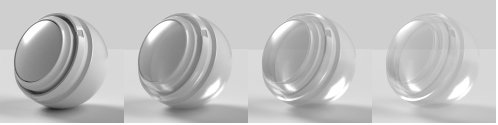
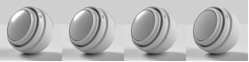

# Adobe Standard Material

>[!NOTE]
>
> Substance 3D Samplerは、Adobe Standardマテリアルではなく、デフォルトで[OpenPBR](openpbr.md)マテリアルモデルになりました。

## 標準マテリアルプロパティ

## 基準サーフェスプロパティ

**基本色**

サーフェスのカラー。

**粗さ**

表面の滑らかさまたはマットの度合い。

**メタリック**

表面の金属光沢の度合い。

**不透明度**

サーフェスの可視性。

**環境オクルージョン**

空洞や折り目からの影により、光がサーフェスに当たらないようにします。

**Specular level**

サーフェス上の光の反射の強度。

**Specular edge color**

光の反射の色。 メタリックマテリアルの傾斜角度に影響します。

**標準**

バンプや亀裂などのサーフェスのディテールをシミュレートします。

**標準スケール**

通常の効果の強さ。

**標準とHeightを組み合わせる**

Heightテクスチャの上に法線テクスチャを適用します。

**Height**

バンプまたはジオメトリディスプレイスメントを使用してサーフェスのディテールを作成します。

**Heightスケール**

Heightのスケールをシーン単位で指定します。 バンプとディスプレイスメントの両方に適用されます。

**Heightレベル**

ディスプレイスメントゼロを表すHeightテクスチャの値。

**異方性レベル**

サーフェスに沿って1方向に伸びる反射の量。

**異方性角度**

異方性効果の反時計回りの回転。

**発光強度**

サーフェスから放出されるライトの強度。

**発光色**

発光する光の色。

**光沢の不透明度**

サーフェス上の微細な繊維やぼやけの効果をシミュレートします。

**光沢カラー**

光沢エフェクトのカラー。

**光沢の粗さ**

光沢エフェクトの柔らかさ。

## 内部プロパティ

**半透明度**

サーフェスを透過できるライトの量。

**吸収カラー**

カラー光は吸収されるにつれて収束します。

**吸収の距離**

吸収カラーに達する前に光が通過するおおよその距離をシーン単位で表したもの。 0に設定した場合、Thicknessは吸収カラーに影響しません。

**屈折指数**

オブジェクトを通過するときに曲がる光の量。

**分散**

屈折したときにカラースペクトルが広がる量。

**サブサーフェスのスキャタリング**

散乱はサーフェスの下にライトを通過しますが、まっすぐに通過しません。

**散布カラー**

散乱光がサーフェスの下のカラーになります。

**散乱距離**

完全な散乱に達する前に、おおよその距離の光が進行しなければならない。

**散乱距離スケール**

散乱距離の乗数。 カラーチャンネルによって異なる場合があります。

**赤のシフト**

他の光の色よりも赤い光が先に進むように設定します。 肌に便利です。

**レイリー散乱**

サーフェスの下をオレンジ色のライトが移動し、下を青色のライトが移動するように設定します。

**ボリュームThickness**

オブジェクトの境界ボックスに対するサーフェスの相対Thickness。 実際のThicknessが不明な場合に、内部効果に使用されます。

**ボリュームThicknessスケール**

ボリュームThicknessの乗数。

## コートのプロパティ

**コートの不透明度**

マテリアルの上にレイヤーをシミュレートします。 クリアコート、ラッカー、ワニスの作成に使用します。

**コートの色**

コートの色。

**コートの粗さ**

毛の表面がどれほど滑らかで艶消しされているのか。

**コートの屈折率**

光の量はコートを通る時に曲がる。

**コートSpecular level**

斜めから見たときにコートに映る光の強さ。

**標準のコート**

毛の表面にバンプや亀裂などのサーフェスのディテールをシミュレートします。

**コート標準スケール**

コートの強さ通常の効果。
