# Adobe Standard Material

>[!NOTE]
>
> Substance 3D Samplerは、Adobe Standardマテリアルではなく、デフォルトで[OpenPBR](openpbr.md)マテリアルモデルになりました。

## 標準マテリアルのプロパティ

## 基準サーフェスプロパティ

**基本色**

サーフェスのカラー。

**粗さ**

表面の滑らかさまたはマットの度合い。

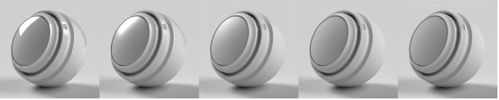

**メタリック**

サーフェスのメタリック光沢の度合い。

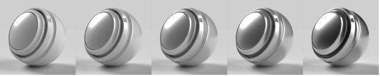

**不透明度**

サーフェスの可視性。

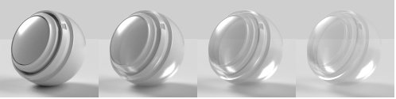

**環境オクルージョン**

空洞や折り目からの影により、光がサーフェスに当たらないようにします。

**Specular level**

サーフェス上の光の反射の強さ。

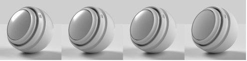

**Specular edge color**

光の反射の色。 メタリックのマテリアルの傾斜角度に影響します。

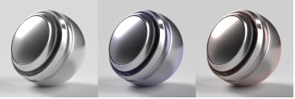

**標準**

バンプや亀裂などのサーフェスのディテールをシミュレートします。

**標準スケール**

通常の効果の強さです。

**標準とHeightを組み合わせる**

テクスチャの上に標準テクスチャを適用します。

**Height**

バンプまたはジオメトリディスプレイスメントを使用してサーフェスのディテールを作成します。

**Heightスケール**

Heightのスケール（シーン単位）。 バンプとディスプレイスメントの両方に適用されます。

**Heightレベル**

ゼロディスプレイスメントを表すHeightテクスチャの値。

**Anisotropy level**

サーフェスに沿って1方向に反射が伸縮する量。

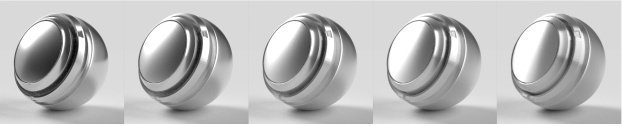

**Anisotropy angle**

異方性効果の反時計回りの回転。

**発光強度**

サーフェスから放出されるライトの強度。

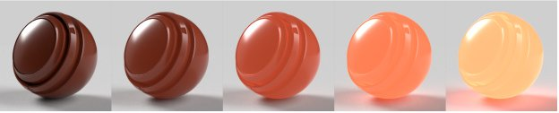

**発光色**

発光する光の色。

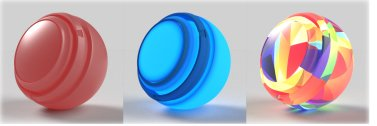

**光沢の不透明度**

サーフェス上の微細な繊維やぼやけの効果をシミュレートします。

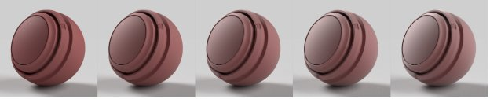

**光沢カラー**

光沢効果の色。

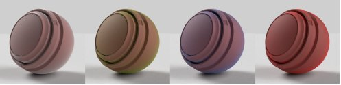

**ラフネス**

光沢効果の柔らかさ。

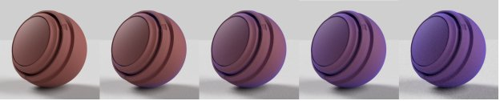

## 内部プロパティ

**Translucency**

サーフェスを透過できるライトの量。

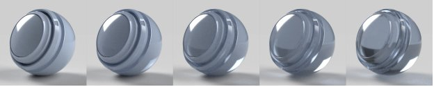

**吸収カラー**

カラー光は吸収されるにつれて収束します。

**吸収の距離**

光が吸収カラーに到達する前に通過するシーン単位の近似距離です。 0に設定した場合、Thicknessは吸収カラーに影響しません。

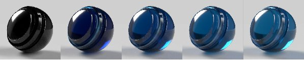

**屈折指数**

オブジェクトを通過するときに曲がる光の量。

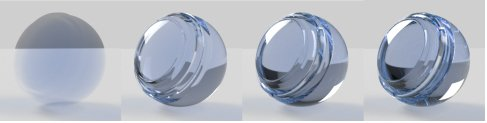

**分散**

屈折したときにカラースペクトルが広がる量。

**表面化散乱**

散乱はサーフェスの下にライトを通過しますが、まっすぐに通過しません。

**拡散カラー**

散乱光がサーフェスの下のカラーになります。

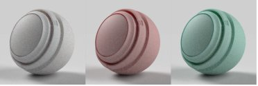

**散乱距離**

完全な散乱に達する前に、おおよその距離の光が進行しなければならない。

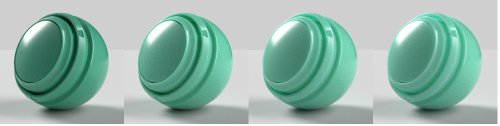

**散乱距離スケール**

散乱距離の乗数。 カラーチャンネルによって異なる場合があります。

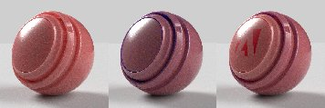

**赤のシフト**

他の光の色よりも赤い光が先に進むように設定します。 肌に便利です。

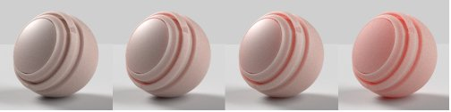

**レイリー散乱**

サーフェスの下をオレンジ色のライトが移動し、下を青色のライトが移動するように設定します。

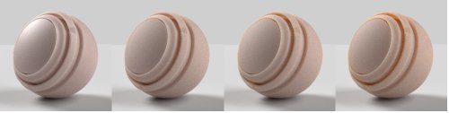

**ボリュームThickness**

オブジェクトの境界ボックスに対するサーフェスの相対Thickness。 実際のThicknessが不明な場合に、内部効果に使用されます。

**ボリュームThicknessスケール**

ボリュームThicknessの乗数。

## コートのプロパティ

**Coat opacity**

マテリアルの上のレイヤーをシミュレートします。 クリアコート、ラッカー、ワニスの作成に使用します。

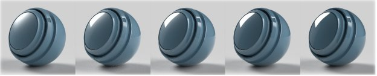

**コートの色**

コートの色。

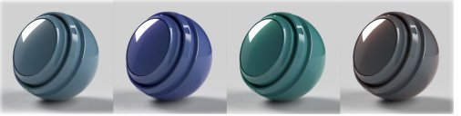

**Coat roughness**

毛の表面がどれほど滑らかで艶消しされているのか。

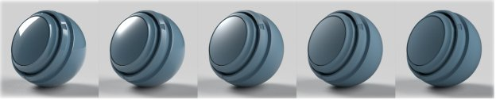

**コートの屈折率**

光の量はコートを通る時に曲がる。

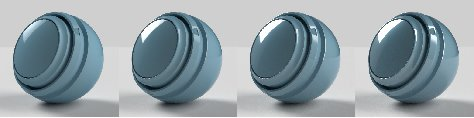

**Coat specular level**

光の反射の強さは、斜めにコートを照らします。

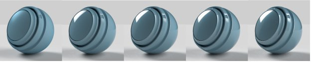

**Coat normal**

毛の表面にバンプや亀裂などのサーフェスのディテールをシミュレートします。

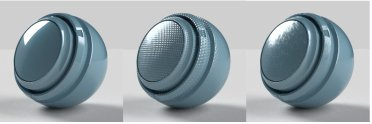

**コート標準スケール**

coat normal効果の強さ。
