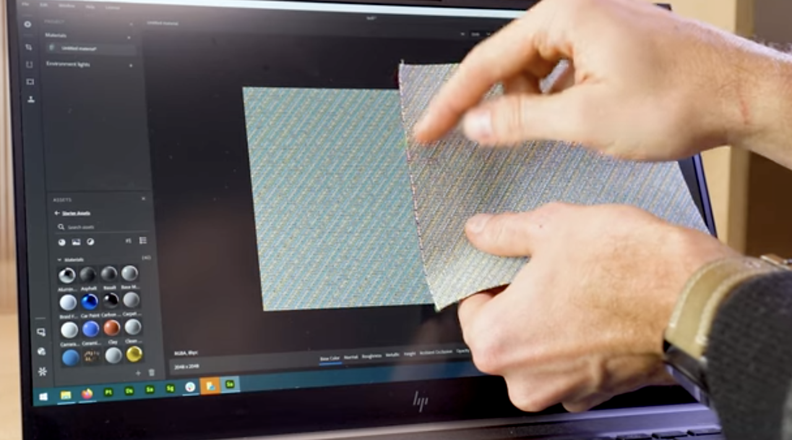

# エンドツーエンドの物理サイズワークフロー

スキャンしたサンプルと画像の実際の物理サイズをデジタルコンテキストで一致させることで、アプリケーション間で物理的に正確なビジュアルを実現します。

## スキャンを読み込み

1. マテリアル作成テンプレートを選択します。
1. 「物理サイズ」チェックボックスをオンにします。

   
1. 物理サイズを設定するには、次の2つの方法があります。

   3a. 「手動測定」をクリックします。「測定」ツールを使用すると、サンプルの2つのフィーチャー間の物理サイズを測定できます。\
   2点間のトラック – > enter

   

   3b. 自動測定 – 自動測定ツールを使用すると、画像メタデータ(dpi)に基づいてサンプルの推定物理サイズを取得できます。 高速ですが、保存されたdpiを使用して正確な開始サイズを計算するため、スキャンでのみ動作します。

   <b>スキャンを処理できるようになりました</b>
1. 切り抜きを追加し、サンプルに合わせて調整します。 2Dビューポートの右下コーナーに表示される物理サイズを確認できます。

   2Dビューポートに物理比率で表示して、作業中のマップを正確に表示します。\
   2Dビューを物理サイズに合わせて設定し、スクリーン比のDPIをマテリアルスケールに一致させることができます。 つまり、実際のサンプルを画面の横に置いて、寸法を確認できます。

   
1. 「平均化（イコライズ）」を追加して、グラデーションを取り除きます。
1. タイリングを追加して、タイリングが正しく見えるようにします
1. 必要に応じてワープ変形を行うと、マップの一部のみを再配置するのに便利です。

   <b>書き出し準備完了</b>
1. 書き出し形式

   Sbsar形式を選択すると、Samplerは物理サイズをメタデータとしてデータに挿入します。 この情報を他のアプリケーションでも読み取り、使用できるようになります。\
   画像を書き出すこともできます。書き出しでは、物理サイズ比が考慮されます。

   任意の時点で物理サイズを使用する必要がある場合は、*物理サイズパネル*&#x200B;を使用してください。

   画像として書き出す場合に、画像のサイズを強制的に物理サイズ比に設定できるようになりました。

## ビデオチュートリアル

また、この機能の使い方を説明するビデオチュートリアルもあります。
