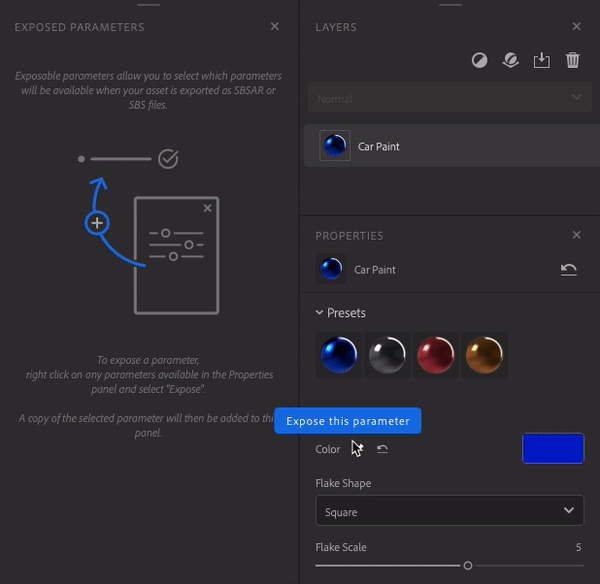

# パラメトリックアセットの書き出し

公開パラメーターは、Samplerに戻らなくても他のアプリケーションで変更できます。 これにより、反復時間が短縮され、アプリケーションを切り替えることなく、最適な外観を見つけることに集中できます。

## パラメーターの公開と公開解除

パラメーターを表示するには、**プロパティパネル**&#x200B;を開きます。 目的のパラメーターにカーソルを合わせるか右クリックし、ピンアイコンまたは「このパラメーターを公開する」をクリックします。

パラメーターの公開を解除するには、次の2つの方法があります。

* **表示されるパラーメーターパネル**&#x200B;で、パラメーターを右クリックし、「公開しない」を選択します。

  
* **プロパティパネル**&#x200B;で、十字ピンのアイコンをクリックするか、パラメーターを右クリックして「このパラメーターを公開しない」を選択します。

  

次のフィルターのパラメーターは公開できません：

* 画像からマテリアル (AI 搭載)
* コンテンツに応じた塗りつぶし
* Heightに垂直
* アップスケール

公開されたパラメーターを含むレイヤーの上にフィルターの1つを追加した場合、そのフィルターは書き出し時に公開されません。\
これを避けるには、フィルターを削除するか、露出したパラメーターを持つレイヤーに影響しない場所に配置します。

ブレンドからパラメータを公開した場合、スタックの一番下のレイヤを移動すると、それらのパラメータは失われます。

## パラメーターの編集

**表示されるパラーメーターパネル**&#x200B;でパラメーターのラベルを右クリックし、新しい名前を入力して「適用」をクリックします。

**表示されるパラーメーターパネル**&#x200B;のパラメーターは、**プロパティパネル**&#x200B;と同じように使用できます。

## 素材を書き出す

公開パラメーターを使用してマテリアルを書き出すには

1. <b>書き出しパネルを開きます。</b>
1. 書き出しをクリックします。
1. SBSARまたはSBSを選択します。
1. 「エクスポート」をクリックします。

SBSARファイル形式をサポートする任意のソフトウェアで、公開されたパラメーターを使用して素材を使用できるようになりました。
