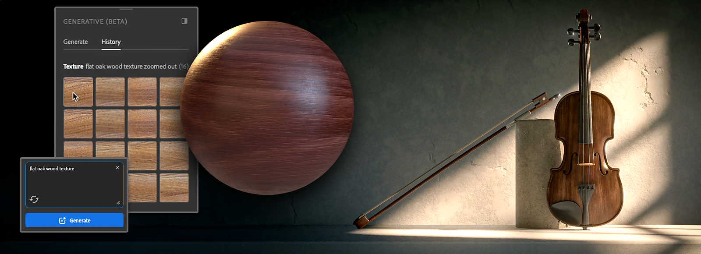

# 生成ワークフロー

Substance 3D Samplerでは、現在ベータ版、テクスチャテキスト化、パターン化テキストおよびテクスチャ画像の3つの生成機能により、新しいアイデアを簡単に繰り返し試すことができます。

## テキストからテクスチャ

テキストからテクスチャへの変換を使用すると、既存のアイデアをすばやく試して、テキストプロンプトからテクスチャを生成できます。

テクスチャ合成を使用するには：

1. 左側のツールバーから<b>生成（ベータ版） </b>パネルを開きます。
1. 「タイプ」ドロップダウンリストで、「<b>テクスチャ</b>」を選択します。
1. 作成するテクスチャについて説明するテキスト・プロンプトを記述します。
1. <b>生成</b>を使用して、テクスチャの生成を開始します。 この機能を使用するたびに、4つのバリエーションが生成されます。
1. 3Dビューまたは2Dビューで結果をドラッグアンドドロップして<b>マテリアル作成テンプレート</b>を開くか、専用ボタンを使用して<b>レイヤーに追加</b>できます。 結果は、<b>アセット</b>に追加して、後で簡単に見つけることもできます。

その結果は、他のテクスチャと同様に使用できます。例えば、画像からマテリアルへの実行とその上へのフィルターの追加などです。

### Text-to-Pattern

Text-to-Patternを使用すると、テキストプロンプトからすばやくパターンを生成できるので、好きなサーフェスに適用できます。

パターン合成を使用するには：

1. 左側のツールバーから<b>生成（ベータ版） </b>パネルを開きます。
1. 「タイプ」ドロップダウンリストで、「<b>パターン</b>」を選択します。
1. 作成するパターンを説明するテキストプロンプトを記述します。
1. <b>生成</b>を使用して、パターンの生成を開始します。 この機能を使用するたびに、4つのバリエーションが生成されます。
1. 専用のボタンを使用して、<b>パターンフィルター</b>の入力として追加するか、<b>レイヤー</b>に直接追加できます。 結果は、<b>アセット</b>ライブラリに追加して、後で簡単に見つけることもできます。

#### 画像からテクスチャ

<b>画像からテクスチャへの変換</b>では、比率に関係なく、<b>参照画像</b>から<b>正方形とタイリングのテクスチャ</b>の4つの命題が作成されます。 これにより、既に所有しているテクスチャの<b>バリエーションの作成</b>や、所有している参照画像からすぐに使用できるテクスチャの作成が可能になります。

イメージからテクスチャへの変換を使用するには：

1. 左側のツールバーから<b>生成（ベータ版） </b>パネルを開きます。
1. 「タイプ」ドロップダウンリストで、「<b>テクスチャ</b>」を選択します。
1. <b>画像をテキストフィールド</b>にドラッグ&amp;ドロップするか、「画像を追加」アイコンをクリックしてファイルエクスプローラーを開き、参照として使用する画像を選択します。
1. <b>生成</b>を使用して、参照画像から着想を得たテクスチャの生成を開始します。 この機能を使用するたびに、4つのバリエーションが生成されます。
1. 3Dビューまたは2Dビューで結果をドラッグ&amp;ドロップして<b>マテリアル作成テンプレート</b>を開くか、専用ボタンを使用して<b>レイヤー</b>に追加できます。 結果は、<b>アセット</b>に追加して、後で簡単に見つけることもできます。

## テクスチャまたはパターンのプロンプトを記述するためのヒント

生成する<b>テクスチャ</b>または<b>パターン</b>を表す<b>単語または式</b>を入力フィールドに追加します。 具体的に指定すると、生成される結果をより詳細に制御できます。

1つまたは複数の特定のプロンプトを<b>除外</b>するには、プロンプトの処理中に避ける単語または式を10個まで追加できます。 除外する単語または式の前に「<b>—no</b>」と書きます。 

また、ジェネレーティブ（ベータ版）パネルの<b>サンプル</b>を使用して、すぐにアイデアを見つけることもできます。

## クレジット生成

Samplerのジェネレーティブ機能は、ベータ版の間はクレジットを使用しません。

Adobeツール間でのクレジット生成の仕組みについて詳しくは、<b>クレジット生成に関するFAQ</b>を参照してください。
