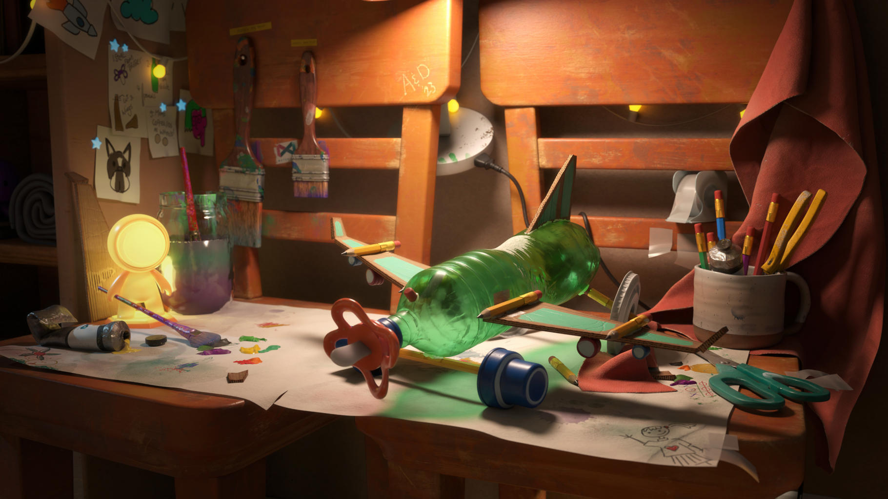

# Substance 3D SamplerのOpenPBR

OpenPBRは、さまざまな3Dツール、レンダラー、パイプラインにわたってマテリアルを表現するための一貫性のある予測可能な手段を提供するように設計された、オープンで物理的に基づいたサーフェスシェーディングモデルです。 このモデルは、さまざまな実世界のサーフェスを表現できる1つの包括的なマテリアルモデルを定義すると同時に、物理的に意味のあるパラメータを使用して、より定型化された、アーティスト主導の外観をサポートする十分な柔軟性を備えています。

Substance 3D Samplerでは、チャンネル設定でマテリアルをASM マテリアルモデルからOpenPBRに切り替えることができます。

ASMマテリアルをOpenPBR マテリアルモデルにエクスポートすることも、その逆も可能です。

>[!TIP]
>
> [fuzz](create-advanced-materials/fuzz.md)、[subsurface](create-advanced-materials/subsurface.md)、[coating](create-advanced-materials/coating.md)などのチャネルの使用を開始する場合は、[詳細マテリアルドキュメント](create-advanced-materials/advanced-materials.md)を参照してください。
