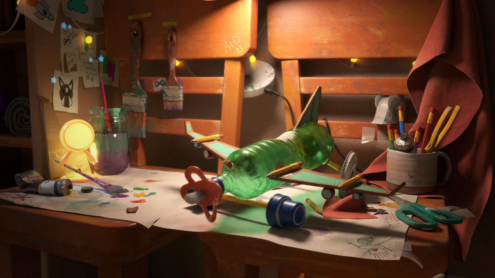

# Substance 3D SamplerのOpenPBR

OpenPBRは、オープンで物理的にベースのサーフェスシェーディングモデルであり、異なる3Dツール、レンダラー、パイプラインのマテリアルを記述するための一貫性のある予測可能な方法を提供するように設計されています。 このモデルは、さまざまな実世界のサーフェスを表現できる1つの包括的なマテリアルモデルを定義すると同時に、物理的に意味のあるパラメータを使用して、より定型化された、アーティスト主導の外観をサポートする十分な柔軟性を備えています。

Substance 3D Samplerでは、「チャンネル設定」でマテリアルをASM マテリアルモデルからOpenPBRに切り替えることができます。

ASMマテリアルをOpenPBR マテリアルモデルにエクスポートすることも、その逆も可能です。

>[!TIP]
>
> [ファズ](create-advanced-materials/fuzz.md)、[サブサーフェス](create-advanced-materials/subsurface.md)、[コーティング](create-advanced-materials/coating.md)などのチャンネルの使用については、[詳細マテリアルのドキュメント](create-advanced-materials/advanced-materials.md)を参照してください。
