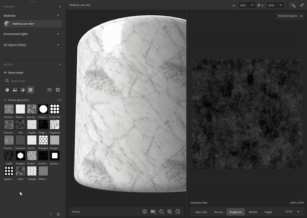

# テクスチャ生成

テクスチャジェネレーターでは、<b>パラメトリックノイズ、</b>パターン、<b>グランジ</b>オプションを使用して、マテリアルの作成をより詳細に制御できます。 生成された画像は、マスクまたはチャンネルマップで使用できます。

<table>
<tr style="border: 0;">
<td style="border: 0;" valign="top">

</td>
<td style="border: 0;" valign="top">

テクスチャジェネレーターは、Substance 3D Samplerのアセットの一種です。 テクスチャジェネレーターアイコンを使用して、アセットパネルでフィルターできます。

</td>
</tr>
</table>

## テクスチャジェネレーターの使用方法

### チャンネルマップ

3Dビュー、2Dビューまたはレイヤースタックにテクスチャジェネレーターをドラッグ&amp;ドロップし、使用するチャンネルを選択します。

塗りつぶしフィルターは、右側の入力にテクスチャジェネレーターを使用してスタックに作成されます。 プロパティパネルでテクスチャジェネレーターのプロパティにアクセスできます。

#### フィルター

<b>寄木</b>などの一部のフィルターでは、パターンマスクに既定のテクスチャジェネレーターが使用されます。また、<b>パターン</b>フィルターのように、画像やテクスチャ生成ツールを使用して作業するものもあります。\
フィルターでは、任意の画像プロパティ（例： <b>カスタムマスク</b>）でテクスチャジェネレーターを使用できます。

フィルターを使用すると、操作するジェネレーターを提案できます。画像プロパティをクリックすると、新しいアセットピッカーに表示されます。

#### チュートリアル

Substance 3D Samplerのすべてのチュートリアルは、[ラーニングページ](https://creativecloud.adobe.com/cc/learn/app/substance-3d-sampler)にあります。

[Samplerのテクスチャジェネレーターを使用したテキスタイルデザイン](https://creativecloud.adobe.com/cc/learn/substance-3d-sampler/web/fabric-texture-generator?locale=en)

[Substance 3D Samplerを使用すれば数分で素材の炭素繊維を作成](https://creativecloud.adobe.com/cc/learn/substance-3d-sampler/web/create-carbon-fiber-material?locale=en)

[Substance 3D Samplerを使用して格子縞の生地を数分で作成](https://creativecloud.adobe.com/cc/learn/substance-3d-sampler/web/create-plaid-fabric-material?locale=en)

## カスタムテクスチャジェネレーターを作成する方法

Adobe Substance 3D Designerで作成したテクスチャジェネレーターは、レイヤースタックアクションの「*読み込み*」ボタンを使用して読み込むことができます。 Samplerに読み込まれた状態で正しく動作するには、Designerに特別な方法で構築する必要があります。

### タイプ

グラフ<b>の種類</b>として、[テクスチャジェネレーター]を選択します。

#### 出力

フィルターのフィルターの出力ノードには、<b>識別子</b>または<b>使用法</b>が定義されている必要があります。

* テクスチャジェネレーターのメイン出力は使用できません。 これにより、3D Samplerでメイン出力として認識できます。

<table>
<tr style="border: 0;">
<td style="border: 0;" valign="top">

</td>
<td style="border: 0;" valign="top">

</td>
</tr>
</table>

* テクスチャジェネレーターの<b>セカンダリ出力</b>には<b>使用方法</b>が必要です。\
  グループ名は、メイン出力<b>Identifier</b>になります。

>[!NOTE]
>
> 独自のフィルターとテクスチャジェネレーターを構築して連携を機能させる場合、<b>出力識別子</b>に従って<b>カスタム使用</b>することをお勧めします。

<table>
<tr style="border: 0;">
<td style="border: 0;" valign="top">

</td>
<td style="border: 0;" valign="top">

</td>
</tr>
</table>

>[!IMPORTANT]
>
> カスタムテクスチャジェネレーターをフィルターの推奨アセットリストに含める場合は、Substanceグラフに次のユーザーデータを追加する必要があります。
> 
> alchemist::suggestedfilters=[FilterName,FilterName2];

>[!NOTE]
>
> userdataは、[カスタムフィルター](../filters/custom-filters.md)で使用できます。

#### 書式設定

フィルターをSubstanceアーカイブファイル(.sbsar)としてエクスポートします

>[!NOTE]
>
> Samplerでは、フィルターパラメーターを公開して、フィルターを直接制御できます。 [こちら](https://experienceleague.adobe.com/en/docs/substance-3d-designer/using/substance-graphs/manage-parameters/exposing-a-parameter)を参照してください
