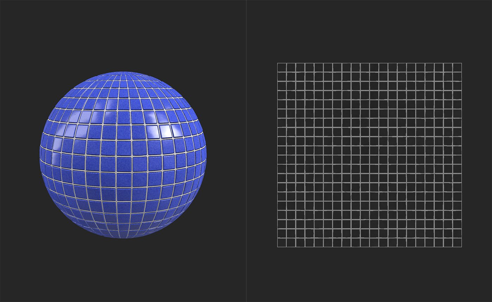
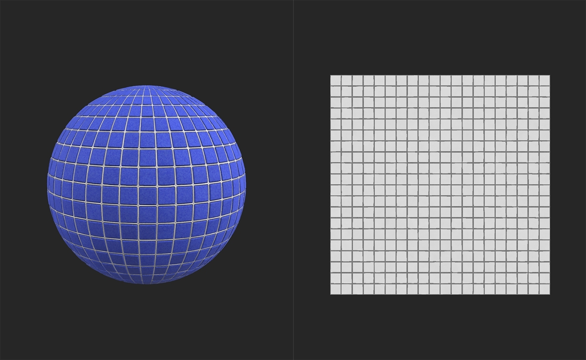

# 反転

<table>
<tr style="border: 0;">
<td width="41.60%" style="border: 0;" valign="top">

**内：**&#x200B;調整

</td>
<td width="58.30%" style="border: 0;" valign="top">

## 説明

マテリアルの個々のチャンネルを反転します。

下の画像は、タイルマテリアルの粗さチャンネルを反転した場合の影響を示しています。

反転させる前に、タイルに光沢があり、環境光を明確に反射しています。

反転後、タイルはマットで、Specularのハイライトが強くありません。

</td>
</tr>
</table>

## パラメーター

**基本パラメーター**

トグルを使用すると、各チャンネルを個別に反転できます。 トグルを有効にすると、チャンネルが反転します。 3Dビューで結果が表示されない場合は、2Dビューの下部にあるチャンネルを選択して、その影響を確認してください。

**マスク**

* **カスタムマスクを使用**：切り替え\
  カスタムマスクの使用を有効または無効にします。 有効にすると、次のパラメーターが表示されます。
  * **マスク**：画像/ブラシ\
    マスクとして使用する画像を選択するか、ブラシを使用して2Dビューでカスタムマスクを直接ペイント
  * **カスタムマスク – ぼかし**: 0-1\
    マスクをぼかす
  * **カスタムマスク – 反転**：切り替え\
    マスクを反転

## 使用方法ガイド
