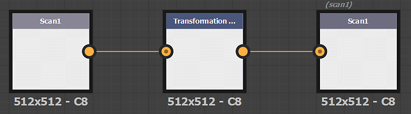
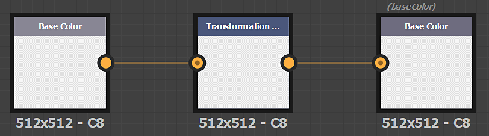
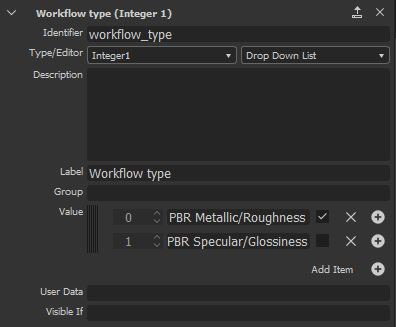

# カスタムフィルター

## Substanceカスタムフィルター

Adobe Substance 3D Designerで作成したフィルターは、レイヤースタック操作の「*読み込み*」ボタンを使用して読み込むことができます。

### Substanceフィルターの作成

Samplerに読み込まれたフィルターが正しく動作するには、Designerに特別な方法でフィルターを作成する必要があります。

フィルターの入出力ノードには、識別子または使用法が定義されている必要があります。

>[!NOTE]
>
> **使用法**&#x200B;または&#x200B;**識別子**&#x200B;のいずれかを使用できます（使用法が優先されます）。

#### 書式設定

フィルターをSubstanceのアーカイブファイル(.SBSAR)として書き出します

>[!NOTE]
>
> Samplerでは、フィルターパラメーターを表示して、フィルターを直接制御できます。 [こちら](https://experienceleague.adobe.com/ja/docs/substance-3d-designer/using/substance-graphs/manage-parameters/exposing-a-parameter)を参照してください

#### 画像を変更するフィルターの作成

| 画像名 | 使用状況 |
| --- | --- |
| *スキャン1* | **スキャン1** |
| *スキャン2* | **scan2** |
| *...* | **...** |

#### フィルターを作成してチャンネルを変更する

| チャンネル名 | 使用状況 |
| --- | --- |
| *基本色* | **ベースカラー** |
| *拡散* | **拡散** |
| *Specular* | **Specular** |
| *Specular level* | **specularlevel** |
| *メタリック* | **メタリック** |
| *粗さ* | **ラフネス** |
| *光沢* | **光沢** |
| *標準* | **通常** |
| *Height* | **Height** |
| *環境オクルージョン* | **アンビエントオクルージョン** |
| *不透明度* | **不透明度** |

>[!IMPORTANT]
>
> Samplerのカスタムフィルターを作成する場合は、Substanceグラフに次のユーザーデータを追加する必要があります。
>
> alchemist::type=filter;

>[!IMPORTANT]
>
> パッケージ内に、画像を処理するグラフ（scan1からscanX）とマテリアルを処理するグラフ（PBRチャンネル）が1つある場合、Samplerは、レイヤースタックのどこにフィルターが挿入されるかに応じて適切なグラフを選択できます。
>
> 「画像」グラフで、次のユーザーデータを追加します。
>
> * alchemist::type=filter;alchemist::variation::type=multi
>
> 「マテリアル」グラフで、以下のuserdataを追加します。
>
> * alchemist::type=filter;alchemist::variation::type=マテリアル

### 特定のパラメーター

特定のパラメータは、アプリケーションによってグローバルに管理されます。 アプリケーション、プロジェクト、レイヤースタックのグローバルパラメーターをカスタムフィルターで使用できます。

#### 法線の形式

アプリケーションの通常の形式を制御します。 SamplerでDirectXに設定

**パラメーターの識別子**: normalformat、normal_format、$normalformat、$normal_format

#### 入力カウント

イメージ（scan1からscanX）を変更する場合は、**Image Count**&#x200B;パラメーターを使用して、レイヤースタック内のイメージの数を使用できます。

* **パラメーターID**: input_count
* **パラメーターの型**: 整数1

#### マテリアルの入力

Atlas Scatterやスプラッタなどのマテリアルスロットをレイヤースタックに表示する場合は、次の手順を実行します。

* 新しい入力ノードのセットを追加します(ベースカラー(Base Color)、法線(Normal)、...)
* 背景のすべての入力ノード（レイヤースタックの下部のマテリアル）は、グループ&#x200B;**マテリアル1**&#x200B;に含まれている必要があります
* 複数のマテリアルスロットを使用する場合は、最初に追加するマテリアルのすべての入力ノードをグループ&#x200B;**マテリアル2**&#x200B;に含める必要があります。
* 入力パラメーターを追加します。
  * **パラメーター識別子**: material_input
  * **パラメーターの型**: 整数1

#### ワークフロータイプ

プロジェクトのワークフロー（PBRメタル/粗さまたはPBR Specular/光沢）に基づいて一部のパラメータの表示/非表示を切り替える場合は、[ワークフローの種類]パラメータを使用できます

**パラメーターの識別子**: workflow_type

**パラメーターの種類**: 整数1、ドロップダウンリスト

オプション：

* 0: PBRメタリック/ラフネス
* 1: PBR Specular/光沢

{width="300px"}
