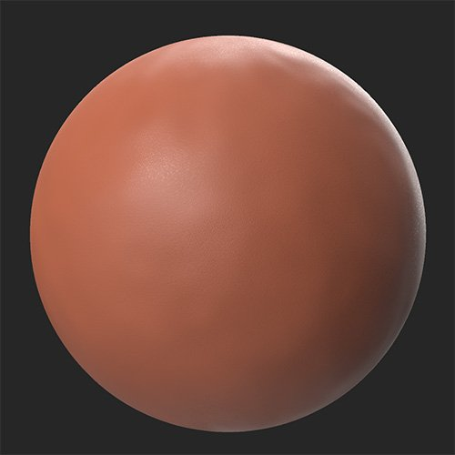

# れんが塀

<table>
<tr style="border: 0;">
<td width="41.60%" style="border: 0;" valign="top">

**In:**&#x200B;ジェネレーター

</td>
<td width="58.30%" style="border: 0;" valign="top">

説明レンガ壁フィルターは、その下のレイヤーに基づいてレンガのパターンを生成します。 これは、レンガの壁（名前が示すように）を作成する場合に便利ですが、床やその他の場所でもレンガが使用されます。

次の画像では、**レンガの壁フィルター**&#x200B;を使用して、粘土の材料をレンガの壁に変換しています。

<table>
<tr style="border: 0;">
<td style="border: 0;" valign="top">

{width="200px"}

</td>
<td style="border: 0;" valign="top">

{width="200px"}

</td>
</tr>
</table>

</td>
</tr>
</table>

## パラメーター

**プリセット**

多数のプリセットから選択して、特定のスタイルを素早くエミュレートできます。

**基本パラメーター**

* **ランダムシード**:ランダムな数値\
  このフィルタで他のランダム値を決定するために使用するランダム値。\
  新しいランダム値を取得するには、数値をクリックします。 ランダムな値が選択されている場合、パラメータ名をクリックして値を0にリセットします。
* **レンガの積み方**:\
  選択したスタイルに基づいてれんがを結合
* **ブリックの種類**:\
  レンガのスタイルを選択
* **タイル**: 1 ～ 25\
  X軸とY軸のタイリングの量を変更します。
* **オフセット**: 0 ～ 1\
  前の行からのレンガの各行のオフセットを修正します。
* **カスタムカラーを使用**：切り替え\
  選択したスタイルに基づいてれんがを結合

**ミックス**

* **ミックスモード**:\
  レンガの整理方法を変更します。 **ミックスモード**&#x200B;を使用すると、ベースセットから個別に制御できる2番目のブリックセットが作成されます。\
  **ミックスモード**&#x200B;を&#x200B;**なし**&#x200B;に設定すると、このセクションには他のパラメーターは表示されません。
* **ブリックの種類2**:\
  2番目のレンガセットのスタイルを選択します。
* **Heightオフセット**: 0 ～ 1\
  2番目のレンガセットのHeightのオフセット

**セメント**

* **目地の色**:カラーピッカー\
  レンガ間のセメントの色を変更します。
* **目地の粗さ**: 0 ～ 1\
  レンガ間のセメントの粗さを変更します。
* **目地**: 0-1\
  レンガ間のセメントの幅を変更します。 レンガのサイズを変更します。
* **目地**: 0 ～ 1\
  セメントのHeightを変える
* **目地**: 0-1\
  セメントの平面度を調整します。 高い値では、セメントはレンガの上に上昇することができます。

**年齢**

* **レンガの乱雑さ**: 0-1\
  レンガの回転を3次元ランダムに調整します。
* **レンガのひび割れ**: 0-1\
  レンガの亀裂の追加
* **レンガのエッジ**: 0 ～ 1\
  れんがのエッジを傷つけて壊す
* **レンガの抜け**: 0-1\
  ランダムにレンガを削除
* **レンガのカラーバリエーション**: 0 ～ 1\
  レンガのカラーを変えて壁の統一感を弱める
* **レンガの汚れ**: 0-1\
  レンガにDirtを加える

**詳細パラメーター**

* **Heightのブレンド強度**: 0 ～ 1\
  ベースマテリアルからHeightのブレンドを調整します。 値を0に設定すると、ベースマテリアルのHeightは無視され、ブリックウォールフィルターパラメーターのみを使用してHeight情報が生成されます。 値を1に設定すると、ベースマテリアルを使用してHeight情報が生成されます。
* **法線の強度**: 0 ～ 1\
  レンガ壁フィルタによって生成された法線の強度を調整します。 値を0に設定すると、法線は適用されません。
* **周囲オクルージョンの強さ**: 0 ～ 1\
  AOの強度を調整します。 値を0に設定すると、アンビエントオクルージョンは無効になります。

使用方法ガイド

レンガの壁フィルターは、下になっているマテリアルを個々のレンガに分解し、並べ替えます。 このため、レンガ壁フィルターは、岩や金属などの硬い表面、つまり現実世界のレンガに最も適したマテリアルで最適に機能します。

低歪高精度フィルターは、ベースマテリアルを作成して、コケ、雪、Dirtなどのエフェクトを重ねるのに便利です。
