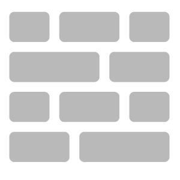
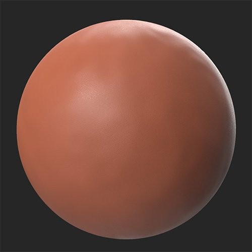
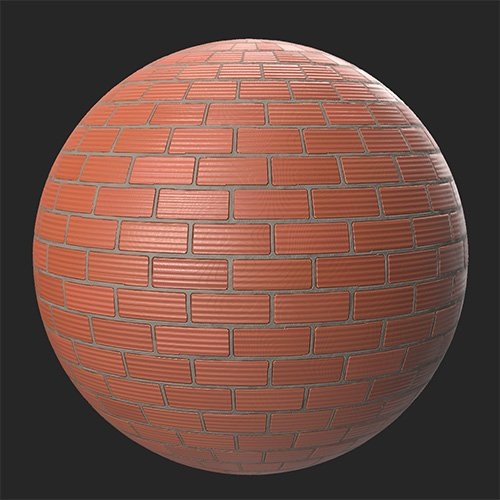

# れんが塀

<table>
<tr style="border: 0;">
<td width="41.60%" style="border: 0;" valign="top">

**In:**&#x200B;ジェネレーター

</td>
<td width="58.30%" style="border: 0;" valign="top">

説明ブリックウォールフィルターは、その下のレイヤーに基づいてレンガパターンを生成します。 この機能は、（名前が示すように）レンガ壁を作成する場合に便利ですが、床やその他の場所でもレンガが使用されます。

下の画像では、粘土のマテリアルが&#x200B;**低歪高精度フィルター**&#x200B;を使用してレンガの壁に変換されています。

<table>
<tr style="border: 0;">
<td style="border: 0;" valign="top">

{width="200px"}

</td>
<td style="border: 0;" valign="top">

{width="200px"}

</td>
</tr>
</table>

</td>
</tr>
</table>

## パラメーター

**プリセット**

多数のプリセットから選択して、特定のスタイルを素早くエミュレートできます。

**基本パラメーター**

* **ランダムシード**:ランダムな数値\
  このフィルタで他のランダム値を決定するために使用するランダム値。\
  新しいランダム値を取得するには、数値をクリックします。 ランダムな値が選択されている場合、パラメータ名をクリックして値を0にリセットします。
* **レンガ債券**:\
  選択したスタイルに基づいてれんがを結合
* **レンガの種類**:\
  レンガのスタイルを選択
* **タイル**: 1 ～ 25\
  「X」および「Y」軸でタイリングの量を変更します。
* **オフセット**: 0 ～ 1\
  前の行からのレンガの各行のオフセットを変更します。
* **カスタムカラーを使用**：切り替え\
  選択したスタイルに基づいてれんがを結合

**ミックス**

* **ミックスモード**:\
  レンガの整理方法を変更します。 **ミックスモード**&#x200B;を使用すると、ベースセットとは別に制御できる2つ目のレンガセットが作成されます。\
  **ミックスモード**&#x200B;を&#x200B;**なし**&#x200B;に設定すると、このセクションには他のパラメーターは表示されません。
* **レンガの種類2**:\
  2番目のレンガセットのスタイルを選択します。
* **Heightオフセット**: 0 ～ 1\
  2番目のレンガセットのHeightをオフセットする

**セメント**

* **目地の色**:カラーピッカー\
  レンガ間のセメントの色を変えます。
* **セメントラフネス**: 0-1\
  レンガ間のセメントのラフネスを変える。
* **目地**: 0-1\
  レンガ間のセメントの幅を変更します。 レンガサイズを変更します。
* **目地**: 0 ～ 1\
  セメントのHeightを変える
* **目地**: 0-1\
  セメントの平面度を調整します。 高い値では、セメントはレンガの上に上昇することができます。

**年齢**

* **レンガ障害**: 0-1\
  レンガの回転を3次元ランダムに調整します。
* **レンガ粉砕**: 0-1\
  レンガに亀裂を追加
* **レンガエッジ**: 0 ～ 1\
  レンガの縁を傷つける、折る
* **レンガが取り消されました**: 0 ～ 1\
  レンガをランダムに削除
* **レンガのカラーバリエーション**: 0 ～ 1\
  レンガのカラーを変更して、壁の表示を不均一にします
* **レンガの汚れ**: 0 ～ 1\
  レンガにDirtを追加

**詳細パラメーター**

* **ブレンドの強さ**: 0 ～ 1\
  ベースマテリアルからHeightのブレンドを調整します。 値を0に設定すると、ベースマテリアルのHeightは無視され、ブリックウォールフィルターパラメーターのみを使用してHeight情報が生成されます。 値を1に設定すると、ベースマテリアルを使用してHeight情報が生成されます。
* **法線の強度**: 0 ～ 1\
  Brickwallフィルタによって生成された法線の強さを調整します。 値を0に設定すると、法線は適用されません。
* **Ambient occlusionの強さ**: 0 ～ 1\
  AOの強さを調整します。 値を0に設定すると、事実上Ambient occlusionは行われません。

使用方法ガイド

低歪高精度フィルターは、下にあるマテリアルを個々のレンガに分解して、並べ替えます。 そのため、レンガ壁フィルターは、岩や金属などの硬い面、つまり現実世界のレンガに最も適したマテリアルで最適に機能します。

低歪高精度フィルターは、ベースマテリアルを作成して、コケ、雪、Dirtなどのエフェクトを重ねるのに便利です。
