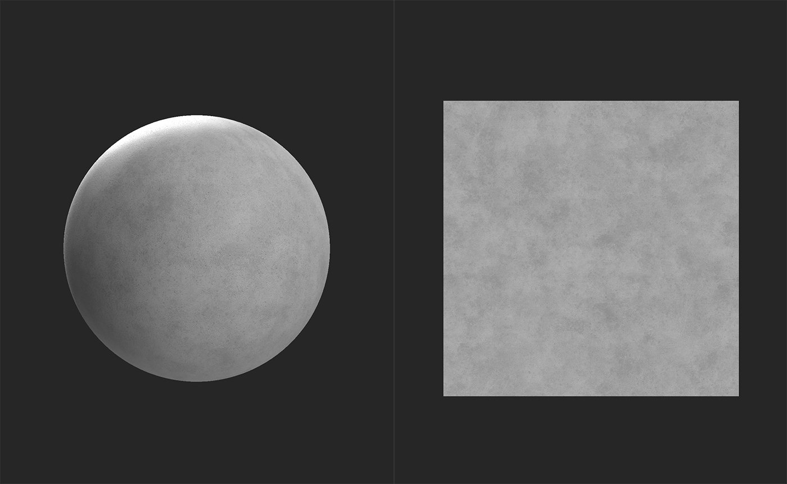
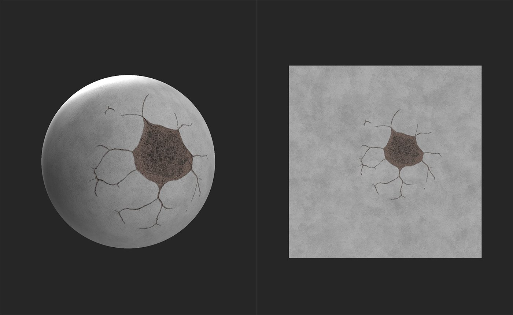

# デカール

<table>
<tr style="border: 0;">
<td width="41.60%" style="border: 0;" valign="top">

**In:**&#x200B;ジェネレーター

</td>
<td width="58.30%" style="border: 0;" valign="top">

## 説明

デカールフィルターを使用すると、特定の場所に別のマテリアルのインスタンスを追加できます。 これは、ステッカーや、手続きには簡単には作成できない特定のディテールなどを追加する場合に便利です。

下の画像は、コンクリートに損傷を与えるために使用されている&#x200B;**デカールフィルター**&#x200B;を示しています。

デカールを追加する前に、コンクリート基層はクリーンで損傷がありません。

**デカールフィルター**&#x200B;を適用すると、素材にリアルな亀裂とダメージが加わります。

</td>
</tr>
</table>

## パラメーター

**基本パラメーター**

* **並べて表示モード**:\
  **2Dビュー**&#x200B;のハンドルを超えて並べて表示するかどうかを決定します。\
  Hは水平を表し、Vは垂直を表します。
* **下のマテリアルの色の一致**: 0-1\
  デカールのマテリアルのカラーを、その下にあるレイヤーのカラー値に合わせて調整します。
* **通常の描画モード**:\
  デカールマテリアルと下にあるレイヤ間の法線のブレンド方法を調整する
* **標準の不透明度ブレンド**: 0 ～ 1\
  デカールマテリアルの法線の不透明度を変更する
* **デカールのHeight位置**: 0-1\
  下にあるレイヤーHeightを基準にしてデカールのHeightを調整
* **デカールのHeightスケール**: 0 ～ 1\
  デカールマテリアルのHeightマップのコントラストを変更する

**詳細パラメーター**

* **デカールの変換**:\
  デカールのマトリックス変換値を調整します。 通常、**2Dビュー**&#x200B;のハンドルを使用するだけで、デカールの変形を調整できます。
* **デカール** **オフセット**: -1 ～ 1\
  デカールのオフセットを調整します。

## 使用方法ガイド

デカールフィルターを使用するには：

1. レイヤースタックへのデカールフィルターの追加
1. デカールレイヤーの下に入力スロットが表示されます
1. デカールマテリアルをデカールレイヤーの入力スロットにドラッグします

デカールレイヤーを選択して、**プロパティパネル**&#x200B;のフィルターパラメーターを調整できます。

**プロパティパネル**&#x200B;のデカール入力マテリアルのパラメーターを調整するには、入力スロットでマテリアルを選択します。
