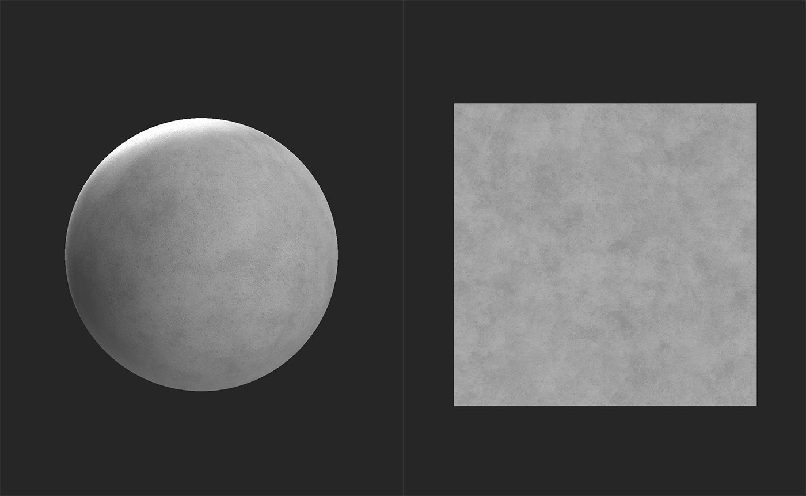
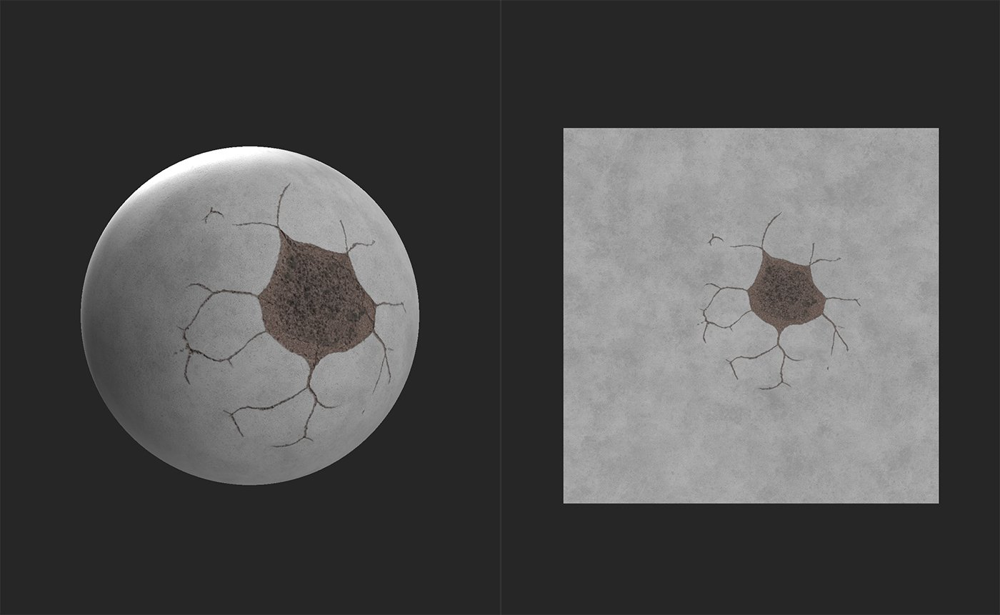

# デカール

<table>
<tr style="border: 0;">
<td width="41.60%" style="border: 0;" valign="top">

**In:**&#x200B;ジェネレーター

</td>
<td width="58.30%" style="border: 0;" valign="top">

## 説明

デカールフィルターを使用すると、同じ場所に別のマテリアルのインスタンスを作成することができます。 これは、ステッカーや、手続きには簡単には作成できない特定のディテールなどを追加する場合に便利です。

下の画像は、コンクリートに損傷を与えるために使用されている&#x200B;**デカールフィルター**&#x200B;を示しています。

デカールを追加する前に、コンクリート基層はクリーンで損傷がありません。

**デカールフィルター**&#x200B;を適用すると、リアルな亀裂とダメージがマテリアルに加わります。

</td>
</tr>
</table>

## パラメーター

**基本パラメーター**

* **タイリングモード**:\
  **2D ビュー**&#x200B;のハンドルを超えて並べて表示するかどうかを指定します。\
  Hは水平を表し、Vは垂直を表します。
* **下のマテリアルの色の一致**: 0-1\
  デカールのマテリアルの色を、その下にあるレイヤーのカラー値に合わせて調整します。
* **通常の描画モード**:\
  デカールマテリアルと下のレイヤーの法線のブレンド方法を調整
* **標準の不透明度ブレンド**: 0 ～ 1\
  デカールマテリアルの法線の不透明度を変更する
* **デカールのHeight位置**: 0-1\
  下にあるレイヤーHeightを基準にしてデカールのHeightを調整
* **デカールのHeightスケール**: 0 ～ 1\
  デカールのマテリアルの高さマップのコントラストを変える

**詳細パラメーター**

* **デカールの変換**:\
  デカル転写のマトリックス変形の値を調整します。 通常、**2D ビュー**&#x200B;のハンドルを使用するだけで、デカールの変形を調整できます。
* **デカール** **オフセット**: -1 ～ 1\
  デカールのオフセットを調整します。

## 使用方法ガイド

デカールフィルターを使用するには：

1. デカールフィルターをレイヤースタックに適用する
1. デカールレイヤーの下に入力スロットが表示されます
1. デカールのマテリアルをデカールレイヤーの入力スロットにドラッグします

デカールレイヤーを選択して、**プロパティパネル**&#x200B;のフィルターパラメーターを調整できます。

**プロパティパネル**&#x200B;のデカール入力マテリアルーのパラメーターを調整するには、入力スロットのマテリアルーをクリックします。
