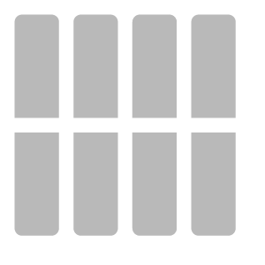
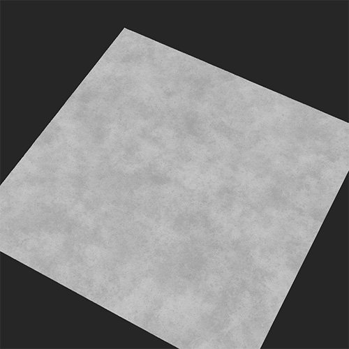
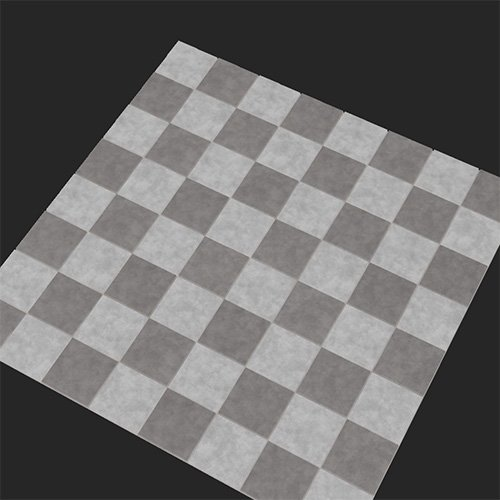

# 下限タイル

<table>
<tr style="border: 0;">
<td width="41.60%" style="border: 0;" valign="top">

**In:**&#x200B;ジェネレーター

</td>
<td width="58.30%" style="border: 0;" valign="top">

## 説明

床タイルフィルタは、下にあるマテリアルを分割し、床タイルの配列に変換します。

下の図は、チェッカーパターンを使用して床タイルに変換されたコンクリートマテリアルを示しています。

<table>
<tr style="border: 0;">
<td style="border: 0;" valign="top">

{width="200px"}

</td>
<td style="border: 0;" valign="top">

{width="200px"}

</td>
</tr>
</table>

</td>
</tr>
</table>

パラメーター

<b>基本パラメーター</b>

* <b>ランダムシード</b>: \
  ランダムシードは、このフィルターのランダム度を使用する他のパラメーターのランダム値を決定します。
* <b>マテリアル数</b>: \
  床タイルに変換するマテリアルの数を変更します。 最初のマテリアルは、下限タイルフィルターのレイヤーの下にあるレイヤーによって決定されます。 選択した場合、2番目の値を入力として追加できます
* <b>入力マテリアルの強度</b>: 0-1 \
  タイルに表示される入力マテリアルの詳細の量
* <b>マテリアルの反転</b>：切り替え \
  2つのマテリアルを使用する場合は、タイル内のどこに表示されるかを交換します。
* <b>カラーバリエーション</b>: 0 ～ 1 \
  同じマテリアルの各タイル間で異なる色の量
* <b>ベベルの半径</b>: 0 ～ 1 \
  タイルのサイズとモルタルのサイズの対比
* <b>ベベル深度</b>: 0-1 \
  モルタルの深度
* <b>ベベルの丸み</b>: 0 ～ 1 \
  タイルの外側の角度を決定
* <b>表面の粒子</b>: 0-1 \
  タイルの標準および高さマップ上に元のマテリアルの詳細がどの程度表示されるかを指定します
* <b>パターンマスク</b>：入力。  \
  下限タイルパターンマスクごとに、使用できるパラメーターのセットが異なります。 ここでは、<b>正方形タイル</b>で使用できるパラメーターのみを説明します

  * <b>ランダムシード</b>\
    ランダムシードは、このフィルターのランダム度を使用する他のパラメーターのランダム値を決定します。
  * <b>X金額</b>\
    タイルの列数の調整
  * <b>Y金額</b> \
    タイルの行数を調整する
  * <b>グラデーション</b> \
    モルタルのサイズに対するタイルのサイズの比率を調整します。
  * <b>輝度ランダム</b>\
    輝度が高さマップに影響するので、このパラメーターを使用すると、一部のタイルがランダムに削除されます
  * <b>パターンの回転</b>: 0 ～ 1 \
    重なりを避けるためにタイルを互いに離した状態で回転させます
  * <b>シェイプのスケール：</b> 0-1 \
    モルタルのサイズに対するタイルのサイズの比率を調整します。
  * <b>図形のスケールのランダム</b>\
    タイルのサイズにランダムな差を加えます
  * <b>図形サイズ</b>\
    タイルの長さと幅を調整
  * <b>図形サイズのランダム</b>\
    タイルの長さと幅にランダム度を追加します
  * <b>位置オフセットモード</b>:ドロップダウンリスト
  * <b>位置オフセット</b>\
    タイルが水平方向に揃わないように、タイルの列をランダムに移動します
  * <b>ランダムな配置</b> \
    タイルをランダムにサーフェス上に配置し、タイル間の重なりを考慮します
  * <b>図形の回転</b>\
    タイルの角度を同じ方向に回転させ、重なり合う可能性のあるできるだけ近い位置に維持します
  * <b>図形のランダムな回転</b>\
    タイルの角度をランダムに回転させ、重ね合わせる可能性のあるできるだけ近い角度に保ちます

<b>ギャップ</b>

* <b>ギャップの色</b>:カラーの選択 \
  タイル間のカラーの変更
* <b>ギャップのラフネス</b>: 0-1 \
  タイル間のマテリアルの粗さの値を変更します。
* <b>ギャップメタリック</b>: 0-1 \
  タイル間のマテリアルのメタリック値を変更します。
* <b>ギャップのHeight</b>: 0-1 \
  タイル間のマテリアルのHeight値を変更します。
* <b>ギャップの不規則性</b>: 0 ～ 1 \
  タイル間にモルタルを適切に適用する度合いを調整します。

<b>年齢</b>

* <b>下限の傾き</b>: 0 ～ 1 \
  ランダムなタイルへの傾きの追加
* <b>Heightランダム</b> \
  タイル間のHeight差をランダムに追加
* <b>Dirt</b>: 0 ～ 1 \
  タイルとギャップにDirtを加える
* <b>損害</b>: 0-1 \
  各タイルのベベルのエッジから、ランダムにシャードを削除します
* <b>問題点</b> \
  タイルに小さな穴や汚れを追加する

<b>技術パラメーター</b>

* <b>マテリアルスケール</b>: 0 ～ 1 \
  タイル内のマテリアルの尺度
* <b>法線の強度</b>: 0 ～ 1 \
  間隔の法線、タイル、マテリアルの強さを調整します

<b>使用方法ガイド</b>

下限タイルフィルターを使用すると、マテリアルをすばやくタイルに変換できます。 下限タイルフィルターは、複数のマテリアルを使用する場合を除いて、ほとんどの場合かなり使いやすくなっています。 2つのマテリアルを使用するには、次の手順に従います。

1. <b>基本パラメーター> マテリアル数</b>を2に設定します。
1. 2番目のマテリアルを、レイヤースタックの下限タイルフィルターの下にある入力スロットにドラッグします。
1. 目的の結果が得られるまで、入力マテリアルのパラメーターを調整します。

1つの入力スロットに複数のマテリアルやフィルタを入れることは可能ですが、入れ替えが複雑になって後でマテリアルを読みにくくなるため、これは避けた方がよいでしょう。 代わりに、プロジェクト内に新しいマテリアルを作成し、新しいマテリアルのインスタンスを入力スロットにドラッグします。 プロジェクトのマテリアルを更新すると、入力スロットのマテリアルが自動的に更新されるため、レイヤースタックを自由に操作して簡単に行えます。
