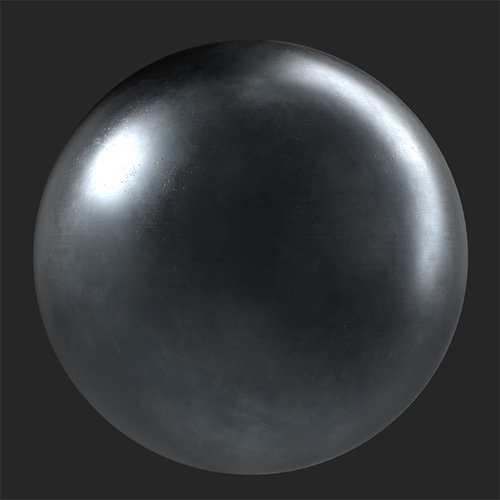
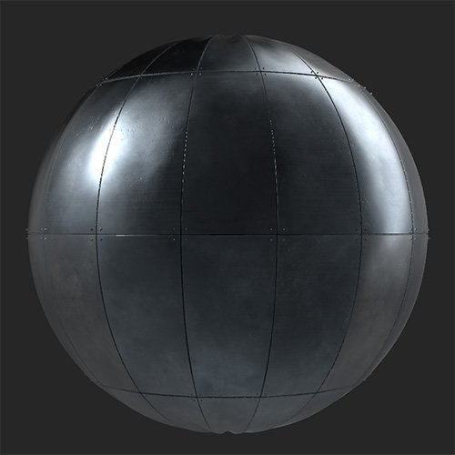

# パネル

<table>
<tr style="border: 0;">
<td width="41.60%" style="border: 0;" valign="top">

**In:**&#x200B;ジェネレーター

</td>
<td width="58.30%" style="border: 0;" valign="top">

## 説明

マテリアルをパネルに変換します。 パネルフィルターは、金属マテリアルに特に適しています。

*パネルに変換された連続的な金属のマテリアル。*

{width="200px"}

{width="200px"}

</td>
</tr>
</table>

## パラメーター

**プリセット**

プリセットを使用すると、パラメーターをすばやく変更して特定のエフェクトを作成できます。

**基本パラメーター**

* **ランダムシード**:\
  ランダムシードは、このフィルターのランダム度を使用する他のパラメーターのランダム値を決定します。
* **X金額**: 0 ～ 20\
  X軸のパネル数の変更
* **Y量**: 0 ～ 20\
  Y軸のパネル数の変更
* **シームの種類**:\
  パネル間で異なるスタイルのシームを選択する
* **締結部品の使用**:\
  パネル間に締結部品を追加します。 有効にすると、締結部品セクションがパラメータのリストに表示されます。

**パネル**

* **オフセット量**: 0 ～ 1\
  パネルの各行を、前の行からパネルサイズのパーセンテージでオフセットします。
* **オフセットランダム**: 0 ～ 1\
  各行のオフセットにランダムな値を追加する
* **垂直オフセット**：切り替え\
  水平オフセットと垂直オフセットを切り替えます。
* **バルジ張力**: -1 ～ 1\
  各パネルの法線を修正して、パネルが圧力によって内側または外側に膨らんでいるように見せます。
* **しわ**: 0-1\
  パネルにわずかなインデントやしわを追加
* **カラーバリエーション**: 0 ～ 1\
  個々のパネル間でカラーをランダムに変化させる
* **反射のバリエーション**: 0-1\
  個々のパネルのラフネスをランダムに変化させる

**シーム**

このセクションで選択できるパラメーターは、**基本パラメーター> シームの種類**&#x200B;で選択した値によって異なります。

* ***ギャップ***
  * **シーム幅**: 0 ～ 1\
    パネル間の幅を変更する
  * **ギャップのバリエーション**: 0-1\
    パネル間のギャップの幅を変えるには、パネルを少しずつずらす
  * **ギャップの角の丸め**: 0-1\
    パネルの端を丸める
  * **ギャップのベベル**: 0-1\
    パネルのエッジをベベルする
* ***連結***
  * **シーム幅**: 0 ～ 1\
    パネル間の幅を変更する
  * **溶接品質**: 0-1\
    溶接の均一性を調整する
  * **溶接の変色**: 0-1\
    パネルの色と比較した溶接の変色の量を変更します。
  * **溶接マテリアルの交換**：切り替え\
    有効にすると、溶接の作成に使用するマテリアルをカスタマイズできます。 これが有効になっている場合は、次の追加パラメーターが表示されます。
    * **溶接マテリアルの色**：色の選択\
      溶接のカラーを選択します。 これは&#x200B;**溶接の変色**&#x200B;の影響を受けます。
    * **溶接ラフネス**: 0-1\
      パネル間の溶接シームのラフネスを調整
* ***重なり***
  * **縫い目の幅**: 0-1\
    パネル間の幅を変更する
* ***立ちシーム***
  * **縫い目の幅**: 0-1\
    パネル間の幅を変更する

**締結部品**

* **ファスナーの種類**:\
  パネル間で使用する締結部品のスタイルを選択します
* **ファスナー量**: 3-10\
  任意の2つのパネル間のエッジに沿って使用する締結部品の数を変更します。
* **ファスナーのサイズ**: 0-1\
  締結部品のサイズを修正する
* **ファスナーのバリエーション**: 0-1\
  締結部品の位置をオフセットする
* **ファスナーを交換マテリアル**：切り替え\
  締結部品に使用されるマテリアルをベースマテリアルとは別に編集します。 有効にすると、次のパラメーターが表示されます。
  * **ファスナーマテリアルの色**:カラー選択\
    ファスナーマテリアルのカラーを選択します
  * **ファスナーラフネス**: 0-1\
    ファスナーマテリアルのラフネスを編集する

**詳細**

* **標準** **強度**: 0 ～ 3\
  マテリアルの全体の法線強度を調整
* **シームのHeight範囲**: 0 ～ 1\
  カスタム継ぎ目をパネルの上に配置する高さを変更する
* **ファスナーのHeight範囲**: 0-1\
  締結部品のHeightを修正する
* **AO深度**: 0-1\
  AOの強さを変更する
* **AO半径**: 0 ～ 1\
  AOの半径を変更する
