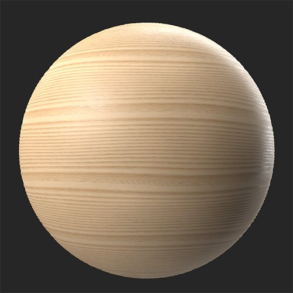
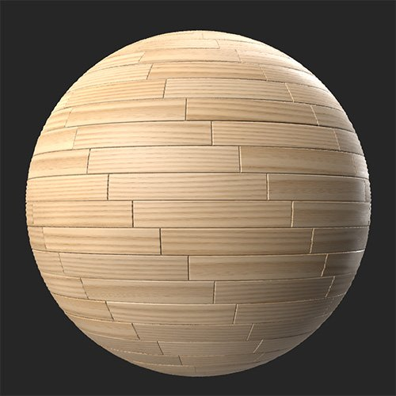

# 寄木

<table>
<tr style="border: 0;">
<td width="41.60%" style="border: 0;" valign="top">

**In:**&#x200B;ジェネレーター

</td>
<td width="58.30%" style="border: 0;" valign="top">

## 説明

マテリアルを寄木細工の床に変換します。

***寄木フィルター**を使用して、木材マテリアルを寄木のパターンに変換しました。*

<table>
<tr style="border: 0;">
<td style="border: 0;" valign="top">

{width="200px"}

</td>
<td style="border: 0;" valign="top">

{width="200px"}

</td>
</tr>
</table>

</td>
</tr>
</table>

## パラメーター

**プリセット**

プリセットを使用すると、パラメーターをすばやく変更して、寄木の床の様々なスタイルを表示できます。

**基本パラメーター**

* **ランダムシード**:\
  ランダムシードは、このフィルターのランダム度を使用する他のパラメーターのランダム値を決定します。
* **パターンの種類**:\
  寄木のパターンを選択
* **X量**: 1 ～ 30\
  X軸の板の数を変える
* **Y量**: 1 ～ 30\
  Y軸の板の数を変える
* **シームの距離**: 0 ～ 1\
  厚板の縫い目の周囲のベベルの距離を修正する
* **プランクスのバリエーション**: 0 ～ 1\
  各板の色とラフネスを自動的に変化させる

**詳細**

* **英語のパターンオフセット**: 0-1 （このパラメーターは、**基本パラメーター>パターンの種類**&#x200B;が&#x200B;**英語**&#x200B;に設定されている場合にのみ使用できます）\
  前の行からの床板の各行のオフセットを変更する
* **シームの強さ**: 0 ～ 1\
  床板間のシームの法線を調整して、目立たせたり目立たなくしたりします
* **シームのベベルカーブ**: 0-1\
  床板間のベベルの幅を変更
* **Heightの範囲**: 0 ～ 1\
  縫い目のHeightを調整する
* **プランクの標準回転バリエーション**: 0-1\
  各板の角度をランダムに変化させる
* **厚板の粗さのバリエーション**: 0-1\
  各板のラフネスをランダムに変化させます。
