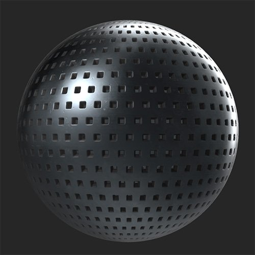

# 穿孔

<table>
<tr style="border: 0;">
<td width="41.60%" style="border: 0;" valign="top">

**In:**&#x200B;ジェネレーター

</td>
<td width="58.30%" style="border: 0;" valign="top">

## 説明

[穴あけ]フィルタを使用して、マテリアルに穴を追加します。

***フィルターを実行**&#x200B;する前と後*

<table>
<tr style="border: 0;">
<td style="border: 0;" valign="top">

{width="200px"}

</td>
<td style="border: 0;" valign="top">

{width="200px"}

</td>
</tr>
</table>

</td>
</tr>
</table>

## パラメーター

**基本パラメーター**

* **ランダムシード**:\
  ランダムシードは、このフィルターのランダム度を使用する他のパラメーターのランダム値を決定します。
* **パターンの選択**:\
  穴のシェイプを選択するか、「カスタムパターン」を選択して独自のパターンを作成します。
* **穿孔の位置**:\
  法線とHeightをマテリアルの内側に引き込むか、マテリアルから際立たせるかを選択します
* **穴あけ面取りサイズ**: 0-1\
  穴のエッジの面取りのサイズを変更する
* **穴のサイズ**: 0 ～ 1\
  穴のサイズを変更する
* **マスクを使用**：切り替え\
  ブラシまたは画像で穴をマスクするために使用できる&#x200B;**マスクセクション**&#x200B;を有効にします。
* **スケールマップの使用**：切り替え\
  スケールマップの使用を有効にします。 有効にすると、次のパラメーターが表示されます。
  * **スケールマップマルチプライヤ**: 0-1\
    穿孔のスケールに対するスケールマップの影響の大きさを調整する
  * **スケールマップの反転**：切り替え\
    スケールマップの値を反転する
  * **カスタムスケールマップ**：画像/ブラシ\
    スケールマップとして使用する画像を読み込むか、ブラシを使用して&#x200B;**2D** **ビュー**&#x200B;にスケールマップを直接ペイントします

**マスク**

このセクションは、**基本パラメーター/マスクを使用**&#x200B;が有効な場合にのみ表示されます

* **マスクを反転**:
* **マスクぼかし**: 0-1\
  マスクに適用されたぼかしの調整
* **マスクのしきい値**: 0 ～ 1\
  マスクのしきい値を変更します。 **マスクのぼかし**&#x200B;と&#x200B;**マスクのしきい値**&#x200B;の値を組み合わせて、マスクのエッジを微調整します。
* **カスタムマスク**：画像/ブラシ\
  画像を読み込んでマスクとして使用するか、**2Dビュー**&#x200B;で直接マスクをペイントします

**穿孔**

* **穿孔のサイズ**: 0 ～ 1\
  各穴のサイズを変更します。これには穴と面取りが含まれます。
* **穿孔Y量**: 1 ～ 64\
  Y軸上のミシン目の数を調整します。
* **穿孔X量**: 1 ～ 64\
  X軸のミシン目の数を調整する
* **穿孔の密度**: 0 ～ 1\
  穴をランダムにマスク
* **穿孔のオフセット**: 0 ～ 1\
  2列目ごとのミシン目のオフセットの調整
* **穿孔の色の不透明度**: 0 ～ 1\
  穴の面取り領域の色の透明度の調整
* **穿孔の色**:カラーの選択\
  各穴の面取り領域の色を選択します
* **ミシン目の粗さ** : 0 ～ 1\
  ミシン目の粗さの値を変更する
* **ミシン目の金属**: 0-1\
  ミシン目の金属的価値を修正する

**詳細パラメーター**

* **輝度**: 0 ～ 1
* **コントラスト**: -1から1
* **色相シフト**: 0 ～ 1
* **彩度**: 0 ～ 1
* **法線の強度**: -1 ～ 1\
  各穴あけ法線の強度を調整する
* **Heightの強さ**: 0 ～ 1\
  各穴の強度Heightマップを調整する
