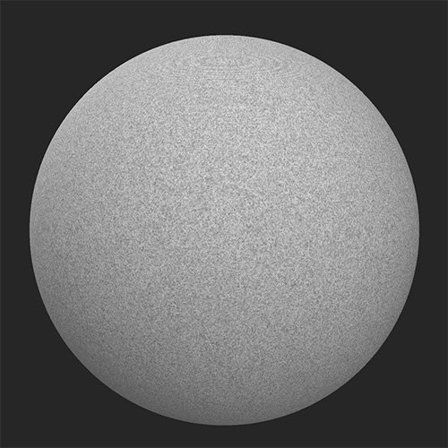
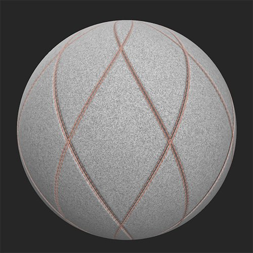

# キルトステッチ

<table>
<tr style="border: 0;">
<td width="41.60%" style="border: 0;" valign="top">

**In:**&#x200B;ジェネレーター

</td>
<td width="58.30%" style="border: 0;" valign="top">

## 説明

このフィルターを使用して、マテリアル内のステッチしたキルトパターンをエミュレートします。

***キルトステッチフィルター**を適用する前と後*

<table>
<tr style="border: 0;">
<td style="border: 0;" valign="top">

{width="200px"}

</td>
<td style="border: 0;" valign="top">

{width="200px"}

</td>
</tr>
</table>

</td>
</tr>
</table>

## パラメーター

**基本パラメーター**

* **ランダムシード**:\
  ランダムシードは、このフィルターのランダム度を使用する他のパラメーターのランダム値を決定します。
* **パターンの選択**:\
  ステッチ/キルトのパターンのスタイルを選択します
* **金額**: 1 ～ 5\
  パターンのタイリング量を制御する
* **回転**:\
  パターンを回転
* **Topstitch**：切り替え\
  トップステッチの追加を有効にして、関連するパラメーターセクションを表示
* **シーム**:トグル\
  パラメーターを追加して、関連するシームーセクションを表示します
* **キルト**：切り替え\
  キルトの追加を有効にして、関連するパラメータセクションを表示します。
* **エッジペイント**：切り替え\
  キルト化された断面の間のエッジをページングし、関連するパラメータ断面を確認します
* **詳細設定**：切り替え\
  **詳細**&#x200B;パラメーターを表示する

**Topstitch**

* **Topstitch Color**:カラー選択\
  トップステッチに使用する糸の色を設定します
* **Topstitchオフセット**: 0-1\
  キルティング領域のエッジからトップステッチをオフセット
* **Topstitch Rotation**: 0-1\
  トップステッチを構成するステッチの方向を変更する
* **Topstitchスケール**: 0-1\
  各寸法のトップステッチのサイズ（幅、長さ、Height）を調整します
* **穿刺強度**: 0 ～ 1\
  トップステッチによって生じたキルティングへのへこみを調整します
* **Topstitch ラフネス**: 0-1\
  ねじのラフネスを調整する
* **Topstitchメタリック**: 0-1\
  ねじのメタリック値を調整する

**シーム**

* **シーム** **選択範囲**:\
  使用するシームのスタイルを選択
* **シームの強さ**: 0 ～ 1\
  シームの法線とHeightの強さを変更する
* **伸縮の強さ**: 0 ～ 1\
  ファブリックの伸縮がシームに与える影響の度合いを調整します。 この効果は非常にわずかです。

**キルト**

* **キルトの種類**:\
  使用するキルトスタイルを選択します
* **キルト強度**:\
  キルトエフェクトの法線強度とHeight強度を調整します

**エッジペイント**

* **エッジの選択**:\
  下にあるマテリアルの法線およびHeightのディテールを痛みが上書きするかどうかを選択します
* **エッジの色**:カラー選択\
  ペイントの色を選択
* **エッジラフネス**: 0 ～ 1
* **エッジメタリック**: 0 ～ 1

**詳細**

* **Height**: 0 ～ 1\
  基礎となるマテリアルからの高さマップの強さを調整
* **法線の強度**: 0 ～ 1\
  **キルトステッチ**&#x200B;フィルターによる法線マップ変化の強さを調整します。 これは、基になるマテリアルの法線には影響しません。
