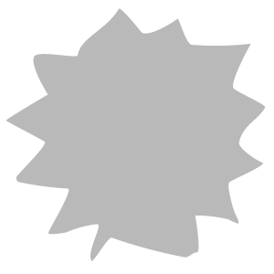

# サーフェスリリーフ

<table>
<tr style="border: 0;">
<td width="41.60%" style="border: 0;" valign="top">

**In:**&#x200B;ジェネレーター

</td>
<td width="58.30%" style="border: 0;" valign="top">

## 説明

サーフェスリリーフフィルターを使用して、マテリアルにノイズを加えます。 これは、大きなシェイプを分割したり、視覚的な趣を加えたりするのに役立ちます。

</td>
</tr>
</table>

## パラメーター

<b>基本パラメーター</b>

* <b>ランダムシード</b>:\
  このフィルタの他のすべてのランダムパラメータの基準となるランダムシード。
* <b>強度</b>: 0 ～ 1\
  ノイズの振幅を変更する
* <b>ぼかしの強さ</b>: 0 ～ 1\
  ノイズに適用されるぼかしの強さ
* <b>表面の不完全性</b>：画像/ブラシ/テクスチャジェネレーター\
  イメージまたはテクスチャジェネレータを使用して、サーフェスの不完全性として使用します。

<b>ノイズパラメーター</b>

* <b>クランプ</b>: 0-1\
  ノイズを特定の範囲に固定する
* <b>コントラスト</b>: 0 ～ 1\
  ノイズのコントラストを変更する
* <b>反転</b>：切り替え\
  ノイズのHeightマップを反転する

<b>変形</b>

* <b>タイル</b>: 1 ～ 16\
  <b>基本パラメーター>スケール</b>とは異なり、<b>タイル</b>はノイズのインスタンス数を管理します。
* <b>ミラー</b>:\
  片方または両方の軸でノイズをミラー
* <b>オフセット</b>:\
  X軸とY軸でのノイズの位置の変更
* <b>回転</b>:\
  ノイズを回転します。 タイル表示が可能なように、回転角度がスナップします。

<b>マスク</b>

* <b>カスタムマスクを使用</b>：切り替え\
  有効にすると、カスタムマスクコントロールが表示されます。
  * <b>マスク</b>：画像/ブラシ/テクスチャジェネレーター\
    マスクとして使用する画像を読み込むか、ブラシを使用して<b>2Dビュー</b>で直接ペイントします
  * <b>カスタムマスク – ぼかし</b>: 0-1\
    マスクをぼかす
  * <b>カスタムマスク – 反転</b>：切り替え

<b>詳細パラメーター</b>

* <b>Heightの強さ</b>: 0 ～ 1\
  ノイズハイトマップと基礎となるマテリアルハイトマップのブレンドを制御
* <b>Height – ベースの置き換え</b>：切り替え\
  ベースHeightを交換するかどうかを切り替えます
* <b>法線の強度</b>: 0 ～ 1\
  ノイズの法線マップの強度を調整する
* <b>標準 – ベースの置き換え</b>：切り替え\
  基本法線マップを置き換えるかどうかを切り替え
* <b>法線方向</b>:\
  法線の生成に使用する軸を変更する
* <b>法線 – 回転方向</b>
* <b>周囲オクルージョン – 強度</b>
* <b>環境オクルージョン – 半径</b>
