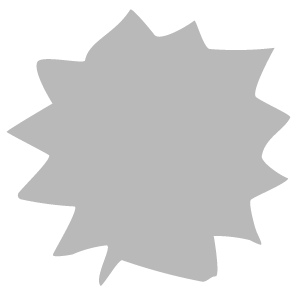

# サーフェスリリーフ

<table>
<tr style="border: 0;">
<td width="41.60%" style="border: 0;" valign="top">

**In:**&#x200B;ジェネレーター

</td>
<td width="58.30%" style="border: 0;" valign="top">

## 説明

サーフェスリリーフフィルターを使用して、マテリアルにノイズを加えます。 これは、大きなシェイプを分割したり、視覚的な趣を加えたりするのに役立ちます。

</td>
</tr>
</table>

## パラメーター

<b>基本パラメーター</b>

* <b>ランダムシード</b>:\
  このフィルタの他のすべてのランダムパラメータの基準となるランダムシード。
* <b>強度</b>: 0 ～ 1\
  ノイズの振幅を変更する
* <b>ぼかしの強さ</b>: 0 ～ 1\
  ノイズに適用されるぼかしの強さ
* <b>表面の不完全性</b>：画像/ブラシ/テクスチャジェネレーター\
  イメージまたはテクスチャジェネレータを使用して、サーフェスの不完全性として使用します。

<b>ノイズパラメーター</b>

* <b>クランプ</b>: 0 ～ 1\
  ノイズを特定の範囲にクランプ
* <b>コントラスト</b>: 0 ～ 1\
  ノイズのコントラストを変更する
* <b>反転</b>：切り替え\
  ノイズの高さマップを反転する

<b>変形</b>

* <b>タイリング</b>: 1 ～ 16\
  <b>基本パラメーター>スケール</b>とは異なり、<b>タイリング</b>はノイズのインスタンス数を管理します。
* <b>ミラー</b>:\
  一方または両方の軸にノイズをミラーリングする
* <b>オフセット</b>:\
  X方向とY軸にノイズを移動
* <b>回転</b>:\
  ノイズを回転させます。 タイリングを可能にするために、回転角度はスナップされます。

<b>マスク</b>

* <b>カスタムマスクを使用</b>：切り替え\
  有効にすると、カスタムマスクコントロールが表示されます。
  * <b>マスク</b>：画像/ブラシ/テクスチャジェネレーター\
    マスクとして使用する画像を読み込むか、ブラシを使用して<b>2D ビュー</b>に直接ペイントします
  * <b>カスタムマスク – ぼかし</b>: 0-1\
    マスクをぼかす
  * <b>カスタムマスク – 反転</b>：切り替え

<b>詳細パラメーター</b>

* <b>Heightの強さ</b>: 0 ～ 1\
  マテリアルハイトマップと下のノイズハイトマップのブレンドを制御
* <b>Height – ベースの置き換え</b>：切り替え\
  ベースHeightを交換するかどうかを切り替えます
* <b>法線の強度</b>: 0 ～ 1\
  ノイズの法線マップの強さを調整
* <b>標準 – ベースの置き換え</b>：切り替え\
  ベース法線マップを交換するかどうかを切り替えます
* <b>法線方向</b>:\
  通常の生成に使用する軸を変更する
* <b>法線 – 回転方向</b>
* <b>Ambient occlusion – 適用度</b>
* <b>Ambient occlusion – 半径</b>
