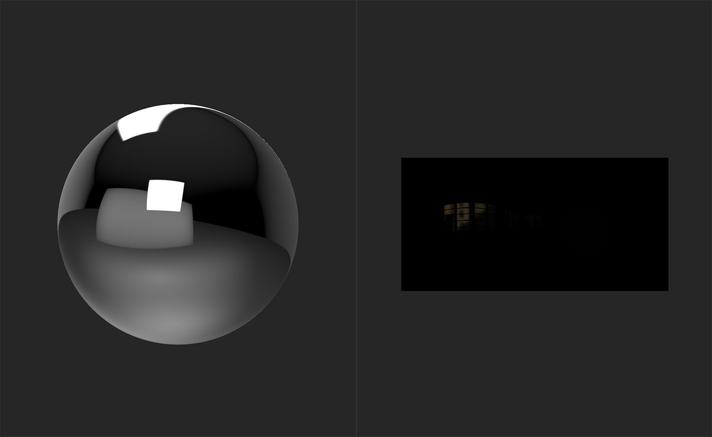
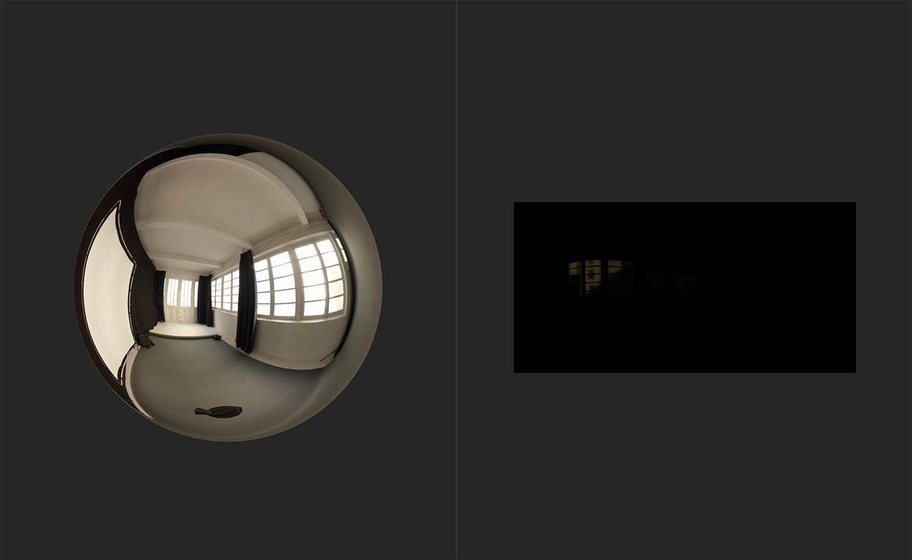

# HDR 結合

<table>
<tr style="border: 0;">
<td width="41.60%" style="border: 0;" valign="top">

**イン：** HDRI ツール

</td>
<td width="58.30%" style="border: 0;" valign="top">

## 説明

**HDR結合** **フィルター**&#x200B;を使用すると、SDR （標準ダイナミックレンジ）画像のコレクションを結合してHDR画像を作成できます。

**HDR結合**&#x200B;の結果を次の図に示します。

**HDR結合**&#x200B;を実行する前は、**3Dビュー**&#x200B;の球体がデフォルトの環境光を反映しています。 **2D ビュー**&#x200B;は、最初のスキャンイメージのインポートされたイメージデータを既定で表示します。この場合、イメージは最も表示度の低いイメージです。

**HDR結合** **フィルター**&#x200B;を追加すると、球体に新しい入力画像（環境光から生成されたHDR画像）が反映されます。

</td>
</tr>
</table>

## TParameters

**基本パラメーター**

* **入力露出デルタ(EV)**: 0-2\
  最高露光量と最低露光量の露出差を設定します。 露光量デルタが大きいと、マージ操作の結果のコントラストが大きくなります。
* **出力の自動露光量**：切り替え\
  自動露光量調整を有効または無効にします。
* **出力の露出オフセット(EV)**: -5 ～ 5\
  露光量をオフセットします。

## 使用方法ガイド

このページでは、**HDR結合フィルター**&#x200B;の使用方法と、SDR画像をHDR 環境光に変換するのに役立つ他のフィルターについて説明します。

**HDRマージ** **フィルター**&#x200B;を使用するための基本的な手順は次のとおりです。

1. レイヤースタックに結合する画像のセットを読み込みます。
1. **HDR結合フィルター**&#x200B;をレイヤースタックに追加します。
1. 露光量の値が正しいことを確認するためにパラメーターを変更します。
