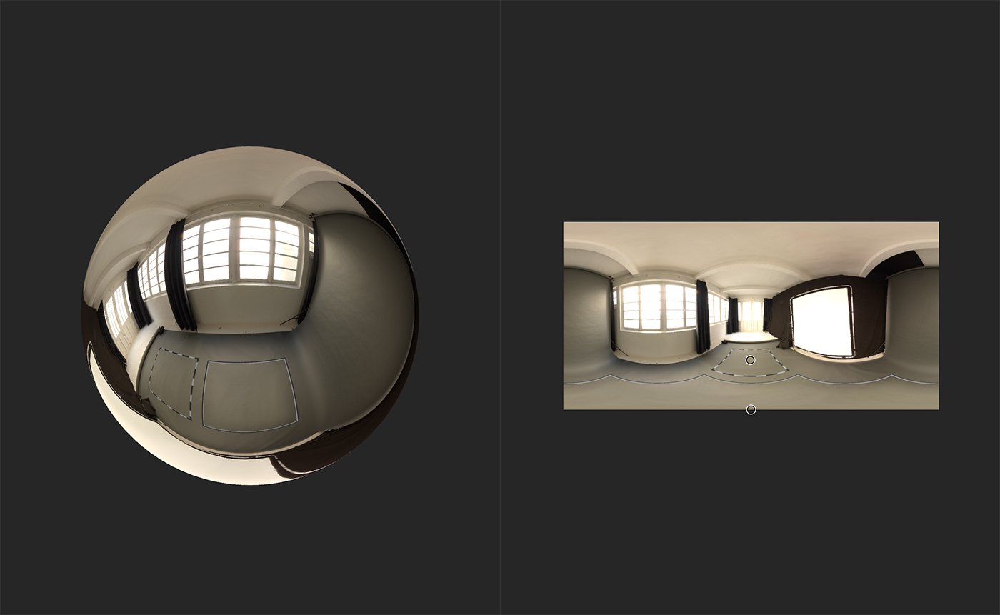

# Nadir Patch

<table>
<tr style="border: 0;">
<td width="41.60%" style="border: 0;" valign="top">

**イン：** HDRI ツール

</td>
<td width="58.30%" style="border: 0;" valign="top">

## 説明

環境光の床面にパッチを適用して、アーティファクトや継ぎ目を隠します。

下の画像では、**Nadir Patch**&#x200B;を使用してこのパノラマ画像のカメラスタンドを取り除く方法を確認できます。

</td>
</tr>
</table>

## パラメーター

**基本パラメーター**

* **有効化**：切り替え\
  パッチをオンまたはオフに切り替えます。これは、レイヤーの可視性を変更することなく、パッチの影響をすばやく確認するのに便利です。
* **フレームヘルパーの表示**：切り替え\
  フレームのオン/オフを切り替えます。
* **フレームThickness**: 0 ～ 1\
  枠のThicknessを調整します。 これは、パッチのソースが床面から遠い場合に役立ちます。
* **パッチスケール**: 0 ～ 1\
  パッチを適用する領域の境界を調整します。
* **パッチサイズ**:\
  パッチの寸法を調整します。
* **パッチの回転**: 0 ～ 1\
  パッチ境界を回転します。 これにより、ソースとパッチ位置の両方が回転するので、パッチの方向は変わりません。 パッチを所定の位置で回転させるには、**ソースの回転オフセット**&#x200B;を使用します。
* **パッチAlpha**:\
  パッチのマスクに使用するシェイプを選択します。 **マスク入力**&#x200B;を選択すると、追加のパラメーターが表示されます：
  * **マスク入力**：画像/ブラシ\
    画像を読み込んでマスクとして使用するか、**2Dビュー**&#x200B;で直接マスクをペイントします。
* **パッチの硬さ**: 0 ～ 1\
  パッチマスクのエッジのぼかしを調整します。
* **ソースの回転オフセット**: 0-1\
  ソースの回転をオフセットします。これはパッチを回転させる効果があります。

## 使用方法ガイド

写真から環境光を作成するときに発生する一般的な問題は、テクスチャの上部と下部の粗さの周辺で発生するアーティファクトです。 **Nadir Patch** **フィルター**&#x200B;を使用すると、これらの問題を最小限に抑えることができます。

1. **Nadir Patchフィルター**&#x200B;をレイヤースタックの先頭に追加します。
1. **2Dビュー**&#x200B;のハンドルを使用して、パッチのソースの場所を変更します。
   1. パッチ適用後の床面は、ソースの位置に応じて変化します。 ソースがテクスチャ空間の下半分にある場合は、下半分の床面にパッチが適用されます。ソースが上半分にある場合は、上半分の床面にパッチが適用されます。
1. パラメータを変更して、継ぎ目やアーティファクトを効果的に隠すようにパッチの変形を微調整します。
