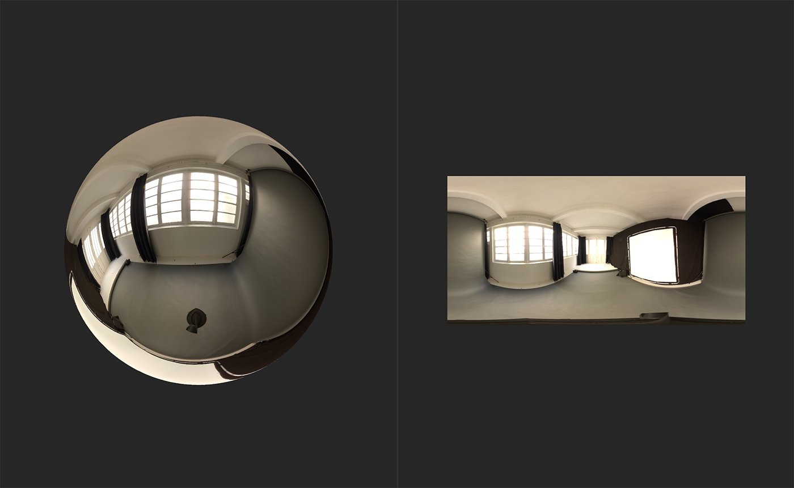
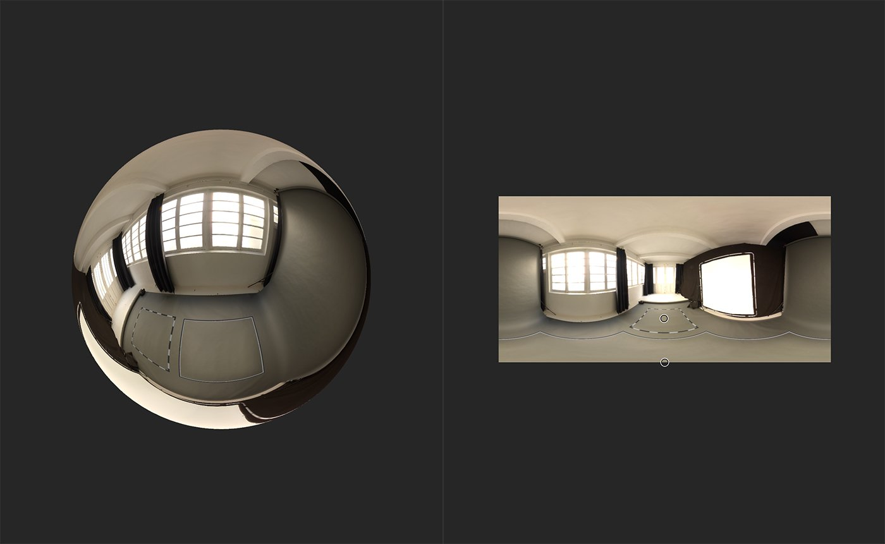

# Nadir Patch

<table>
<tr style="border: 0;">
<td width="41.60%" style="border: 0;" valign="top">

**イン：** HDRI ツール

</td>
<td width="58.30%" style="border: 0;" valign="top">

## 説明

環境光の床面にパッチを適用して、斑点やシームを隠します。

下の図は、このパノラマ画像で&#x200B;**Nadir Patch**&#x200B;を使用してカメラスタンドを取り除く方法を示しています。

</td>
</tr>
</table>

## パラメーター

**基本パラメーター**

* **有効化**：切り替え\
  パッチをオンまたはオフに切り替えます。これは、レイヤーの可視性を変更することなく、パッチの影響をすばやく確認するのに便利です。
* **ヘルパーを表示**：切り替え\
  フレームのオンとオフを切り替えます。
* **Thickness**: 0 ～ 1\
  フレームのThicknessを調整します。 これは、パッチのソースが床面から遠い場合に役立ちます。
* **パッチスケール**: 0 ～ 1\
  パッチを適用する領域の境界を調整します。
* **パッチサイズ**:\
  パッチの寸法を調整します。
* **パッチの回転**: 0 ～ 1\
  パッチ境界を回転します。 これにより、ソースとパッチ位置の両方が回転するので、パッチの方向は変わりません。 パッチを所定の位置で回転させるには、**ソースの回転オフセット**&#x200B;を使用します。
* **パッチAlpha**:\
  パッチのマスクに使用するシェイプを選択します。 **マスク入力**&#x200B;を選択すると、追加のパラメーターが表示されます：
  * **マスク入力**：画像/ブラシ\
    マスクとして使用する画像を読み込むか、**2D ビュー**&#x200B;で直接マスクをペイントします。
* **パッチの硬さ**: 0 ～ 1\
  パッチマスクのエッジのぼかしを調整します。
* **ソースの回転オフセット**: 0-1\
  ソースの回転をオフセットします。これはパッチを回転させる効果があります。

## 使用方法ガイド

写真から環境光を作成する際に発生する一般的な問題は、テクスチャの上部と下部の爪に生じる斑点です。 **Nadir Patch** **フィルター**&#x200B;を使用すると、これらの問題を最小限に抑えることができます。

1. **Nadir Patchフィルター**&#x200B;をレイヤースタックの先頭に追加します。
1. **2D ビュー**&#x200B;のハンドルを使用して、修正プログラムのソースの場所を変更します。
   1. パッチ適用後の床面は、ソースの位置に応じて変化します。 ソースがテクスチャスペースの下半分にある場合は、下半分の床面にパッチが適用されます。ソースが上半分にある場合は、上半分の床面にパッチが適用されます。
1. パラメーターを変更し、パッチの変形を微調整して、シームと斑点を効果的に隠します。
