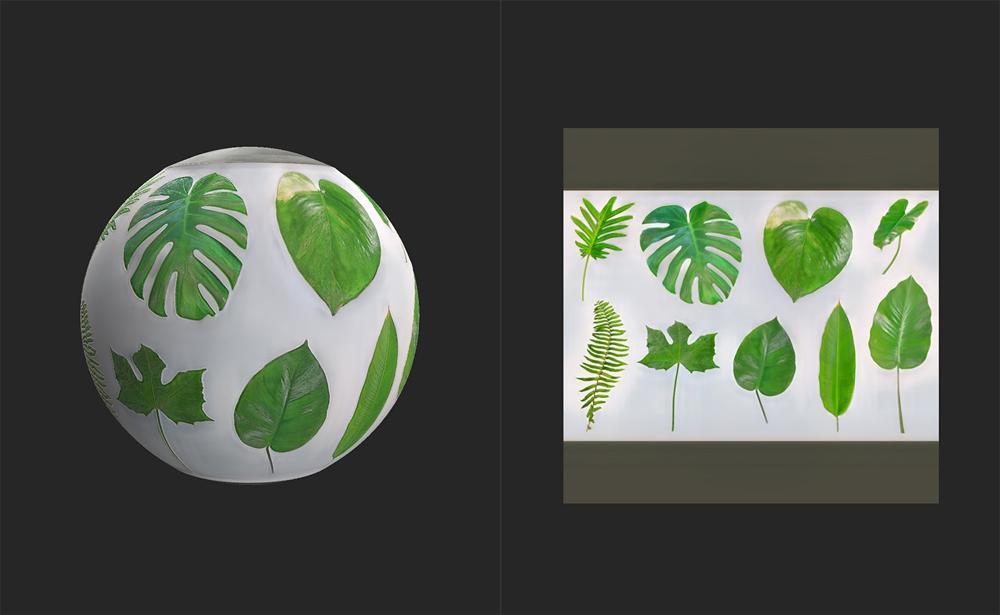

# Atlas Creator

<table>
<tr style="border: 0;">
<td width="41.60%" style="border: 0;" valign="top">

**イン：**&#x200B;ツール

</td>
<td width="58.30%" style="border: 0;" valign="top">

## 説明

**アトラス作成者** **フィルター**&#x200B;を使用すると、素材や画像をアトラスに変換できます。 その後、**Atlas Splitter**&#x200B;や&#x200B;**Atlas Scatter**&#x200B;などの他のフィルターを使用して、マテリアル内でアトラス要素を使用できます。

以下の画像は、**アトラス作成者**&#x200B;によって処理される前後のジャングルの葉のアトラスを示しています。

上の画像では、アトラス画像が読み込まれ、マテリアルに変換されましたが、不透明度マップは個々の要素を考慮していないため、アトラスマテリアルではありません。

**アトラス作成**&#x200B;を実行すると、不透明度マップが生成され、アトラス要素間の領域がベースカラーチャンネルで塗りつぶされます。

</td>
</tr>
</table>

パラメーター

**基本パラメーター**

* **小さいシェイプを削除**: 0-1

  アトラス内のオブジェクトの最小サイズを調整します。 これはアーティファクトを削除する場合に便利です。
* **不透明度 – クロミナンスの影響** : 0 ～ 2

  カラー値に基づいてアトラス要素のエッジを微調整します。
* **不透明度を追加**：画像/ブラシ

  マスクとして使用するファイルを読み込むか、ブラシを使用して、不透明にする必要がある領域を&#x200B;**2Dビュー**&#x200B;で直接ペイントします。

使用方法ガイド

## アトラス画像の準備

**アトラス作成者フィルター**&#x200B;を使用する前に、アトラス画像が正しく準備されていることを確認することをお勧めします。

**アトラス作成者**&#x200B;は、画像の色に基づいて作業し、透明度を考慮しません。 つまり、アトラス画像を準備する最良の方法は、要素間のスペースを統一して白黒にすることです。こうすることで、**アトラス作成者**&#x200B;は不透明度マスクを簡単に生成できます。

## 画像からアトラスマテリアルを生成する

**アトラス作成者**&#x200B;は、アトラス画像をマテリアルアトラスに変換するように設計されています。

1. 元の画像をレイヤースタックに読み込みます。
1. マテリアル作成テンプレートの選択を求めるプロンプトが表示されたら、[イメージからマテリアル]を選択します。 それ以外の場合は、レイヤースタックの画像を使用して、画像の上に&#x200B;**Image to Material （AI搭載）フィルター**&#x200B;を追加します。
1. **画像をマテリアルに変換**&#x200B;フィルターがソース画像をマテリアルに変換するのを待ちます。 満足できる結果が得られるまで、パラメーターを調整します。
1. **アトラス作成フィルター**&#x200B;をレイヤースタックの先頭に追加します。
1. 満足のいく結果が得られるまで、**アトラス作成者**&#x200B;のパラメーターを調整します。

1. 画像をレイヤースタックに追加します。 マテリアル作成テンプレートを選択するように求められた場合は、**[ビットマップとして使用]**&#x200B;を選択します。
1. 画像レイヤーを選択した状態で、**プロパティパネル**&#x200B;で、**出力方法**&#x200B;を&#x200B;**ベースカラー**&#x200B;に変更します。
1. **アトラス作成者**&#x200B;をレイヤースタックの先頭に追加します。
1. 満足のいく結果が得られるまで、**アトラス作成者**&#x200B;のパラメーターを調整します。**2Dビュー**&#x200B;で不透明度チャンネルを表示して、フィルターの結果をより明確に表示します。
1. **書き出しパネル**&#x200B;を使用して、生成されたチャンネルを書き出します。
