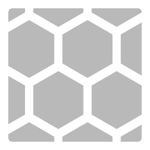

# 自動タイリング

<table>
<tr style="border: 0;">
<td width="41.60%" style="border: 0;" valign="top">

**イン：**&#x200B;ツール

</td>
<td width="58.30%" style="border: 0;" valign="top">

## 説明

<b>自動タイルフィルター</b>は、マテリアル内の繰り返し構造を検索し、それらを使用してタイルマテリアルを作成します。 <b>タイルフィルターを作成</b>や<b>タイリングフィルター</b>とは異なり、<b>自動タイリング</b>では、タイルにできるマテリアルの最も小さな領域を分離することに重点が置かれています。

<b>自動タイリング </b>は、テキスタイルに特に有効です。

</td>
</tr>
</table>

>[!NOTE]
>
> 自動タイリングフィルターを機能させるには、元の画像またはマテリアルで最低3x3の繰り返しが必要です。

## 自動タイリングフィルターチュートリアル

## 自動タイリングについて

レイヤースタックにパターンを追加すると、<b>自動タイリング</b>によって繰り返しパターンが自動的に検索され、タイリングマテリアルが生成されます。 問題が解決しない場合は、[<b>詳細設定</b>]ボタンを使用してプロセスを手動で調整できます。

画像からマテリアルを作成する場合は、最初に<b>自動タイリングフィルター</b>を使用してから、<b>画像からマテリアルフィルター</b>を使用することをお勧めします。

<b>自動タイリング</b>はデバイス上で完全に実行され、コンテンツはクラウドに送信されません。

## パラメーター

ほとんどのフィルターとは異なり、<b>自動タイル</b>にはパラメーターがありません。 代わりに、<b>詳細設定</b>ボタンがあります。このボタンをクリックすると、フィルターを構成するプロセスが順を追って実行されます。 すべての手順を手動で調整する必要はありません。ウィンドウの上部にある手順を選択すると、前または後にスキップできます。

このプロセスは、次の手順で構成されます。

1. <b>概要</b>:フィルターの機能について説明します。 今後、この画面を非表示にするには、チェックボックスを使用します。
1. <b>マップの選択</b>:フィルターで使用するチャンネルを選択します。 最も目に見える繰り返しパターンのチャンネルを使用することをお勧めします。 通常はBase colorチャンネルまたはHeightチャンネルを使用しますが、マテリアルによっては他のチャンネルを使用すると便利です。
1. <b>サンプル設定</b>：最適な結果を得るために、入力マテリアルに変更を加えます。 これには、解像度の選択、入力の回転またはワープなどが含まれます。 パターンが非常に小さい場合は、パターンが表示されるように高解像度を選択すると便利です。 ただし、パターンが大きい場合は、解像度が低いほど結果が良くなり、早く結果が得られます。
1. <b>パターンサイズ</b>：このステップでは、フィルターは見つけることができる最小のパターンを探します。 自動検出機能のサイズには、大きい方と小さい方があり、任意のサイズを指定する場合は、「カスタムサイズ」を選択できます。 最適な結果を得るには、パターンがボックスに1回繰り返し表示される最小サイズを選択します。\
   ボックスの形状がすべて不規則で、パターンに合っていないようであれば、カスタムサイズを使用して、より規則的な結果を得てください。
1. <b>パターン検出</b>：各ポイントがパターン内の同じ位置にくるように、ポイントを配置します。 例えば、白黒の市松模様の場合、ポイントを黒い正方形の中央に配置することができます。
1. <b>目標範囲</b>：最終的なパターンを作成するために使用するマテリアルの領域を選択します。 領域を大きくすると、表示される繰り返しの量が減少しますが、斑点のある領域や表示される照明の違いを含めると、表示される繰り返しの量が増加する可能性があります。
1. <b>縫い目の除去</b>：縫い目の表示を最小限に抑えるように設定を調整します。 <b>切り取りのSmoothness</b>はシームの線の滑らかさを制御し、<b>ブレンドの幅</b>はタイル間のシームをぼかします。

すべての手順を完了したら、<b>[適用]</b>を使用して選択内容を確認します。 <b>自動タイリング</b>フィルターは、マテリアルを処理して最終結果を生成します。
