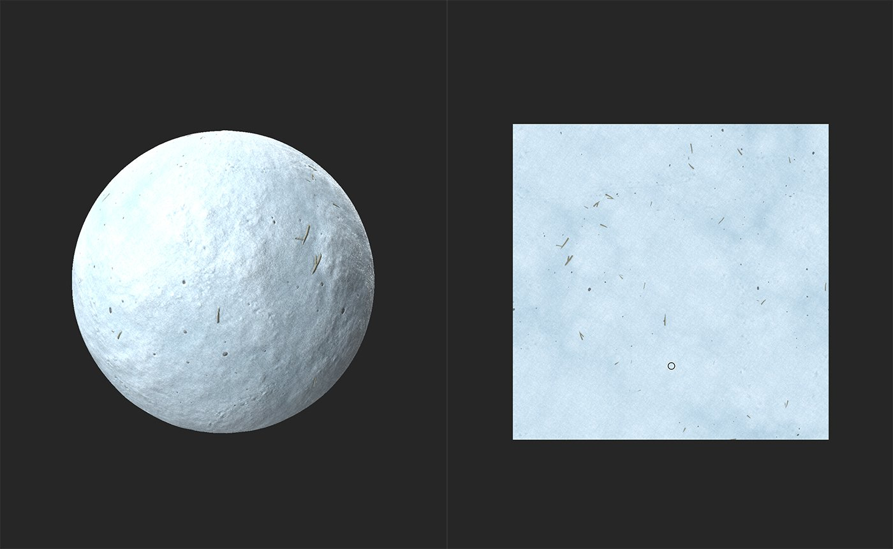
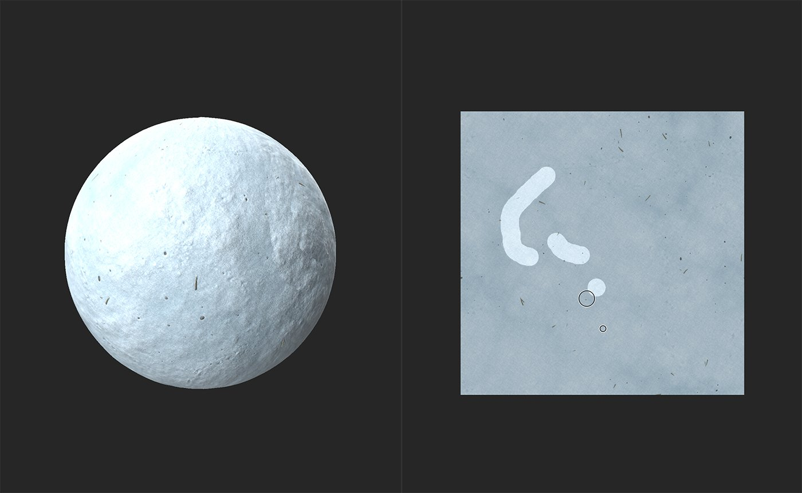
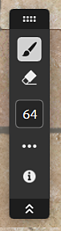

# クローンスタンプ

<table>
<tr style="border: 0;">
<td width="41.60%" style="border: 0;" valign="top">

**イン：**&#x200B;ツール

</td>
<td width="58.30%" style="border: 0;" valign="top">

## 説明

**クローンスタンプツール**&#x200B;を使用すると、マテリアルの一部を手動で複製したり、パッチを適用したりできます。 これは、シームを修正したり、マテリアルからエラーを削除したりするのに便利です。**クローンスタンプフィルター**&#x200B;は、左側のサイドバーで使用できるツールの1つです。

下の画像は、雪のマテリアルから破片を取り除くために使用されている&#x200B;**クローンスタンプ**&#x200B;を示しています。

上の画像では、雪のマテリアルには多数の小枝やその他の破片が散らばっています。

**クローンスタンプ**&#x200B;ツールを使用して、小枝を取り除き、きれいな雪に置き換えます。

</td>
</tr>
</table>

## クローンスタンプのチュートリアル

## パラメーター

<b>基本パラメーター</b>

* <b>マスクを展開</b>: 0-1\
  塗りつぶされた領域の周囲で、フィルターが下になっているマテリアルと一致させる範囲を調整します。
* <b>フェードのブレンド</b>: 0 ～ 1\
  クローン領域のエッジを柔らかくして、下にあるマテリアルと調和させます。
* <b>ぼかしマスク</b>: 0-1\
  コピースタンプのエッジのディテール量を調整します。 この値を大きくすると、クローン領域のエッジが塗り潰しのようになります。
* <b>縦横比を維持</b>：切り替え\
  オフにすると、スタンプ領域の比率を調整できます。
  * <b>水平方向</b>: 0 ～ 2
  * <b>垂直方向</b>: 0 ～ 2
* <b>回転</b>: -180 ～ 180\
  スタンプ領域を回転します。
* <b>水平方向に反転</b>：切り替え\
  スタンプ領域を水平軸に沿って鏡像化します。
* <b>垂直方向に反転</b>：切り替え\
  スタンプ領域を垂直軸に沿ってミラーします。

<b>フェードブレンド</b>

フェードブレンドコントロールを使用して、マテリアルの各チャンネルのフェードブレンドを個別に調整します。

<b>詳細</b>

* <b>法線の強度</b>: 0 ～ 2\
  スタンプ領域の法線の強さを調整します。
* <b>ソースの位置</b>: \
  0-1：水平ソース位置を調整します。\
  0-1：ソースの垂直位置を調整します。
* <b>ターゲット位置</b>:\
  0-1：水平のターゲット位置を調整します。\
  0-1：垂直方向のターゲット位置を調整します。
* <b>タイリングモード</b>:ドロップダウン\
  タイリングを有効または無効にします。

## 使用方法ガイド

**クローンスタンプツール**&#x200B;をクリックして、レイヤースタックの上部に新しいクローンスタンプフィルターレイヤーを作成します。 **レイヤーパネル**&#x200B;の&#x200B;**「レイヤーを追加」ボタン**&#x200B;を使用して、クローンスタンプフィルターを追加することもできます。

クローンスタンプフィルターレイヤーを作成すると、**2D ビュー**&#x200B;が&#x200B;**ビューポート**&#x200B;に自動的に開きます。 クローンスタンプレイヤーを選択すると、**ツールバー**&#x200B;が&#x200B;**2D ビュー**&#x200B;の上部に表示されます。

{width="300px"}

クローンスタンプツールの使用を開始するには、**2D ビュー**&#x200B;内の問題のある領域をクリックしてドラッグします。 マテリアルはソースに基づいて自動アップデートを開始します。 **クローンスタンプツール**&#x200B;を使用する領域がハイライト表示されます。

## ツールバー

<table>
<tr style="border: 0;">
<td width="16.67%" style="border: 0;" valign="top">

</td>
<td width="83.33%" style="border: 0;" valign="top">

クローンスタンプレイヤーを選択すると、コントロールを含むツールバーが2D ビューに表示されます。

* <b>ブラシツール</b>を選択してマスクに追加するか、<b>消しゴムツール</b>を選択してマスクから削除します。
* 現在選択されているツールのサイズを設定します。
* その他のコントロールへのアクセス：
  * <b>ブラシタイリング</b>: \
    XおよびYブラシタイリングを切り替えます。
  * <b>オーバーレイ：</b>\
    2D ビューの上にカーソルを置いたときにオーバーレイを表示するかどうかを切り替えます。
* 2D ビューコントロールの表示

</td>
</tr>
</table>

>[!NOTE]
>
> 他のビューポートツールバーと同様に、ツールバーの上部にあるハンドルをドラッグして、ツールバーのビューポート内の位置を変更します。ハンドルをダブルクリックすると、垂直方向と水平方向のモードを切り替えることができます。また、二重の山形を使用すると、ツールバーの表示と非表示を切り替えることができます。

## ソースの選択

2D ビュー内でCtrlキーを押しながらクリックして、新しいソースを追加します。 新しいソースを追加すると、<b>レイヤーパネル</b>のクローンスタンプレイヤーの下に追加のスタンプが作成されます。 各スタンプを個別に制御できます。

>[!NOTE]
>
> 通常は、コピーする領域の近くにソースポイントを置かないようにすることをお勧めします。 ソースポイントが問題のある領域に近い場合は、問題のある領域をコピーできます。

## ショートカット

| アクション | Windows + Linux | MacOs |
| --- | --- | --- |
| ブラシサイズを大きくする | &rbrack;またはCtrl +マウスホイール | &rbrack;またはCmd +マウスホイール |
| ブラシサイズを小さくする | &lbrack;またはCtrl +マウスホイール | &lbrack;またはCmd +マウスホイール |
| ソースを設定 | Ctrl +左クリック | Cmd +左クリック |
