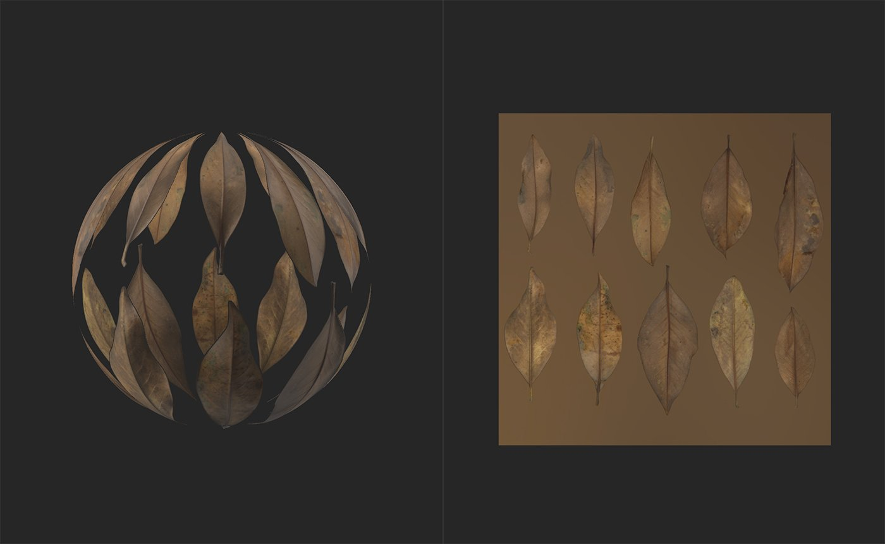
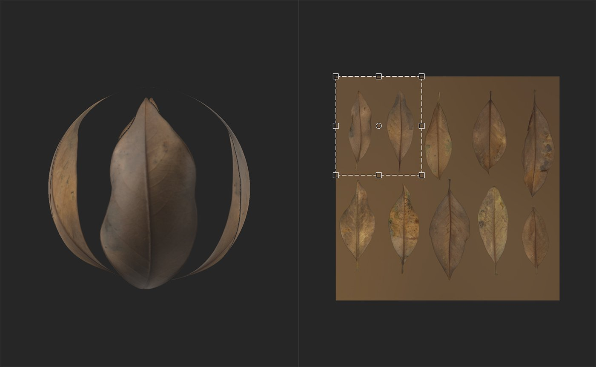
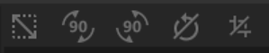

# 切り抜きツール

<table>
<tr style="border: 0;">
<td width="41.60%" style="border: 0;" valign="top">

**イン：**&#x200B;ツール

</td>
<td width="58.30%" style="border: 0;" valign="top">

## 説明

**切り抜きツール**&#x200B;を使用して、画像またはマテリアルの切り抜きを調整します。 **切り抜きツール**&#x200B;は、**変形ツール**&#x200B;と非常によく似ています。 **変形ツール**&#x200B;では、変形ボックスに加えた変更は元の画像と一対一の方法で反映されます。このため、変形ボックスの尺度を大きくすると、元の画像のサイズが大きくなります。 **切り抜きツール**&#x200B;では、この関係が反転され、切り抜きボックスのスケールを大きくすると、下にある画像のサイズが小さくなります。 このため、**切り抜きツール**&#x200B;を使用する場合、既定のマテリアル出力ではなくレイヤー入力を表示するように&#x200B;**2D ビュー**&#x200B;を設定すると便利です。

**切り抜きツール**&#x200B;は、標準以外の縦横比の画像を調整する場合に便利です。 例えば、切り抜きツールを使用して、**プロパティパネル**&#x200B;の「入力サイズ」パラメーターで読み込んだ画像の拡大・縮小を調整できます。

>[!NOTE]
>
> **切り抜きツール**&#x200B;は、画像とマテリアルのどちらでも使用できます。 **切り抜きレイヤー**&#x200B;の下のレイヤースタックに画像またはスキャンチャンネルが存在する場合、**切り抜きフィルター**&#x200B;がスキャンチャンネルに適用されます。 イメージまたはスキャンチャンネルが存在しない場合は、**切り抜きフィルター**&#x200B;でマテリアルが変更されます。

下の画像で、**切り抜きツール**&#x200B;の動作を確認できます。

2D ビューはレイヤー入力を表示するように設定されているため、**2D ビュー**&#x200B;のハンドルは、入力のどの領域が出力になるかを示します。

</td>
</tr>
</table>

## パラメーター

**基本パラメーター**

* **入力サイズ**: 0-8192\
  入力のサイズをピクセル単位でXおよびY 軸上で調整します。

**詳細パラメーター**

* **フィルタリング**:\
  サイズを変更するピクセルに適用するフィルタリング方式を選択します。 フィルタリングはピクセル同士をぼかしますが、ニアレストフィルタリングはピクセルのエッジを維持します。
* **切り抜き変形**: 0-1\
  変形の行列値を変更します。 これらの値を編集すると、回転と拡大/縮小をより正確に制御でき、切り抜きハンドルをゆがめることができます。
* **切り抜きのオフセット**: 0 ～ 1\
  開始位置から切り抜きをオフセットします。

## 使用方法ガイド

>[!NOTE]
>
> 切り抜きフィルターには独自の解像度があり、切り抜いたマテリアルや画像に応じた適切な解像度で切り抜いて出力します。 最良の結果を得るには、上記のレイヤーを「入力の最大値」に入れ、アップスケールを使用して最終的な結果を大きくします。

**切り抜きツール**&#x200B;をクリックして、レイヤースタックの上部に新しい切り抜きフィルターレイヤーを追加します。

切り抜きフィルターレイヤーを作成または選択すると、**2D ビュー**&#x200B;が自動的に開きます。 切り抜きレイヤーが選択されている状態で、**2D ビュー**&#x200B;の上部にツールバーが表示されます。

## 機能

>[!NOTE]
>
> 切り抜きフィルターは、要求した移動、拡大/縮小または回転の反転を実行します。 切り抜きフィルターが正しくないと思われる場合は、変形フィルターの方が便利な場合もあります。

### 移動

レイヤーを移動するには：

1. 変形ボックス内にマウスを移動します
1. カーソルが4つの矢印に変わります
1. クリック&amp;ドラッグして、変形ボックスを移動します。

### 拡大・縮小

レイヤーを拡大/縮小するには：

1. 変形ボックスの端またはコーナーにあるハンドルのいずれかにカーソルを合わせます
1. カーソルが4つの矢印に変わります。
1. クリック&amp;ドラッグして、変形ボックスを拡大/縮小します。

>[!NOTE]
>
> 変形ボックスの隅にあるハンドルを使用すると、一度に2次元に拡大/縮小できますが、変形ボックスの端にあるハンドルを使用すると、1次元に拡大/縮小することが制限されます。

### 回転

レイヤーを回転するには：

1. 変形ボックスの外側（**2D ビュー**&#x200B;内）にマウスを移動します。
1. カーソルの横に小さな横矢印が表示されます。
1. クリック&amp;ドラッグして、変形ボックスを回転させます。

>[!NOTE]
>
> 変形の中心を変えるには、回転ボックスの中央にある小さな円をドラッグします。 変形ボックスは、常にこの円を中心に回転します。

## ツールバー

{width="200px"}

ツールバーには、次のショートカットが含まれています。

* 正方形にする：現在の変形の拡大・縮小を調整して、正方形にします。
* +90°回転（右）：時計回りに90°回転。
* -90°回転（左）：反時計回りに90°回転。
* 回転の中心をリセット：回転の中心を変形ボックスの中心にリセットします。
* 変形をリセット：変形ツールをデフォルトの位置にリセットします。
