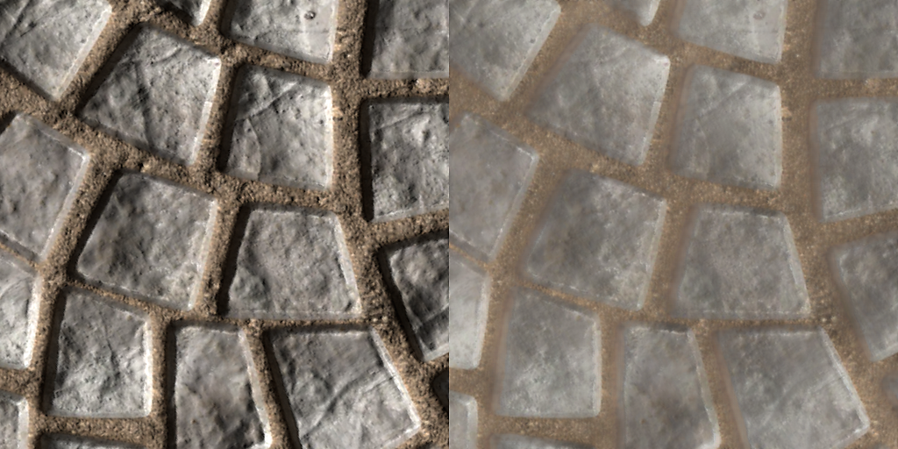
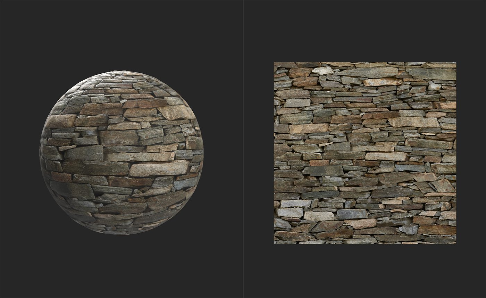
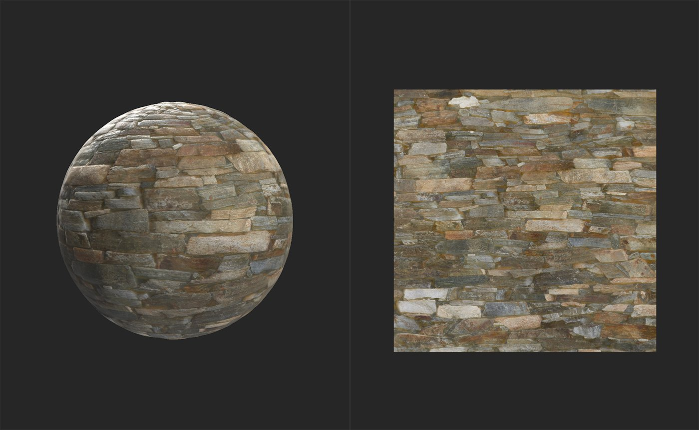

# Delight （AI搭載）

<table>
<tr style="border: 0;">
<td width="41.60%" style="border: 0;" valign="top">

**イン：**&#x200B;ツール

</td>
<td width="58.30%" style="border: 0;" valign="top">

## 説明

base colorチャンネルから照明を消すことができます。 通常、マテリアルには照明に関する情報を含めないため、画像をマテリアルに変換する場合は、この設定が重要になります。 マテリアルとは、光がサーフェスにどのように反応するかを表す情報の集まりです。したがって、光の情報を含まないチャンネルに既に光の情報がベイクされている場合、マテリアルがサーフェスをリアルに表現する能力が損なわれる可能性があります。

***1&rbrace;喜び（AI利用）フィルター**&#x200B;で処理される前後の画像の例。 **シャドウとハイライトが削除され、base colorのみが残っていることに注意してください。*

以下の画像は、**喜び（AI利用）フィルター**&#x200B;で処理される前後のマテリアルを示しています。

上の画像では、マテリアルチャンネルに大部分の照明情報がbase colorに含まれています。 レンガ間の暗いシャドウは、base colorチャンネルに存在しないようにする必要があります。

光を当てた後、シャドウを除去して、より物理的に正確なbase colorチャンネルを作成しました。 この例の結果は目立たないように見えますが、画像を楽しませることは、画像をマテリアルに変換する重要な手順です。

ソースイメージでは、光は静的な光源から来ますが、マテリアルはあらゆる角度から来る光を処理できる必要があります。 例えば、上から下に向かって光が輝く元画像を、楽しい手順を踏まずにマテリアルに変換した場合、下から上に向かって光が輝く3D空間で表示される可能性があります。 光源が1つしかない場合は、マテリアルが複数のライトから影をキャストしているように同時に見えるため、カメラはすぐに場違いに見えます。

</td>
</tr>
</table>

## パラメーター

採光器にはパラメータがなく、自動的に機能します。

## 使用方法ガイド

使い方は？

**明るさフィルター**&#x200B;をレイヤースタックの上部に追加します。

### どのような場合に使用しますか？

**画像をマテリアル(B2M)に変換**&#x200B;を使用する場合は、画像からすべてのチャンネルを抽出してマテリアルを並べ替え可能にした後に、描画機能を使用して、ベースカラーから明るさを削除します。 **画像からマテリアル （AI利用）**&#x200B;には楽しいパスが含まれているため、**Delighter （AI利用）フィルター**&#x200B;を使用する必要はありません。
