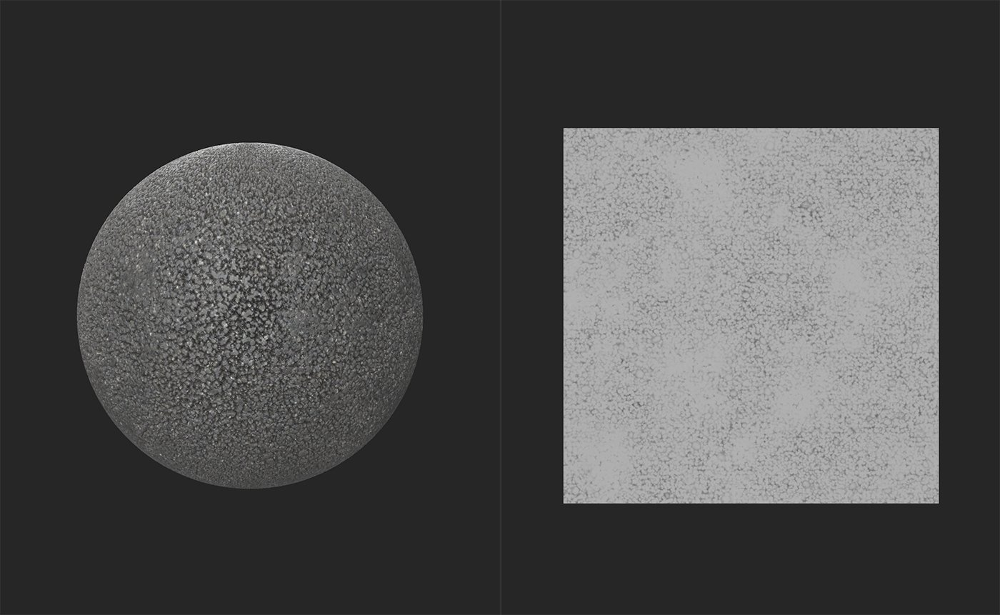
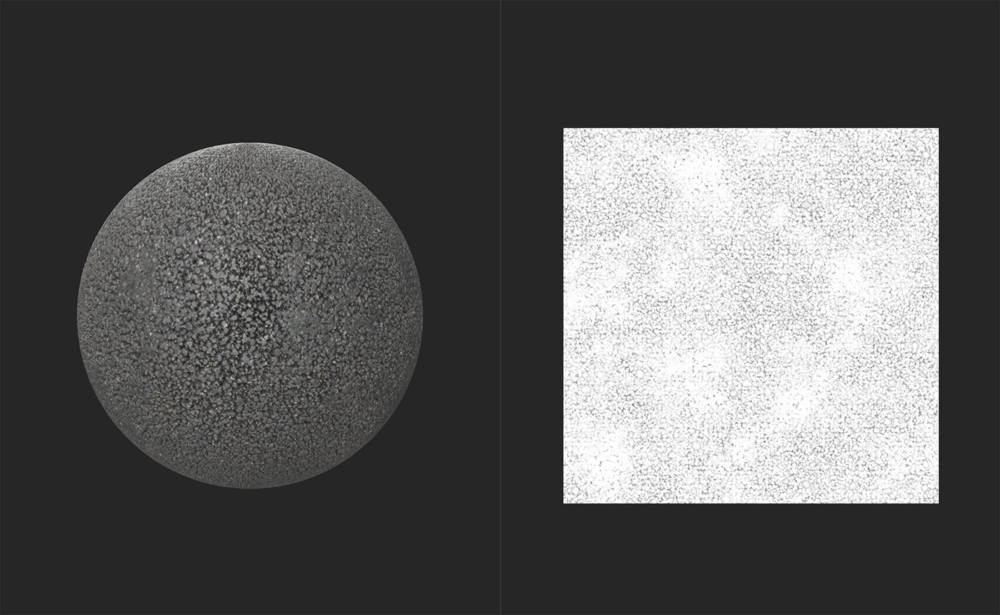

# AOのHeight

<table>
<tr style="border: 0;">
<td width="41.60%" style="border: 0;" valign="top">

**イン：**&#x200B;ツール

</td>
<td width="58.30%" style="border: 0;" valign="top">

## 説明

Heightと通常のデータからAmbient occlusionマップを生成します。

**AOフィルターへのHeight**&#x200B;の結果は、次の画像をご覧ください。

上の図では、**2D ビュー**&#x200B;に高さマップが表示されています。 マテリアルには、この画像のAmbient occlusion情報が含まれていません。

この画像では、Ambient occlusionマップは&#x200B;**AOフィルターへのHeight**&#x200B;によって作成されており、**2D ビュー**&#x200B;に表示されます。 一般に、Ambient occlusionは微妙な影響を与えるので、このマテリアルではあまり確認できません。マテリアルで&#x200B;**AOにHeight**&#x200B;フィルターを使用して、AOの適用度を上げ、Ambient occlusionを操作する感覚を得てください。

</td>
</tr>
</table>

## パラメーター

**基本パラメーター**

* **モード**:\
  Heightチャンネルからデータを生成するか、通常チャンネルからデータを生成するか、両方のチャンネルからデータを生成するかを選択します。
* **周囲オクルージョン – 強度**: 0-1\
  生成されたAOデータの強さを調整します
* **Ambient occlusion – スプレッド**: 0 ～ 1\
  生成されたAOデータの半径を調整する
