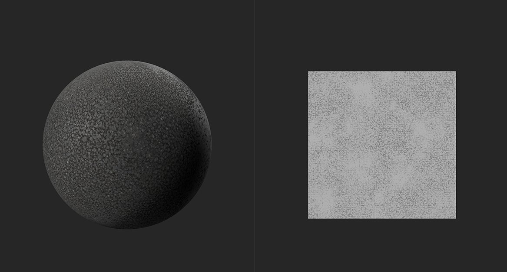
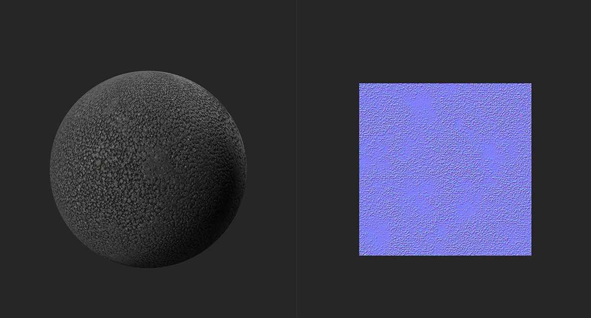

# Heightを標準に

<table>
<tr style="border: 0;">
<td width="41.60%" style="border: 0;" valign="top">

**イン：**&#x200B;ツール

</td>
<td width="58.30%" style="border: 0;" valign="top">

## 説明

Heightチャンネルに基づいて標準チャンネルデータを生成します。

次の画像で、**標準フィルターへのHeight**&#x200B;の動作を確認できます。

上の図では、マテリアルからの通常のデータはありません。 Heightマップのみが使用可能で、**2Dビュー**&#x200B;に表示されます。

**標準フィルターへのHeight**&#x200B;では、上の画像に示されているHeightマップから標準データが生成されます。 生成された法線マップにより、光は2番目の画像のマテリアルからよりリアルに反射します。

</td>
</tr>
</table>

## パラメーター

**基本パラメーター**

* **ワールド単位を使用**：切り替え\
  パラメータを実世界の単位で測定するかどうかを変更します。 これにより、使用できるパラメーターが変更されます。
  * **[ワールド単位を使用]が有効な場合：**
    * **表面サイズ(cm)**: 0 ～ 500\
      UV空間のサイズをワールド単位で設定します
    * **深度 (cm)**: 0 ～ 10\
      高さマップで表される距離を設定します。 高さマップが狭い場合、高さマップ値の差が大きいと、法線角度への影響が小さくなります。 高さマップが広い場合は、高さマップ値の差が小さいと、法線マップ上の角度が大きくなることがあります。
  * **[ワールド単位を使用]が無効な場合：**
    * **強度**: 0 ～ 3\
      法線角度の急角度を調整
* **下の法線を結合**: 0-1\
  このフィルターの結果に既存の法線マップを追加します。

**マスク**

* **カスタムマスク**:トグル\
  カスタムマスクの使用を有効または無効にします。 有効にすると、次のパラメーターが表示されます。
  * **マスク**：画像/ブラシ\
    マスクとして使用する画像を選択するか、ブラシを使用して2D ビュー内で直接カスタムマスクをペイントします
  * **カスタムマスク – ぼかし**: 0-1\
    マスクをぼかす
  * **カスタムマスク – 反転**：切り替え\
    マスクを反転
