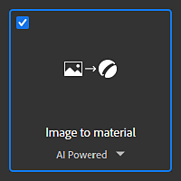
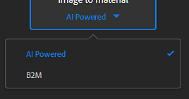

# 画像からマテリアル

**画像からマテリアル**&#x200B;テンプレートを使用すると、1つの入力画像から高品質のPBRマテリアルを生成できます。

このテンプレートには、主に次の2つのアルゴリズムがあります。

* **AI利用**
* **B2M**

各アルゴリズムの詳細については、以下を参照してください。

## 例

単一の入力画像から生成されたマテリアルチャンネルの例を次に示します。

{width="500px"}

## アルゴリズム

**画像からマテリアル**&#x200B;へのテンプレートのアルゴリズムを変更するには、テンプレート名の下のドロップダウンをクリックします。

### AI 搭載

<b>AIを活用した</b>アルゴリズムでは、機械学習を使用して、シェイプとオブジェクトを認識し、法線、Height、粗さのマップを正確に作成して、シャドウやハイライトからアルベドを取り除きます。

ニューラルネットワークは、布地、有機物、屋内および屋外表面などの幅広い材料で訓練されています。

>[!NOTE]
>
> 画像からマテリアル（AI搭載）への変換は、高解像度の画像での計算に時間がかかります。[レイヤー解像度](../../interface/preferences/layer-resolution.md)システムを使用して、作業中のワークフローを最適化することをお勧めします。

### B2M

**B2M**&#x200B;アルゴリズムでは、Substanceに基づくビットマップからマテリアルへの変換法を使用して、基本色、法線、メタリック、粗さ、および周辺オクルージョンなどの複数のチャンネルを、手続き型の手法を使用して生成します。

このアルゴリズムでは、生成される結果の精度が下がる場合がありますが、より広い範囲の入力画像に対して有効です。

## Adobe Capture

この機能は、Adobe Captureモバイルアプリ（AndroidおよびiOS）でも利用できます。 外出先で写真を撮影し、その結果のプレビューをスマートフォンで直接取得できます。

結果をSubstance 3D Samplerに簡単に送信して、以降のエディションに使用できます。

>[!NOTE]
>
> この機能は、Adobe版Substance 3D Collectionサブスクリプションでのみ利用できます。
