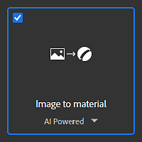
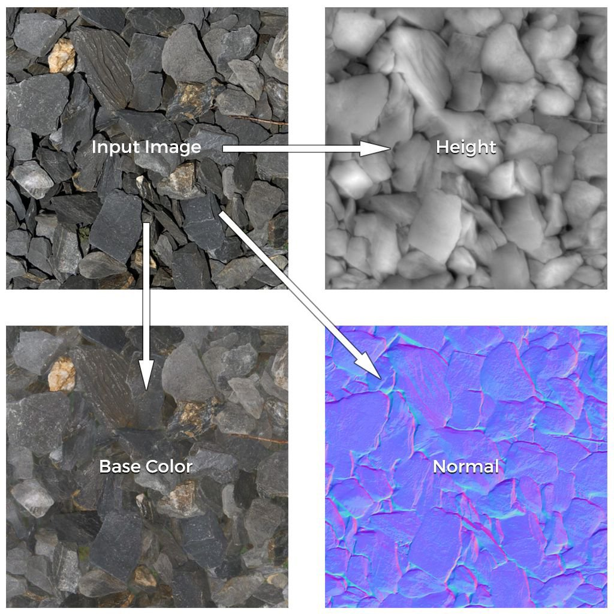
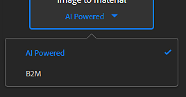
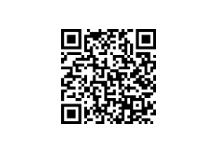

# 画像をマテリアルに

**画像からマテリアルへ**&#x200B;テンプレートを使用すると、1つの入力画像から高品質のPBRマテリアルを作成できます。

このテンプレートには、主に次の2つのアルゴリズムがあります。

* **AI利用**
* **B2M**

各アルゴリズムの詳細については、以下を参照してください。

## 例

次に、1つの入力画像から生成されたマテリアルチャンネルの例を示します。

{width="500px"}

## アルゴリズム

テンプレート&#x200B;**画像のアルゴリズムをマテリアル**&#x200B;に変更するには、テンプレート名の下のドロップダウンをクリックします：

### AI 搭載

<b>AI利用</b>のアルゴリズムでは、機械学習を使用して、シェイプとオブジェクトを認識し、法線、Height、ラフネスのマップを正確に生成するとともに、シャドウやハイライトからアルベドを取り除きます。

ニューラルネットワークは、布地、オーガニック、屋内および屋外サーフェスなどの幅広いマテリアルで訓練されています。

>[!NOTE]
>
> 画像からマテリアルへの変換（AIを利用）は、高解像度の画像での処理に時間がかかります。作業中のワークフローを最適化するには、[レイヤー解像度](../../interface/preferences/layer-resolution.md)を使用することをお勧めします。

### B2M

**B2M**&#x200B;アルゴリズムでは、Substanceに基づくビットマップからマテリアルへの方式を使用して、プロシージャルの手法を使用し、base color、標準、メタリック、ラフネス、ambient occlusionなどの複数のチャンネルを生成します。

このアルゴリズムでは、精度の低い結果が生成される場合がありますが、より広い範囲の入力画像で機能します。

## Adobe Capture

この機能は、Adobe Captureモバイルアプリ（AndroidおよびiOS）でも利用できます。 外出先で写真をスナップし、その結果のプレビューをスマートフォンで直接取得できます。

結果をSubstance 3D Samplerに簡単に送信して、以降のエディションに使用できます。

>[!NOTE]
>
> この機能は、Adobe版Substance 3D Collectionサブスクリプションでのみ利用できます。
