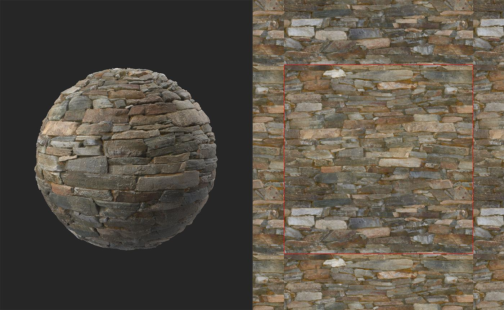
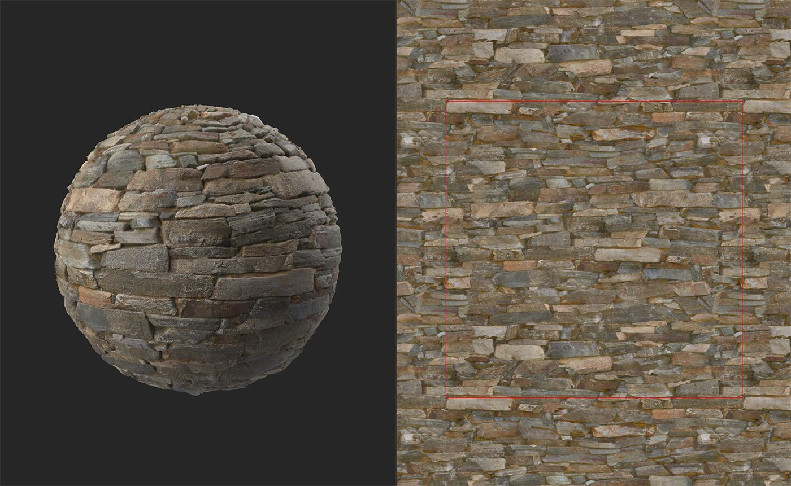
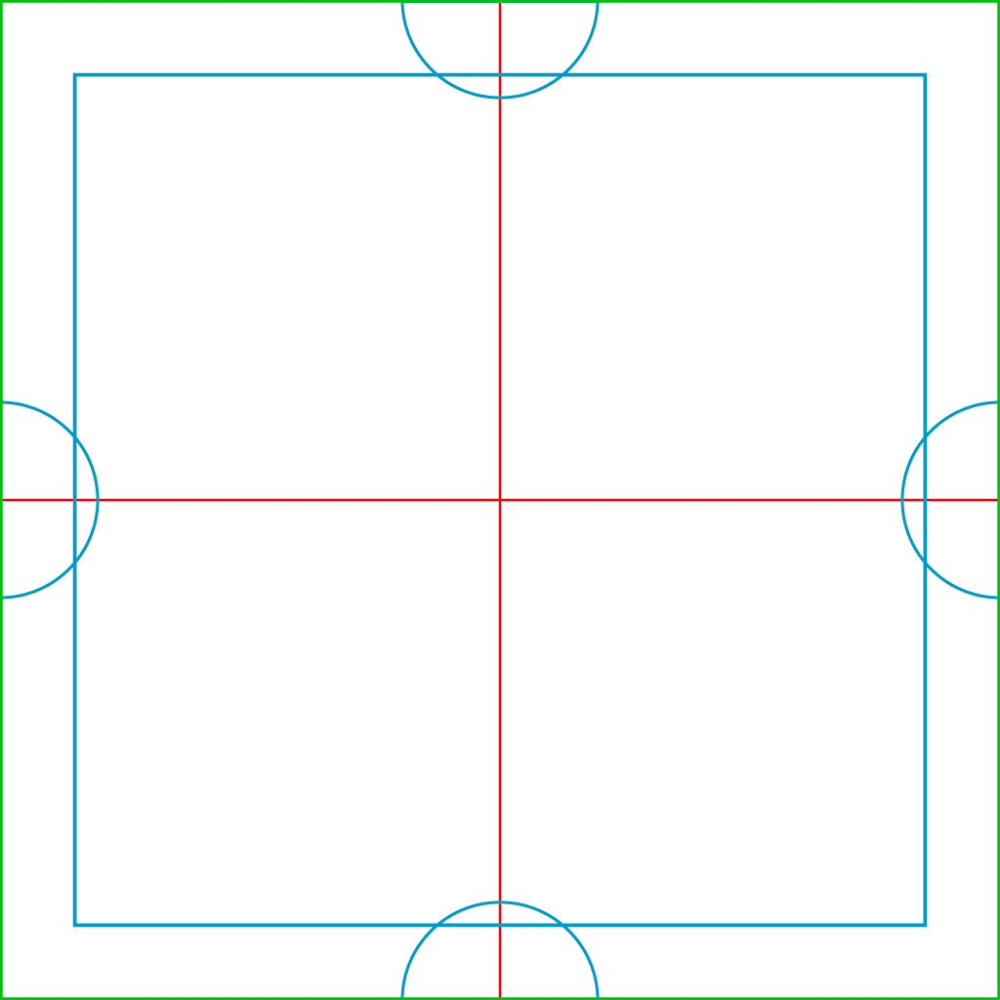

# 並べて表示

<table>
<tr style="border: 0;">
<td width="41.60%" style="border: 0;" valign="top">

**In:**&#x200B;ジェネレーター

</td>
<td width="58.30%" style="border: 0;" valign="top">

## 説明

**タイルフィルターを使用**&#x200B;して、マテリアルを並べて表示できるようにします。 **タイリングフィルター**&#x200B;を使用するとマテリアルを並べて表示することもできますが、フィルターごとに動作が異なります。 **Make it Tileフィルター**&#x200B;が機能していない場合は、**タイリングフィルター**&#x200B;を試してください。

下の画像では、**タイルフィルターを作成**&#x200B;して、タイリングでないマテリアルをタイル可能なマテリアルに変換する方法を確認できます。 このマテリアルは、グリッドのようなパターンを描き、焦点を引き付ける特定のポイントがないため、うまくタイル表示されます。

上の図では、赤い線はマテリアルの境界線を示しています。 強いシームが存在し、このマテリアルがタイリングしないことは明らかです。

**タイルにする**&#x200B;と、このマテリアルは赤い線がなければ十分にタイル化され、マテリアルの境界線にシームが表示されなくなります。

</td>
</tr>
</table>

## パラメーター

**基本パラメーター**

* **しきい値**: 0 ～ 1\
  一番上のレイヤーのサイズとマッチングを調整します。
* **Smoothness**: 0 ～ 1\
  上のレイヤーのシームを滑らかにします。
* **コントラスト**: 0 ～ 1\
  シームのコントラストを調整します。 コントラストを下げると、シームをぼかしたときと同じ効果が得られます。
* **スポットの削除**：切り替え\
  有効にすると、フィルターは上位レイヤーと下位レイヤーのシーム付近の斑点を削除しようとします。
* **Color Equalizer**: 0 ～ 50\
  カラー値を平均化（イコライズ）して、シームを見やすくします。
* **Heightの一致**:\
  フィルターの上のレイヤーと下のレイヤーで、高さマップのブレンド方法を変更します。 より明確に結果を確認するには、**2D ビュー**&#x200B;でHeightチャンネルを表示します。 HeightマッチングはHeightチャンネル以外のチャンネルには影響しないので、法線とAOはHeightマッチングの変更の影響を受けません。

**詳細パラメーター**

* **クロミナンスの影響** : 0 ～ 1\
  カラー値がシームに与える影響を調整します。
* **マスクの反転**：切り替え\
  上下のレイヤーマスクを反転します。
* **Smoothnessに一致するHeight**: 0 ～ 16\
  上下のレイヤー間で一致するHeightのぼかしを調整します。
* **左/右パッチソース**: -1 ～ 1\
  左右のパッチのソースの場所を調整します。
* **パッチソースの上/下**: -1から1\
  上位および下位パッチのソースの場所を調整します。

## 使用方法ガイド

**タイルを作成** **フィルター**&#x200B;は、マテリアルの複数のコピーを重ね合わせることで機能します。

次の画像は、レイヤーのレイアウトを示しています。

* 緑の外周は、**タイルにする**&#x200B;フィルターの結果のマテリアルのエッジを示します
* 赤い線は下のレイヤーの境界線を示します。 一番下のレイヤーは、X方向とY軸のUV領域の50%分オフセットされているため、赤い線はカバーする必要があるタイリングシームです。
* 青い正方形と半円が赤いシームを覆っています。 フィルターのパラメーターを使用すると、青いシームをできるだけ滑らかにしておきながら、赤いシームが見えないように青いシェイプの境界線を調整できます。

{width="512px"}

左右の半円が一致してマテリアルタイルが水平になり、上下の半円が一致してマテリアルタイルが垂直になります。 中央の青い正方形は、残りのすべてのシームを削除し、シームのない完全にタイル可能なマテリアルを作成します。
