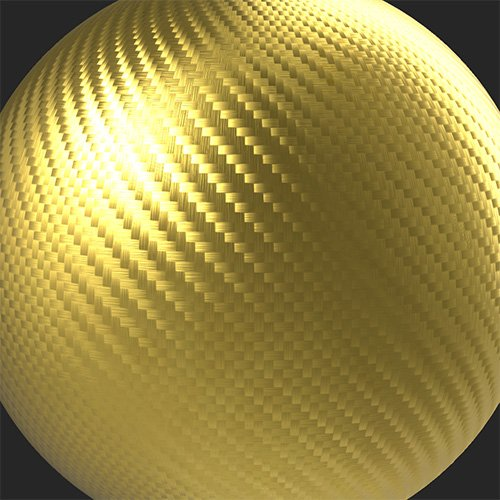

# ハイ / ローメッシュのマッチング

<table>
<tr style="border: 0;">
<td width="41.60%" style="border: 0;" valign="top">

**イン：**&#x200B;ツール

</td>
<td width="58.30%" style="border: 0;" valign="top">

## 説明

**一致フィルター**&#x200B;を使用すると、選択したパラメーターまたは別のマテリアルを使用して、マテリアルの色と粗さを一致させることができます。

次の画像は、ベースの色を調整して炭素繊維の材料を模様の付いた金に変換するために使用されている&#x200B;**マッチフィルター**&#x200B;を示しています。

<table>
<tr style="border: 0;">
<td style="border: 0;" valign="top">

{width="200px"}

</td>
<td style="border: 0;" valign="top">

{width="200px"}

</td>
</tr>
</table>

</td>
</tr>
</table>

## パラメーター

**基本パラメーター**

* **ターゲットモード**:\
  入力マテリアルまたはカスタムパラメータのいずれと一致させるかを選択します。 使用可能なパラメーターは、選択されている&#x200B;**ターゲットモード**&#x200B;によって異なります。
  * **入力**
    * **半径**: 0 ～ 50\
      一致した領域の半径を調整
    * **プリセット**:\
      カラーのみを一致させるか、カラーと粗さの両方を一致させるかを選択します。 この選択により、**詳細パラメーター**&#x200B;で使用できるオプションが変わります
  * **パラメーター**
    * **プリセット**:\
      カラーのみを一致させるか、カラーと粗さの両方を一致させるかを選択します。 この選択により、**詳細パラメーター**&#x200B;で使用できるオプションが変わります
    * **基本色**:カラーの選択\
      一致するカラーを選択
    * **粗さ** : 0 ～ 1\
      一致させる粗さを設定

**詳細パラメーター**

* **タイリングされた入力**：切り替え\
  入力タイルでマテリアルのエッジの一致を改善する場合は、このオプションを有効にします
* **ベースカラー – ターゲットに一致**: 0-1\
  ベースカラーマッチングの強度を調整
* **粗さ – ターゲットに一致**: 0-1\
  粗さのマッチングの強さを調整
