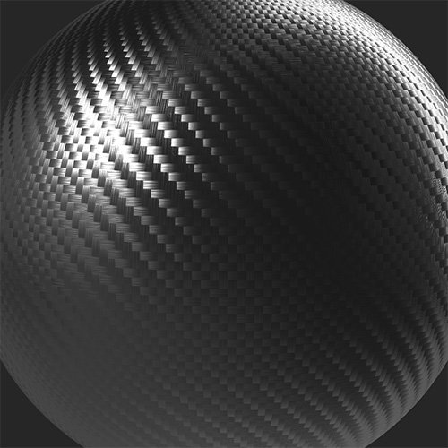
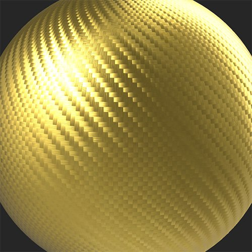

# ハイ / ローメッシュのマッチング

<table>
<tr style="border: 0;">
<td width="41.60%" style="border: 0;" valign="top">

**イン：**&#x200B;ツール

</td>
<td width="58.30%" style="border: 0;" valign="top">

## 説明

**一致フィルター**&#x200B;を使用すると、マテリアルの色とラフネスを、選択したパラメーターまたは別のマテリアルと一致させることができます。

次の図は、base colorを調整してカーボンファイバーのマテリアルをパターン化した金に変えるために使用されている&#x200B;**マッチフィルター**&#x200B;を示しています。

<table>
<tr style="border: 0;">
<td style="border: 0;" valign="top">

{width="200px"}

</td>
<td style="border: 0;" valign="top">

{width="200px"}

</td>
</tr>
</table>

</td>
</tr>
</table>

## パラメーター

**基本パラメーター**

* **ターゲットモード**:\
  入力パラメーターまたはカスタムマテリアルーと一致させるかどうかを選びます。 使用可能なパラメーターは、選択されている&#x200B;**ターゲットモード**&#x200B;によって異なります。
  * **入力**
    * **半径**: 0 ～ 50\
      一致した領域の半径を調整
    * **プリセット**:\
      カラーだけを一致させるか、カラーとラフネスの両方を一致させるかを選択します。 この選択により、**詳細パラメーター**&#x200B;で使用できるオプションが変わります
  * **パラメーター**
    * **プリセット**:\
      カラーだけを一致させるか、カラーとラフネスの両方を一致させるかを選択します。 この選択により、**詳細パラメーター**&#x200B;で使用できるオプションが変わります
    * **Base color**:カラー選択\
      一致するカラーを選択
    * **ラフネス**: 0 ～ 1\
      ラフネスを一致させる

**詳細パラメーター**

* **タイリングされた入力**：切り替え\
  入力タイルがマテリアルの端での一致を改善する場合は、このオプションを有効にします
* **ベースカラー – ターゲットに一致**: 0-1\
  ベースカラーマッチングの強さを調整
* **ラフネス – ターゲットと一致**: 0-1\
  ラフネス照合の強さを調整します
