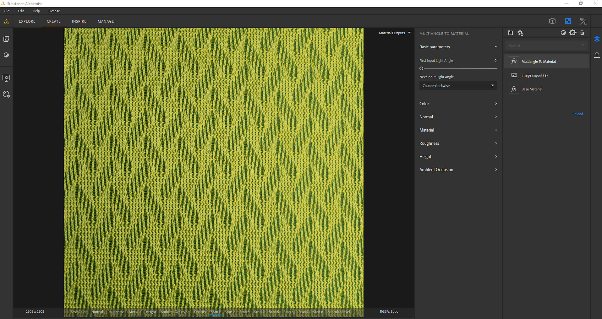

# マルチアングルからマテリアル

**マルチアングルからマテリアル**&#x200B;テンプレートは、特定の光条件で撮影された2 ～ 8枚の入力画像から素材を作成します。 このような光条件は、マテリアルスキャナーで実現できます。

>[!NOTE]
>
> 独自のマテリアルスキャナー[を作成する方法の詳細については、この記事](https://www.adobe.com/products/substance3d/magazine/your-smartphone-is-a-material-scanner-vol-ii.html)をご覧ください。

## 例

次に、8つの入力画像から作成したマテリアルの例を示します。

* 最初の8枚は8光度以下で撮影したスキャン画像です。
* 下部の画像は、テンプレートの出力（ベースカラー、法線、Height、メタリック、ラフネス）です。

{width="400px"}

## Substance 3D Samplerの設定

PBRチャネルが正しく抽出されるように設定および設定するには、次の3つがあります。

* スキャン画像の順序
* 最初の入力ライト角度
* 次の入射光角

{width="450px"}

### 画像をスキャンする順序

画像を読み込む際には、画像読み込みレイヤーで、8つの画像が連続していることを確認してください。

例えば、0°の最初の画像は&#x200B;**scan1**&#x200B;で、45°の画像は&#x200B;**scan2**&#x200B;です。次に、315°の画像は&#x200B;**scan8**&#x200B;になります

{width="450px"}

### 最初と次のライト角度

マルチアングルからマテリアルレイヤーで次の操作を行います。

* 最初の入力光の角度を設定します。 **scan1**&#x200B;が180°の場合、最初の入力光角度は0.5です。**scan1**&#x200B;が0°の場合、最初の入力光角度は0です。
* 次の入力光角度を設定：画像の回転方向を定義します。 scan1が0°の場合、scan2 45°...の値は&#x200B;**反時計回り**&#x200B;です

{width="450px"}
