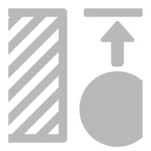

# Heightに垂直

<table>
<tr style="border: 0;">
<td width="41.60%" style="border: 0;" valign="top">

**イン：**&#x200B;ツール

</td>
<td width="58.30%" style="border: 0;" valign="top">

## 説明

通常のチャンネルに基づいてHeight情報を生成します。

下の画像は、**Heightに垂直フィルター**&#x200B;の動作を示しています。 最初の画像では、HeightマップにHeight情報がありません。 2番目の画像では、**Heightに垂直** **フィルター**&#x200B;を適用した後、リアルなHeightマップが生成されます。

</td>
</tr>
</table>

## パラメーター

このフィルターにはパラメーターがありません。 レイヤースタックの一番上に追加するだけで使用できます。
