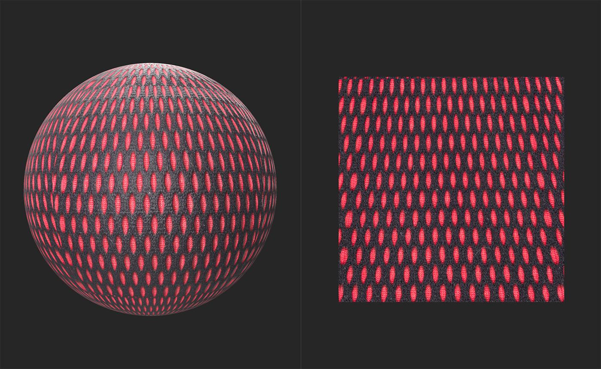
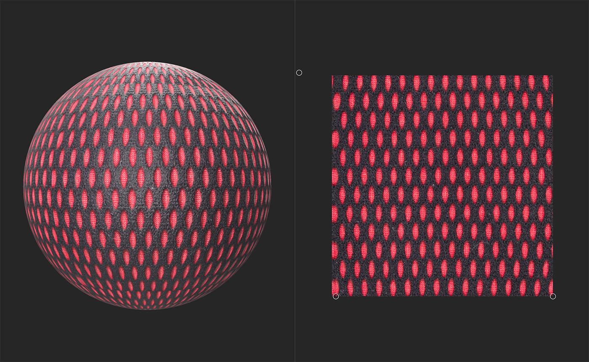

# 変形

<table>
<tr style="border: 0;">
<td width="41.60%" style="border: 0;" valign="top">

**イン：**&#x200B;ツール

</td>
<td width="58.30%" style="border: 0;" valign="top">

## 説明

<b>変形ツール</b>を使用して、画像の遠近法の問題を修正します。 <b>遠近法 変形</b>はマテリアルでも使用できます。

次の図は、<b>変形ツール</b>で修正される前のマテリアルの例を示しています。 2D ビューの上部付近にある図形が、2D ビューの下部付近にある図形と比べて、垂直方向にどのように伸縮されるかに注目してください。

<b>遠近法 変形</b>では、図形は一貫しており、グリッドを形成しています。 この時点から、<b>タイリング</b>や<b>タイル状にする</b>などのフィルターを使用して、これをタイル可能なマテリアルに変換することは簡単です。

</td>
</tr>
</table>

## 使用方法ガイド

変形レイヤーを選択すると、2D ビューのテクスチャの各隅にハンドルが表示されます。 2D空間で個別に移動して、遠近法を補正します。

{width="300px"}

## ツールバー

変形レイヤーを選択すると、**2D ビュー**&#x200B;の上部にツールバーが表示されます。 **[位置のリセット]ボタン**&#x200B;を使用して、変形レイヤーのハンドルを既定の位置にリセットします。
