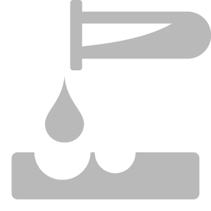

# 腐食

<table>
<tr style="border: 0;">
<td width="41.60%" style="border: 0;" valign="top">

**イン：**&#x200B;摩耗と仕上げ

</td>
<td width="58.30%" style="border: 0;" valign="top">

## 説明

腐食フィルターは、マテリアルを酸が侵食する効果を模倣して、穴を開けて表面にダメージを与えます。

</td>
</tr>
</table>

## パラメーター

**基本パラメーター**

* **ランダムシード**:\
  ランダムシードは、このフィルターのランダム度を使用する他のパラメーターのランダム値を決定します。
* **影響を受ける領域**:\
  サーフェスの曲率がフィルタの効果に与える影響を選択します。
* **穿孔レベル**: 0 ～ 1\
  作成する穴の数を調整します。
* **曲率の位置**: 0 ～ 1\
  影響を受ける曲率範囲を変更します。
* **曲率の滑らかさ**: 0 ～ 1\
  曲率マップを滑らかにします。
* **ダメージの距離**: 0-1\
  腐食した領域の周囲のダメージ半径を制御します。
* **ダメージの強さ**: 0 ～ 1\
  影響を受ける領域のダメージの量を調整します。
* **Heightの強さ**: 0 ～ 1\
  高さマップへのダメージの影響を制御します。
* **押し出し位置**：切り替え\
  高さマップのダメージ方向を切り替えます。 無効にすると、ダメージは表面に食い込み、有効にすると、表面から外側に向かってダメージが発生します。

**マスク**

* **カスタムマスクを使用**：切り替え\
  カスタムマスクの使用を有効または無効にします。 有効にすると、次のパラメーターが表示されます。
  * **マスク**：画像/ブラシ\
    マスクとして使用する画像を選択するか、ブラシを使用して2Dビューでカスタムマスクを直接ペイントします。
  * **カスタムマスク – ぼかし**: 0-1\
    マスクをぼかします。
  * **カスタムマスク – 反転**：切り替え\
    マスクを反転します。

**詳細パラメーター**

詳細パラメーターの一部は、このフィルターによって変更された領域のみではなく、マテリアル全体に影響します。

* **輝度**: 0 ～ 1\
  マテリアル全体の輝度または明度を調整します。
* **コントラスト**: -1から1\
  マテリアル全体のアルベドコントラストを調整します。
* **色相シフト**: 0 ～ 1\
  マテリアル全体でカラーの色相値をオフセットします。
* **彩度**: 0 ～ 1\
  マテリアル全体の彩度を調整します。
* **法線の強度**: 0 ～ 1\
  **腐食フィルター**&#x200B;の影響を受けた法線マップの強さを調整します。
* **Height範囲**: 0 ～ 1\
  マテリアル全体を表示するには、高さマップの値の範囲を大きくします。
* **Heightの位置**: 0 ～ 1\
  マテリアル全体のHeightをオフセットします。
* **Ambient occlusionの強さ**: 0 ～ 1\
  **腐食フィルター**&#x200B;によるAOの影響の強さを調整します。
