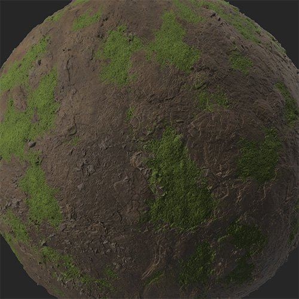

# コケ

<table>
<tr style="border: 0;">
<td width="41.60%" style="border: 0;" valign="top">

**イン：**&#x200B;摩耗と仕上げ

</td>
<td width="58.30%" style="border: 0;" valign="top">

## 説明

**コケフィルター**&#x200B;を使用して、マテリアルにコケや苔癬を追加します。 **コケ**&#x200B;は、マテリアルのオクルージョンマップを使用して、亀裂や割れ目の中で自然に成長します。

次の図は、**コケフィルター**&#x200B;を適用する前と後のDirt素材を示しています。

<table>
<tr style="border: 0;">
<td style="border: 0;" valign="top">

{width="200px"}

</td>
<td style="border: 0;" valign="top">

{width="200px"}

</td>
</tr>
</table>

</td>
</tr>
</table>

## パラメーター

**基本パラメーター**

* **ランダムシード**:\
  このフィルタの他のすべてのランダムパラメータの基準となるランダムシード。
* **コケのグローバルな広がり**: 0-1\
  マテリアルのコケの適用範囲を調整します。
* **コケの色**:カラー選択\
  コケの原色を選択します。
* **第2コケの色**:カラー選択\
  コケの第2カラーを選択します。
* **コケの再パーティション**:\
  コケの適用に使用する方法を選択します。 既定では、**オクルージョン**&#x200B;はマテリアルのAOマップを使用してコケを適用しますが、他のオプションでは効果が異なります。 **カスタム** **マスク**&#x200B;を選択すると、**マスク** **セクション**&#x200B;が表示されます。

**マスク**

このセクションは、**基本パラメーター/ Moss Repartition**&#x200B;で&#x200B;**カスタムマスク**&#x200B;を選択した場合にのみ表示されます。

* **カスタムマスク – ぼかし**: 0-1\
  マスクをぼかします。
* **カスタムマスク – 反転**：切り替え\
  マスクを反転します。
* **カスタムマスク**：画像/ブラシ\
  マスクとして使用する画像を選択するか、ブラシを使用して2Dビューでカスタムマスクを直接ペイントします。

**コケ**

このセクションで使用できるパラメーターは、**基本パラメーター> Moss Repartition**&#x200B;でどのオプションが選択されているかによって異なります。

* **オクルージョン**
  * **コケのオクルージョン伝達**: 0-1\
    オクルージョンに基づいてコケの広がりを制御します。
  * **コケのオクルージョンマスク**: 0-1\
    オクルージョンマップをマスクとして使用して、コケの量を調整します。
* **全体**
  * **コケ全体の伝達**: 0-1\
    コケの量を調整します。
* **上位**
  * **上のコケのしきい値**: 0 ～ 1\
    コケを表示するかどうかを決定するしきい値を制御します。
  * **コケの頂角**&#x200B;法線マップに基づいて、マテリアルにコケを適用する方法を調整します。
* **すべて**
  * **すべて**&#x200B;には、**オクルージョン**、**全体**、および&#x200B;**上位**&#x200B;の上記のパラメーターがすべて含まれています。

次のパラメーターは、**基本パラメーター/Moss Repartition**&#x200B;でどのオプションを選択したかとは別に使用できます。

* **コケの花のサイズ**: 0 ～ 1\
  コケの粒度を変更します。
* **コケ粒子の適用度**: 0-1\
  コケの粒子の視認性を調整します。
* **コケの塊のサイズ**: 0 ～ 1\
  コケがくっつく傾向を制御します。
* **コケの塊のシャープ**: 0 ～ 1\
  ヘアグループのエッジの柔らかさを調整します。
* **コケの塊の強度**: 0 ～ 1\
  コケの塊の強度を制御します。
* **コケのぼかし**: 0-1\
  コケのマスクのエッジをぼかす方法を調整します。
* **コケバンプ強度**: 0-1\
  コケのでこぼこを変更します。
* **上のコケのしきい値**: 0 ～ 1

**技術パラメーター**

* **法線の強度**: 0 ～ 1\
  コケ法線の強度を調整します。
* **周囲オクルージョンの強度**&#x200B;コケの周囲オクルージョンの強度を制御します。
