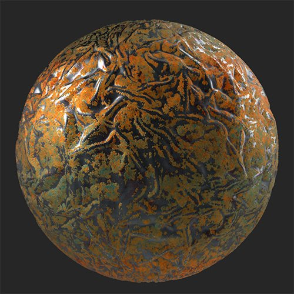

# 酸化する

<table>
<tr style="border: 0;">
<td width="41.60%" style="border: 0;" valign="top">

**イン：**&#x200B;摩耗と仕上げ

</td>
<td width="58.30%" style="border: 0;" valign="top">

## 説明

素材の上に酸化の層を追加します。*しわの寄った表面には、**酸化フィルター**&#x200B;が適用されています。*

<table>
<tr style="border: 0;">
<td style="border: 0;" valign="top">

{width="200px"}

</td>
<td style="border: 0;" valign="top">

{width="200px"}

</td>
</tr>
</table>

</td>
</tr>
</table>

## パラメーター

**基本パラメーター**

* **ランダムシード**:\
  ランダムシードは、このフィルターのランダム度を使用する他のパラメーターのランダム値を決定します。
* **ターゲット領域**：切り替え\
  材料に酸化効果を適用する方法を変更できます。 有効にすると、次のコントロールが表示されます。
  * **ターゲット領域の強さ**: 0 ～ 1\
    ターゲット領域エフェクトの広がりを調整します。
  * **展開中**: 0-1\
    酸化が広がる範囲を調整します。
* **色**：色の選択\
  フィルターのベースカラーを選択します。 ベースカラーは、酸化効果を構成するすべてのカラーの色相を変更します。
* **カラーバリエーション**: 0 ～ 1\
  カラーバリエーション効果のスケールを調整します。
* **密度**: 0 ～ 1\
  エフェクトの適用量の密度を変更します。
* **エッジの裁ち落とし**: 0 ～ 1\
  酸化効果のエッジが非酸化領域にブリードする方法を変更します。
* **パッチ**: 0 ～ 1\
  これは、酸化された領域と酸化されていない領域の間でマスクを変更するための個別の制御です。 これを密度やその他のコントロールと組み合わせて、酸化された領域のエッジを微調整します。
* **チッピング**: 0-1\
  酸化された領域を削り取って、下にある材料を表示します。
* **ステイン**: 0-1\
  材料の上に重ねる汚れの量を調整します。
* **腐食の粗さ**: 0 ～ 1\
  酸化領域の粗さを調整します。
* **金属の腐食**: 0-1\
  酸化領域のメタリック値を調整します。
* **ノイズの強さ**: 0 ～ 1

**マスク**

* **カスタムマスクを使用**：切り替え\
  カスタムマスクの使用を有効または無効にします。 有効にすると、次のパラメーターが表示されます。
  * **マスク**：画像/ブラシ\
    マスクとして使用する画像を選択するか、ブラシを使用して2Dビューでカスタムマスクを直接ペイントします。
  * **カスタムマスク – ぼかし**: 0-1\
    マスクをぼかします。
  * **カスタムマスク – 反転**：切り替え\
    マスクを反転します。
  * **カスタムマスクの不透明度**: 0 ～ 1\
    マスクの不透明度を調整します。

**技術パラメーター**

次のパラメーターを使用すると、**明るさ/コントラスト**&#x200B;や&#x200B;**色相/彩度**&#x200B;などの調整レイヤーを追加せずに、マテリアル全体の名前付きの値を調整できます

* **輝度**: 0 ～ 1
* **コントラスト**: -1から1
* **色相シフト**: 0 ～ 1
* **彩度**: 0 ～ 1
* **法線の強度**: 0 ～ 1
* **Height範囲**: 0 ～ 1
* **Heightの位置**: 0 ～ 1
* **周囲オクルージョンの強さ**: 0 ～ 1
