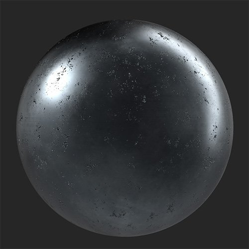

# ペイント

<table>
<tr style="border: 0;">
<td width="41.60%" style="border: 0;" valign="top">

**イン：**&#x200B;摩耗と仕上げ

</td>
<td width="58.30%" style="border: 0;" valign="top">

## 説明

**ペイントフィルター**&#x200B;を使用すると、様々なThicknessのペイントのレイヤーで素材を覆うことができます。

*上に磨り減ったペイントが追加された金属素材です。*

<table>
<tr style="border: 0;">
<td style="border: 0;" valign="top">

{width="200px"}

</td>
<td style="border: 0;" valign="top">

{width="200px"}

</td>
</tr>
</table>

</td>
</tr>
</table>

## パラメーター

**基本パラメーター**

* **ランダムシード**:\
  ランダムシードは、このフィルターのランダム度を使用する他のパラメーターのランダム値を決定します。
* **色**：色の選択\
  ペイントカラーを設定します。
* **粗さ** : 0 ～ 1\
  ペイントがカバーする領域の粗さを設定します。
* **Thickness**: 0 ～ 1\
  ペイントの粘性とThicknessを調整します。 この値は、ペイントを通して見える基本Heightと通常の情報の量に影響します。
* **ピール**: 0 ～ 1\
  塗料が剥がれた部分にパッチを追加します。
* **粒子**: 0-1\
  ペイントの表面の粒子を変更します。
* **粒子サイズ**: 1 ～ 5\
  粒子の作成に使用するテクスチャのスケールを調整します。

**マスク**

* **キャビティマスク**：切り替え\
  Heightマップにある空洞に基づいてマスクを作成します。 有効にすると、次のパラメーターが表示されます。
  * **キャビティのサイズ**: 0 ～ 1\
    Heightマスクの作成に使用するキャビティ範囲を調整します。
  * **キャビティの強度**: 0 ～ 1\
    空洞の深度に基づいてマスクの不透明度を調整します。
  * **キャビティのマスクを反転**：切り替え\
    キャビティマスクを反転して、影響を受けるポイントが高いか低いかを変更します。
* **カスタムマスクを使用**：切り替え\
  カスタムマスクの使用を有効または無効にします。 有効にすると、次のパラメーターが表示されます。
  * **マスク**：画像/ブラシ\
    マスクとして使用する画像を選択するか、ブラシを使用して2Dビューでカスタムマスクを直接ペイントします。
  * **カスタムマスク – ぼかし**: 0-1\
    マスクをぼかします。
  * **カスタムマスク – 反転**：切り替え\
    マスクを反転します。

**詳細パラメーター**

* **基本色**：切り替え\
  ベースカラーチャンネルにフィルターを適用するかどうかを設定します。
* **メタリック**：切り替え\
  メタリックチャンネルがフィルターの影響を受けるかどうかを設定します。
  * **メタリック値**: 0 ～ 1\
    ペイントする領域のメタリック値を調整します。
* **粗さ**：切り替え\
  粗さチャンネルがフィルターの影響を受けるかどうかを設定します。
* **標準**：切り替え\
  法線チャンネルがフィルタの影響を受けるかどうかを設定します。 有効にすると、追加のコントロールが表示されます。
  * **法線 – 強度**: -1 ～ 1\
    法線の強度を調整します。
* **Height**:トグル\
  Heightチャンネルがフィルターの影響を受けるかどうかを設定します。 有効にすると、追加のコントロールが表示されます。
  * **Height – 適用度**: 0 ～ 1\
    Heightマップのコントラストを調整します。
* **不透明度**：切り替え\
  不透明度チャンネルにフィルターを適用するかどうかを設定します。 有効にすると、追加のコントロールが表示されます。
  * **不透明度 – 値**: 0 ～ 1\
    マテリアルの不透明度を変更します。
* **放射性**：切り替え\
  放射チャンネルがフィルターの影響を受けるかどうかを設定します。 有効にすると、追加のコントロールが表示されます。
  * **放射型 – カラー**:カラー選択\
    放射チャンネルのカラーを設定します。
* **環境オクルージョン**：切り替え\
  周囲のオクルージョンチャンネルがフィルターの影響を受けるかどうかを設定します。 有効にすると、次の追加コントロールが表示されます。
  * **周囲オクルージョン – 強度**: 0-1\
    生成されたAOの強度を調整します。
  * **環境オクルージョン** **– 半径**: 0-1\
    AO効果の半径を調整します。
