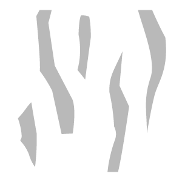
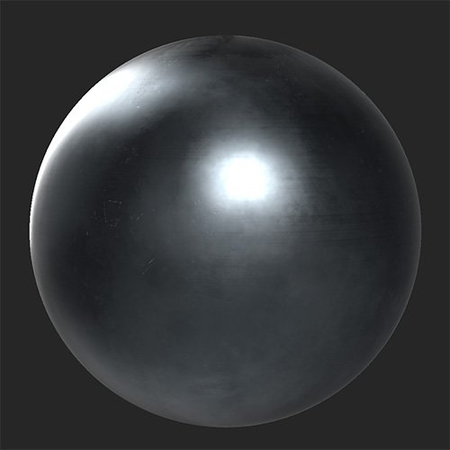
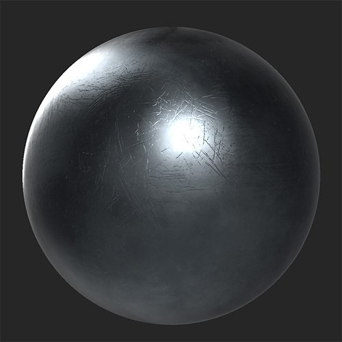

# ひっかき傷

<table>
<tr style="border: 0;">
<td width="41.60%" style="border: 0;" valign="top">

**イン：**&#x200B;摩耗と仕上げ

</td>
<td width="58.30%" style="border: 0;" valign="top">

## 説明

マテリアルに傷や磨耗を加えます。

***スクラッチフィルター**&#x200B;を適用する前と後*

<table>
<tr style="border: 0;">
<td style="border: 0;" valign="top">

{width="200px"}

</td>
<td style="border: 0;" valign="top">

{width="200px"}

</td>
</tr>
</table>

</td>
</tr>
</table>

## パラメーター

**基本パラメーター**

* **ランダムシード**:\
  ランダムシードは、このフィルターのランダム度を使用する他のパラメーターのランダム値を決定します。
* **仮想記憶**：切り替え\
  スクラッチの有効化または無効化。 有効にすると、「**仮想記憶**」セクションが表示されます。
* **チップ**:トグル\
  表面に欠けた効果を追加します。 有効にすると、**チップ**&#x200B;セクションが表示されます。
* **マイクロスクラッチ**:トグル\
  表面にマイクロスクラッチを追加します。 有効にすると、**マイクロスクラッチ**&#x200B;セクションが表示されます。

**仮想記憶**

このセクションを表示するには、**基本パラメーター/仮想記憶**&#x200B;を有効にする必要があります。

* **金額**: 0 ～ 1\
  表示されるスクラッチの数を制御します。
* **強度**: 0 ～ 1\
  傷の深度と強さを調整します。
* **スケール**: 1 ～ 4\
  スクラッチのサイズを変更します。 このスライダーを大きくすると、スクラッチサイズが小さくなります。

**チップ**

このセクションを表示するには、**基本パラメーター/仮想記憶**&#x200B;を有効にする必要があります。

* **金額**: 0 ～ 1\
  表示するチップの数を制御します。
* **強度**: 0 ～ 1\
  チップの深度と強さを調整します。
* **スケール**: 1 ～ 4\
  チップのサイズを変更します。 このスライダーを大きくすると、チップサイズが小さくなります。

**マイクロスクラッチ**

* **金額**: 0 ～ 1\
  表示されるマイクロスクラッチの数を制御します。
* **強度**: 0 ～ 1\
  マイクロスクラッチの深度と強さを調整します。
* **回転**: 0 ～ 1\
  マイクロスクラッチを回転させます。
* **ランダムな回転**: 0 ～ 1\
  マイクロスクラッチの回転をランダムに変化させます。
* **スケール**: 0 ～ 2\
  マイクロスクラッチのサイズを調整します。 このスライダーを大きくすると、マイクロスクラッチサイズが大きくなります。
* **ランダムにスケール**: 0 ～ 1\
  マイクロスクラッチのスケールをランダムに変化させます。
* **幅**: 0 ～ 1\
  スクラッチの幅を制御
* **幅ランダム**: 0 ～ 1\
  マイクロスクラッチの幅をランダムに変化させます。
* **ゆがみ**: 0 ～ 1\
  傷にゆがみを加えて、均一さを破ります。
* **ゆがみランダム**: 0 ～ 1\
  ゆがみ効果のランダム度を制御します。
* **ゆがみの頻度**: 0 ～ 1\
  ゆがみエフェクトの周波数スケールを制御します。

**マスク**

* **カスタムマスク**:トグル\
  カスタムマスクの使用を有効または無効にします。 有効にすると、次のパラメーターが表示されます。
  * **マスク**：画像/ブラシ\
    マスクとして使用する画像を選択するか、ブラシを使用して2D ビュー内で直接カスタムマスクをペイントします。
  * **カスタムマスク – ぼかし**: 0-1\
    マスクをぼかします。
  * **カスタムマスク – 反転**：切り替え\
    マスクを反転します。

**詳細パラメーター**

* **全体的な不透明度**: 0 ～ 1\
  **スクラッチフィルター**&#x200B;効果の不透明度を調整します。
* **Base color**:トグル\
  base colorチャンネルがフィルターの影響を受けるかどうかを設定します。 有効にすると、追加のコントロールが表示されます。
  * **Base color – カラー**:カラー選択\
    スクラッチとチップのbase colorを選択します。
* **メタリック**：切り替え\
  メタリックチャンネルがフィルターの影響を受けるかどうかを設定します。 有効にすると、追加のコントロールが表示されます。
  * **メタリック値**: 0 ～ 1\
    スクラッチした領域のメタリック値を調整します。
* **ラフネス**:トグル\
  ラフネスチャンネルがフィルターの影響を受けるかどうかを設定します。 有効にすると、追加のコントロールが表示されます。
  * **ラフネス – 値**: 0 ～ 1\
    スクラッチした領域のラフネスの値を調整します。
* **標準**：切り替え\
  法線チャンネルがフィルタの影響を受けるかどうかを設定します。 有効にすると、追加のコントロールが表示されます。
  * **法線 – 強度**: -1 ～ 1\
    法線の強度を調整します。
  * **標準 –** **平坦化**:\
    この値を小さくすると、法線がフラットになります。
* **Height**:トグル\
  Heightチャンネルがフィルターの影響を受けるかどうかを設定します。 有効にすると、追加のコントロールが表示されます。
  * **Height – 適用度**: 0 ～ 1\
    高さマップのコントラストを調整します。
* **Emissive**:トグル\
  emissiveチャンネルがフィルタの影響を受けるかどうかを設定します。 有効にすると、追加のコントロールが表示されます。
  * **Emissive – カラー**:カラー選択\
    emissiveチャンネルのカラーを設定します。
* **Specular level**:トグル\
  Specular levelチャンネルがフィルターの影響を受けるかどうかを制御します。 有効にすると、追加のコントロールが表示されます。
  * **Specular level** **– 値**: 0-1\
    Specularチャンネルの値を調整します。
* **Ambient occlusion**:トグル\
  ambient occlusionチャンネルがフィルターの影響を受けるかどうかを設定します。 有効にすると、次の追加コントロールが表示されます。
  * **Ambient occlusion – 適用度**: 0 ～ 1\
    生成されたAOの強さを調整します。
  * **Ambient occlusion** **– 半径**: 0 ～ 1\
    AO効果の半径を調整します。
* **不透明度**：切り替え\
  不透明度チャンネルにフィルターを適用するかどうかを設定します。 有効にすると、追加のコントロールが表示されます。
  * **不透明度 – 値**: 0 ～ 1\
    マテリアルの不透明度を変更します。
